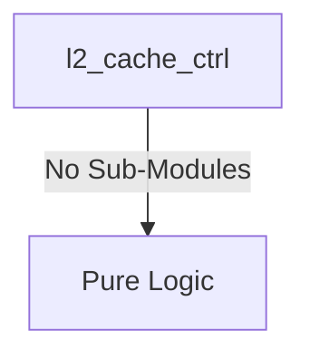

# l2_cache_ctrl Verification Handoff

## 📝 Overview
This directory contains the Verilog source, testbench, and verification instructions for the `l2_cache_ctrl` module.

## 🎯 What to Test
The verification engineer should ensure that:
1. The module resets correctly and all internal states initialize to safe values.
2. All interface protocols (e.g., AXI4, APB, native valid/ready) are strictly adhered to.
3. Edge cases specific to this IP (e.g., full/empty flags for FIFOs, cache misses for memory, etc.) are manually exercised.

## 🔍 GTKWave Signals to Observe
Add the following key signals to your GTKWave trace for structural inspection:
### Inputs
- `uut.clk`
- `uut.rst_n`
- `uut.s_arvalid`
- `uut.s_araddr`
- `uut.s_rready`
- `uut.s_awvalid`
- `uut.s_awaddr`
- `uut.s_wvalid`
- `uut.s_wdata`
- `uut.s_wstrb`
- `uut.s_bready`
- `uut.m_arready`
- `uut.m_rvalid`
- `uut.m_rdata`
- `uut.m_rresp`
- `uut.m_awready`
- `uut.m_wready`
- `uut.m_bvalid`
- `uut.tag_out`
- `uut.tag_valid_out`
- `uut.dat_dout`
- `uut.dat_dout_valid`

### Outputs
- `uut.s_arready`
- `uut.s_rvalid`
- `uut.s_rdata`
- `uut.s_rresp`
- `uut.s_awready`
- `uut.s_wready`
- `uut.s_bvalid`
- `uut.s_bresp`
- `uut.m_arvalid`
- `uut.m_araddr`
- `uut.m_rready`
- `uut.m_awvalid`
- `uut.m_awaddr`
- `uut.m_wvalid`
- `uut.m_wdata`
- `uut.m_wstrb`
- `uut.m_bready`
- `uut.tag_cs`
- `uut.tag_we`
- `uut.tag_index`
- `uut.tag_in`
- `uut.dat_cs`
- `uut.dat_we`
- `uut.dat_bank`
- `uut.dat_wmask`
- `uut.dat_addr`
- `uut.dat_din`

## 🏗 Structural Block Diagram
The following Mermaid diagram maps the exact sub-module hierarchy instantiated within `l2_cache_ctrl`. Use this to verify that structural boundaries match the behavioral expectations.

## ▶️ Simulation Instructions
1. **Compile**: `iverilog -o sim.vvp l2_cache_ctrl.v tb_l2_cache_ctrl.v` (Include dependencies using ` -I ../../includes -I` if necessary)
2. **Simulate**: `vvp sim.vvp`
3. **View**: `gtkwave tb_l2_cache_ctrl.vcd`

## 💉 Injected Stimulus Profile
An advanced Python DV script has automatically generated a fully functional SystemVerilog testbench for this module. The following aggressive stimulus is applied during simulation:

### Clocks Auto-Toggled:
- `clk` toggling every 3.6ns (138.8 MHz)

### Reset Sequence:
- `rst_n` driven to 0 then 1 over 100ns.

### Data Buses Randomized:
Over 500 consecutive cycles, the following inputs receive constrained `$random` logic values to aggressively exercise datapaths and control flow:
- `s_arvalid`
- `s_araddr`
- `s_rready`
- `s_awvalid`
- `s_awaddr`
- `s_wvalid`
- `s_wdata`
- `s_wstrb`
- `s_bready`
- `m_arready`
- `m_rvalid`
- `m_rdata`
- `m_rresp`
- `m_awready`
- `m_wready`
- `m_bvalid`
- `tag_out`
- `tag_valid_out`
- `dat_dout`
- `dat_dout_valid`
