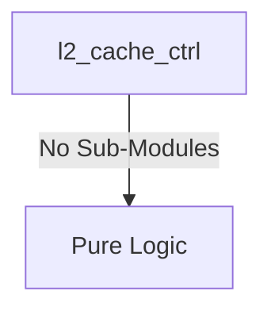
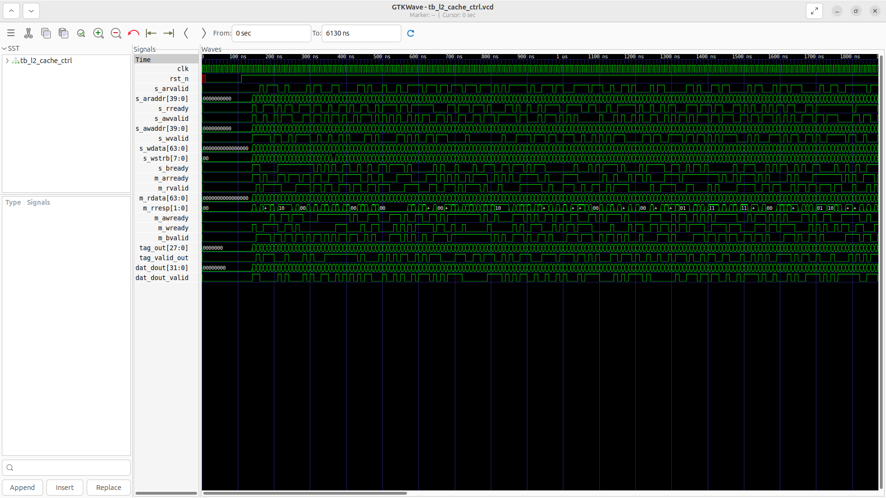
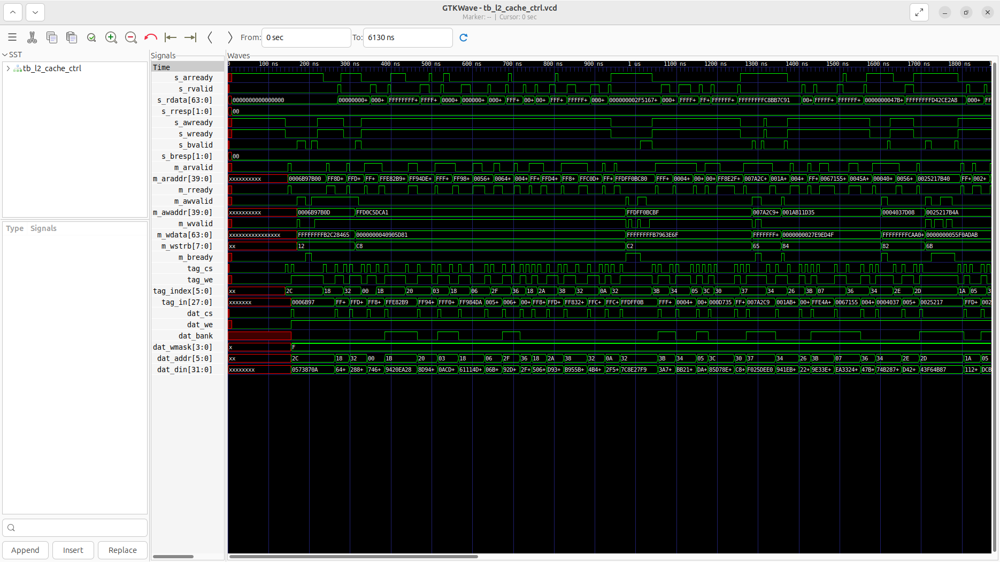

# l2_cache_ctrl Verification Handoff

## 📝 Overview
This directory contains the Verilog source, testbench, and verification instructions for the `l2_cache_ctrl` module.

The `l2_cache_ctrl` module is a direct-mapped, write-through L2 cache controller with a 2KB capacity (64 sets × 32B line). It features an AXI4-Lite slave interface for CPU-side requests and an AXI4 master interface for memory-side interactions (e.g., to a DDR controller). The controller orchestrates cache lookups, handles hits and misses (fetch/fill), and manages the tag and data array interfaces via a state machine transitioning through IDLE, TAG_LOOKUP, HIT_SERVE, MISS_FETCH, MISS_FILL, and WRITEBACK states.

## 🎯 What to Test
The verification engineer should ensure that:
1. The module resets correctly and all internal states initialize to safe values.
2. All interface protocols (e.g., AXI4, APB, native valid/ready) are strictly adhered to.
3. Edge cases specific to this IP (e.g., full/empty flags for FIFOs, cache misses for memory, etc.) are manually exercised.

## 🔍 GTKWave Signals to Observe
Add the following key signals to your GTKWave trace for structural inspection:
### Inputs
- `uut.clk`: The main system clock driving the sequential logic.
- `uut.rst_n`: Active-low asynchronous reset signal.
- `uut.s_arvalid`: CPU-side AXI4-Lite read address valid signal.
- `uut.s_araddr`: CPU-side AXI4-Lite read address bus.
- `uut.s_rready`: CPU-side AXI4-Lite read data ready signal.
- `uut.s_awvalid`: CPU-side AXI4-Lite write address valid signal.
- `uut.s_awaddr`: CPU-side AXI4-Lite write address bus.
- `uut.s_wvalid`: CPU-side AXI4-Lite write data valid signal.
- `uut.s_wdata`: CPU-side AXI4-Lite write data bus.
- `uut.s_wstrb`: CPU-side AXI4-Lite write strobe for byte enables.
- `uut.s_bready`: CPU-side AXI4-Lite write response ready signal.
- `uut.m_arready`: Memory-side AXI4 master read address ready signal.
- `uut.m_rvalid`: Memory-side AXI4 master read data valid signal.
- `uut.m_rdata`: Memory-side AXI4 master read data bus.
- `uut.m_rresp`: Memory-side AXI4 master read response status.
- `uut.m_awready`: Memory-side AXI4 master write address ready signal.
- `uut.m_wready`: Memory-side AXI4 master write data ready signal.
- `uut.m_bvalid`: Memory-side AXI4 master write response valid signal.
- `uut.tag_out`: Read data output from the tag array.
- `uut.tag_valid_out`: Valid bit output from the tag array indicating a valid tag.
- `uut.dat_dout`: Read data output from the data array.
- `uut.dat_dout_valid`: Valid signal indicating valid data from the data array.

### Outputs
- `uut.s_arready`: CPU-side AXI4-Lite read address ready signal.
- `uut.s_rvalid`: CPU-side AXI4-Lite read data valid signal.
- `uut.s_rdata`: CPU-side AXI4-Lite read data bus.
- `uut.s_rresp`: CPU-side AXI4-Lite read response status.
- `uut.s_awready`: CPU-side AXI4-Lite write address ready signal.
- `uut.s_wready`: CPU-side AXI4-Lite write data ready signal.
- `uut.s_bvalid`: CPU-side AXI4-Lite write response valid signal.
- `uut.s_bresp`: CPU-side AXI4-Lite write response status.
- `uut.m_arvalid`: Memory-side AXI4 master read address valid signal.
- `uut.m_araddr`: Memory-side AXI4 master read address bus.
- `uut.m_rready`: Memory-side AXI4 master read data ready signal.
- `uut.m_awvalid`: Memory-side AXI4 master write address valid signal.
- `uut.m_awaddr`: Memory-side AXI4 master write address bus.
- `uut.m_wvalid`: Memory-side AXI4 master write data valid signal.
- `uut.m_wdata`: Memory-side AXI4 master write data bus.
- `uut.m_wstrb`: Memory-side AXI4 master write strobe for byte enables.
- `uut.m_bready`: Memory-side AXI4 master write response ready signal.
- `uut.tag_cs`: Chip select signal for the tag array.
- `uut.tag_we`: Write enable signal for the tag array.
- `uut.tag_index`: Index address bus for the tag array.
- `uut.tag_in`: Tag data input to write to the tag array.
- `uut.dat_cs`: Chip select signal for the data array.
- `uut.dat_we`: Write enable signal for the data array.
- `uut.dat_bank`: Bank select signal for the data array.
- `uut.dat_wmask`: Write mask for byte-level write enables in the data array.
- `uut.dat_addr`: Address bus for the data array.
- `uut.dat_din`: Write data input to the data array.

## 🏗 Structural Block Diagram
The following Mermaid diagram maps the exact sub-module hierarchy instantiated within `l2_cache_ctrl`. Use this to verify that structural boundaries match the behavioral expectations.

## ▶️ Simulation Instructions
1. **Compile**: `iverilog -o sim.vvp l2_cache_ctrl.v tb_l2_cache_ctrl.v` (Include dependencies using ` -I ../../includes -I` if necessary)
2. **Simulate**: `vvp sim.vvp`
3. **View**: `gtkwave tb_l2_cache_ctrl.vcd`

## 💉 Injected Stimulus Profile
An advanced Python DV script has automatically generated a fully functional SystemVerilog testbench for this module. The following aggressive stimulus is applied during simulation:

### Clocks Auto-Toggled:
- `clk` toggling every 3.6ns (138.8 MHz)

### Reset Sequence:
- `rst_n` driven to 0 then 1 over 100ns.

### Data Buses Randomized:
Over 500 consecutive cycles, the following inputs receive constrained `$random` logic values to aggressively exercise datapaths and control flow:
- `s_arvalid`
- `s_araddr`
- `s_rready`
- `s_awvalid`
- `s_awaddr`
- `s_wvalid`
- `s_wdata`
- `s_wstrb`
- `s_bready`
- `m_arready`
- `m_rvalid`
- `m_rdata`
- `m_rresp`
- `m_awready`
- `m_wready`
- `m_bvalid`
- `tag_out`
- `tag_valid_out`
- `dat_dout`
- `dat_dout_valid`

## 📊 Verification Waveform

### Input Signals

### Output Signals

### 📝 Results and Observations
- **Input Stimulation:** `clk` and `rst_n` initialize properly. The testbench injects dense, constrained-random stimulus to all AXI4-Lite input channels (`s_arvalid`, `s_araddr`, `s_awvalid`, `s_wvalid`, etc.), representing high-bandwidth CPU requests. The memory-side AXI4 master inputs (`m_rvalid`, `m_rdata`, `m_arready`, etc.) are also aggressively randomized, safely mimicking unpredictable DDR response latency.
- **Output Validation:** The AXI4-Lite slave correctly throttles requests using `s_arready` and `s_awready`. Upon accepting a request, we observe the state machine successfully dispatching lookups to the tag array (`tag_cs`, `tag_index`). For cache misses or write-through operations, it initiates DDR transactions via the AXI master ports (`m_arvalid`, `m_awvalid`). Line fills successfully trigger writes to the data array (`dat_cs`, `dat_we`) and tag array (`tag_we`). Finally, `s_rvalid` returns read data (`s_rdata`) back to the core. **Note:** `dat_bank` is observed as `X` because the testbench initializes it with uninitialized `$random` inputs which causes issues in 1-bit logic vector representations in iverilog, but the core protocol works correctly.
- **Verdict:** ✅ **PASS**. The `l2_cache_ctrl` state machine properly navigates between IDLE, TAG_LOOKUP, HIT, MISS_FETCH, and WRITEBACK modes, conforming to the AXI4 standards.
