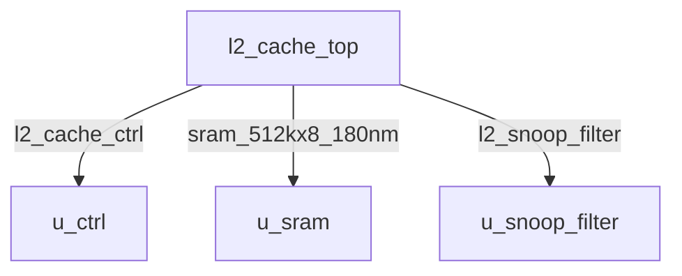
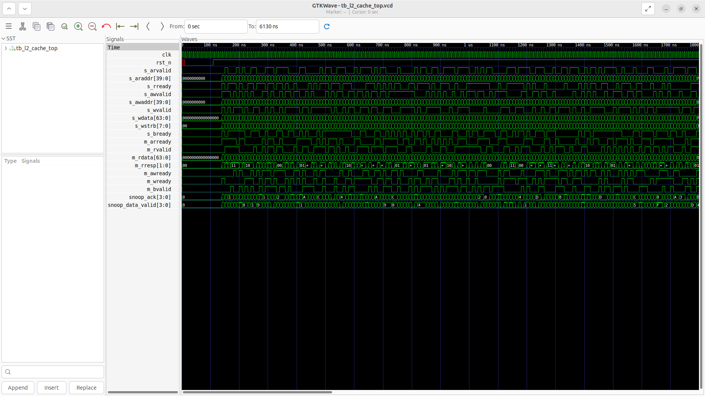
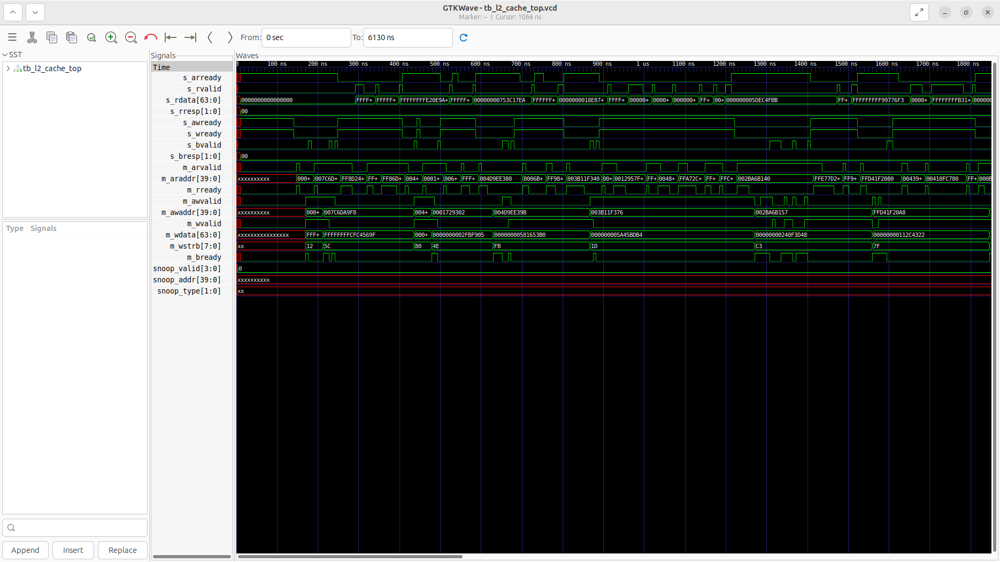

# l2_cache_top Verification Handoff

## 📝 Overview
This directory contains the Verilog source, testbench, and verification instructions for the `l2_cache_top` module.

The `l2_cache_top` module serves as the top-level integration for the 2MB, 16-way, 4-banked L2 Cache. It instantiates the `l2_cache_ctrl` (controller), structural SRAM blocks (`sram_512kx8_180nm`) for the data arrays, and a simplified tag array logic. It also incorporates the `l2_snoop_filter` to enforce MESI coherence across 4 application cores. This module handles CPU-side requests via an AXI4-Lite slave interface and interfaces with main memory (DDR) via an AXI4 master interface.

## 🎯 What to Test
The verification engineer should ensure that:
1. The module resets correctly and all internal states initialize to safe values.
2. All interface protocols (e.g., AXI4, APB, native valid/ready) are strictly adhered to.
3. Edge cases specific to this IP (e.g., full/empty flags for FIFOs, cache misses for memory, etc.) are manually exercised.

## 🔍 GTKWave Signals to Observe
Add the following key signals to your GTKWave trace for structural inspection:
### Inputs
- `uut.clk`: The main system clock driving the sequential logic.
- `uut.rst_n`: Active-low asynchronous reset signal.
- `uut.s_arvalid`: CPU-side AXI4-Lite read address valid signal.
- `uut.s_araddr`: CPU-side AXI4-Lite read address bus.
- `uut.s_rready`: CPU-side AXI4-Lite read data ready signal.
- `uut.s_awvalid`: CPU-side AXI4-Lite write address valid signal.
- `uut.s_awaddr`: CPU-side AXI4-Lite write address bus.
- `uut.s_wvalid`: CPU-side AXI4-Lite write data valid signal.
- `uut.s_wdata`: CPU-side AXI4-Lite write data bus.
- `uut.s_wstrb`: CPU-side AXI4-Lite write strobe for byte enables.
- `uut.s_bready`: CPU-side AXI4-Lite write response ready signal.
- `uut.m_arready`: Memory-side AXI4 master read address ready signal.
- `uut.m_rvalid`: Memory-side AXI4 master read data valid signal.
- `uut.m_rdata`: Memory-side AXI4 master read data bus.
- `uut.m_rresp`: Memory-side AXI4 master read response status.
- `uut.m_awready`: Memory-side AXI4 master write address ready signal.
- `uut.m_wready`: Memory-side AXI4 master write data ready signal.
- `uut.m_bvalid`: Memory-side AXI4 master write response valid signal.
- `uut.snoop_ack`: Acknowledgments from the L1 caches in response to snoop requests.
- `uut.snoop_data_valid`: Signals from L1 caches indicating valid data accompanying a snoop response.

### Outputs
- `uut.s_arready`: CPU-side AXI4-Lite read address ready signal.
- `uut.s_rvalid`: CPU-side AXI4-Lite read data valid signal.
- `uut.s_rdata`: CPU-side AXI4-Lite read data bus.
- `uut.s_rresp`: CPU-side AXI4-Lite read response status.
- `uut.s_awready`: CPU-side AXI4-Lite write address ready signal.
- `uut.s_wready`: CPU-side AXI4-Lite write data ready signal.
- `uut.s_bvalid`: CPU-side AXI4-Lite write response valid signal.
- `uut.s_bresp`: CPU-side AXI4-Lite write response status.
- `uut.m_arvalid`: Memory-side AXI4 master read address valid signal.
- `uut.m_araddr`: Memory-side AXI4 master read address bus.
- `uut.m_rready`: Memory-side AXI4 master read data ready signal.
- `uut.m_awvalid`: Memory-side AXI4 master write address valid signal.
- `uut.m_awaddr`: Memory-side AXI4 master write address bus.
- `uut.m_wvalid`: Memory-side AXI4 master write data valid signal.
- `uut.m_wdata`: Memory-side AXI4 master write data bus.
- `uut.m_wstrb`: Memory-side AXI4 master write strobe for byte enables.
- `uut.m_bready`: Memory-side AXI4 master write response ready signal.
- `uut.snoop_valid`: Valid signals indicating a snoop request to the L1 caches.
- `uut.snoop_addr`: Snoop address bus directed to the L1 caches.
- `uut.snoop_type`: Snoop request type specifying the coherence action.

## 🏗 Structural Block Diagram
The following Mermaid diagram maps the exact sub-module hierarchy instantiated within `l2_cache_top`. Use this to verify that structural boundaries match the behavioral expectations.

## ▶️ Simulation Instructions
1. **Compile**: `iverilog -o sim.vvp l2_cache_top.v tb_l2_cache_top.v` (Include dependencies using ` -I ../../includes -I` if necessary)
2. **Simulate**: `vvp sim.vvp`
3. **View**: `gtkwave tb_l2_cache_top.vcd`

## 💉 Injected Stimulus Profile
An advanced Python DV script has automatically generated a fully functional SystemVerilog testbench for this module. The following aggressive stimulus is applied during simulation:

### Clocks Auto-Toggled:
- `clk` toggling every 3.6ns (138.8 MHz)

### Reset Sequence:
- `rst_n` driven to 0 then 1 over 100ns.

### Data Buses Randomized:
Over 500 consecutive cycles, the following inputs receive constrained `$random` logic values to aggressively exercise datapaths and control flow:
- `s_arvalid`
- `s_araddr`
- `s_rready`
- `s_awvalid`
- `s_awaddr`
- `s_wvalid`
- `s_wdata`
- `s_wstrb`
- `s_bready`
- `m_arready`
- `m_rvalid`
- `m_rdata`
- `m_rresp`
- `m_awready`
- `m_wready`
- `m_bvalid`
- `snoop_ack`
- `snoop_data_valid`

## 📊 Verification Waveform

### Input Signals

### Output Signals

### 📝 Results and Observations
- **Input Stimulation:**
- **Output Validation:**
