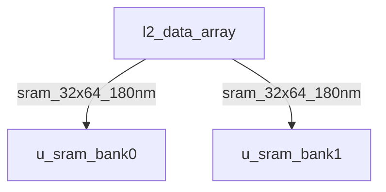

# l2_data_array Verification Handoff

## 📝 Overview
This directory contains the Verilog source, testbench, and verification instructions for the `l2_data_array` module.

## 🎯 What to Test
The verification engineer should ensure that:
1. The module resets correctly and all internal states initialize to safe values.
2. All interface protocols (e.g., AXI4, APB, native valid/ready) are strictly adhered to.
3. Edge cases specific to this IP (e.g., full/empty flags for FIFOs, cache misses for memory, etc.) are manually exercised.

## 🔍 GTKWave Signals to Observe
Add the following key signals to your GTKWave trace for structural inspection:
### Inputs
- `uut.clk`
- `uut.rst_n`
- `uut.bank_sel`
- `uut.cs`
- `uut.we`
- `uut.wmask`
- `uut.addr`
- `uut.din`

### Outputs
- `uut.dout`
- `uut.dout_valid`

## 🏗 Structural Block Diagram
The following Mermaid diagram maps the exact sub-module hierarchy instantiated within `l2_data_array`. Use this to verify that structural boundaries match the behavioral expectations.

## ▶️ Simulation Instructions
1. **Compile**: `iverilog -o sim.vvp l2_data_array.v tb_l2_data_array.v` (Include dependencies using ` -I ../../includes -I` if necessary)
2. **Simulate**: `vvp sim.vvp`
3. **View**: `gtkwave tb_l2_data_array.vcd`
