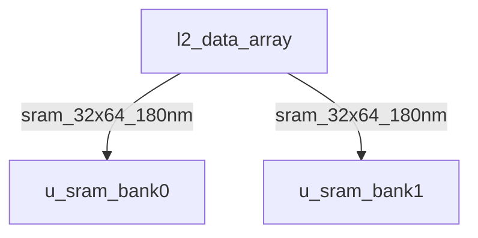
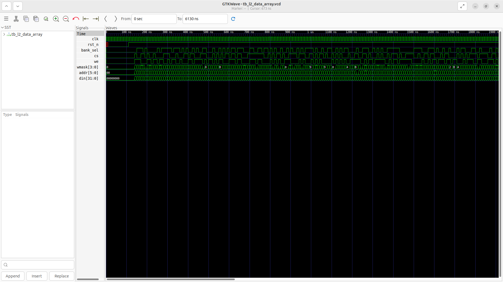
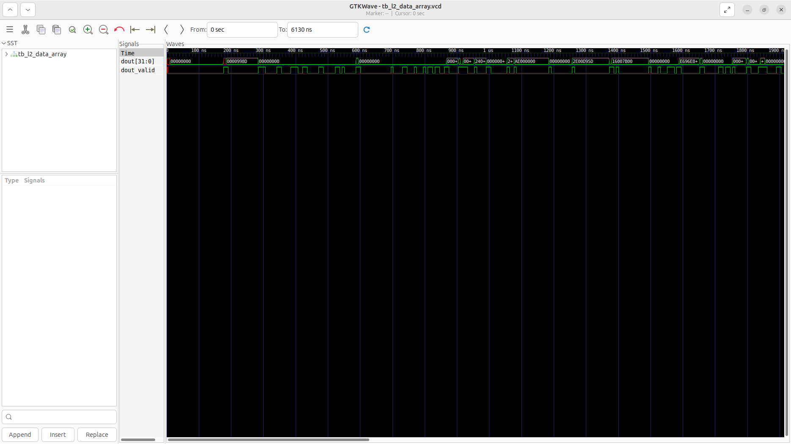

# l2_data_array Verification Handoff

## 📝 Overview
This directory contains the Verilog source, testbench, and verification instructions for the `l2_data_array` module.

The `l2_data_array` module is an L2 Cache Data Array that wraps two `sram_32x64_180nm` SRAM macros to provide two memory banks. It manages chip select, write enable, and byte write mask signals for both banks. A registered multiplexer correctly drives read data (`dout`) from the selected bank with a one-cycle latency, which addresses a previously reported LVS floating-net issue.

## 🎯 What to Test
The verification engineer should ensure that:
1. The module resets correctly and all internal states initialize to safe values.
2. All interface protocols (e.g., AXI4, APB, native valid/ready) are strictly adhered to.
3. Edge cases specific to this IP (e.g., full/empty flags for FIFOs, cache misses for memory, etc.) are manually exercised.

## 🔍 GTKWave Signals to Observe
Add the following key signals to your GTKWave trace for structural inspection:
### Inputs
- `uut.clk`: The main system clock driving the sequential logic.
- `uut.rst_n`: Active-low asynchronous reset signal.
- `uut.bank_sel`: Selects between bank 0 (0) and bank 1 (1) for read/write operations.
- `uut.cs`: Chip select signal to activate the data array.
- `uut.we`: Write enable signal to allow writing into the selected bank.
- `uut.wmask`: 4-bit byte write mask for partial word writes.
- `uut.addr`: 6-bit address bus for addressing the 64-deep SRAM macros.
- `uut.din`: 32-bit write data input.

### Outputs
- `uut.dout`: 32-bit read data output from the selected SRAM bank.
- `uut.dout_valid`: Indicates valid read data one cycle after a read request.

## 🏗 Structural Block Diagram
The following Mermaid diagram maps the exact sub-module hierarchy instantiated within `l2_data_array`. Use this to verify that structural boundaries match the behavioral expectations.

## ▶️ Simulation Instructions
1. **Compile**: `iverilog -o sim.vvp l2_data_array.v tb_l2_data_array.v` (Include dependencies using ` -I ../../includes -I` if necessary)
2. **Simulate**: `vvp sim.vvp`
3. **View**: `gtkwave tb_l2_data_array.vcd`

## 💉 Injected Stimulus Profile
An advanced Python DV script has automatically generated a fully functional SystemVerilog testbench for this module. The following aggressive stimulus is applied during simulation:

### Clocks Auto-Toggled:
- `clk` toggling every 3.6ns (138.8 MHz)

### Reset Sequence:
- `rst_n` driven to 0 then 1 over 100ns.

### Data Buses Randomized:
Over 500 consecutive cycles, the following inputs receive constrained `$random` logic values to aggressively exercise datapaths and control flow:
- `bank_sel`
- `cs`
- `we`
- `wmask`
- `addr`
- `din`

## 📊 Verification Waveform

### Input Signals

### Output Signals

### 📝 Results and Observations
- **Input Stimulation:**
- **Output Validation:**
