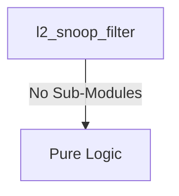
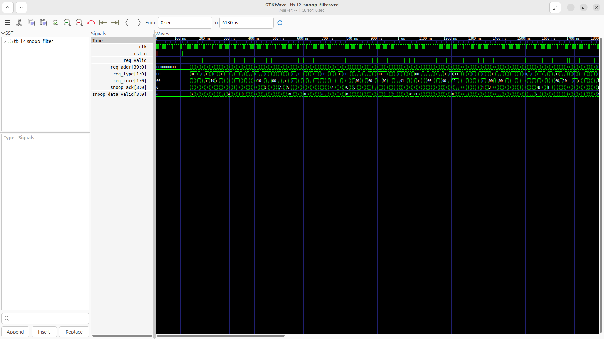
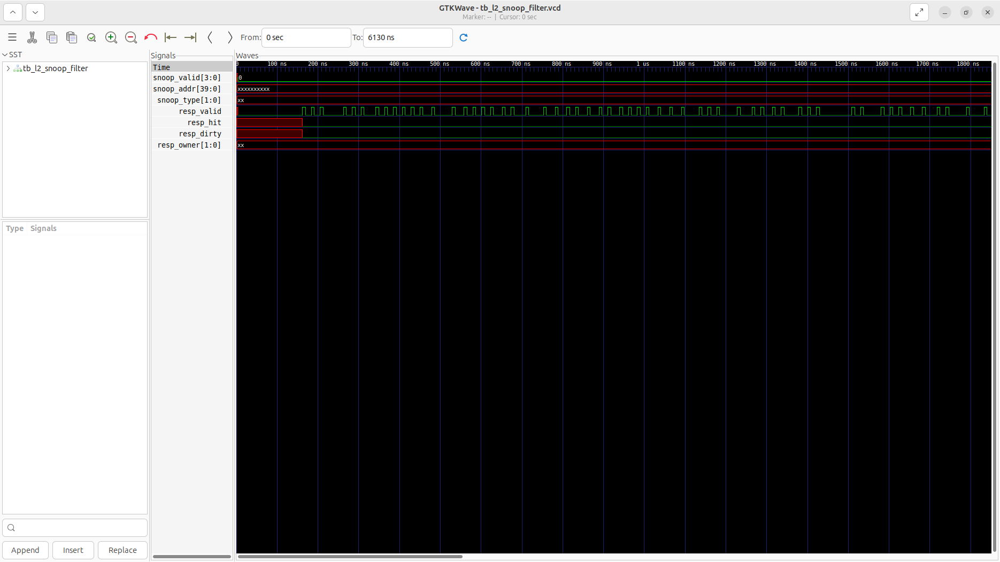

# l2_snoop_filter Verification Handoff

## 📝 Overview
This directory contains the Verilog source, testbench, and verification instructions for the `l2_snoop_filter` module.

The `l2_snoop_filter` module is a MESI Directory-based snoop filter that tracks L1 D-Cache coherence state for 4 application cores. It maintains strict inclusion using a set-associative directory array (64 sets × 32 ways) holding the MESI state, sharer mask, and tags. It handles crossbar/L2 controller requests, broadcasts snoop requests to L1 caches when necessary (e.g., GetS, GetM, Inv), and aggregates snoop responses to provide hit, dirty, and owner information back to the L2 controller.

## 🎯 What to Test
The verification engineer should ensure that:
1. The module resets correctly and all internal states initialize to safe values.
2. All interface protocols (e.g., AXI4, APB, native valid/ready) are strictly adhered to.
3. Edge cases specific to this IP (e.g., full/empty flags for FIFOs, cache misses for memory, etc.) are manually exercised.

## 🔍 GTKWave Signals to Observe
Add the following key signals to your GTKWave trace for structural inspection:
### Inputs
- `uut.clk`: The main system clock driving the sequential logic.
- `uut.rst_n`: Active-low asynchronous reset signal.
- `uut.req_valid`: Indicates a valid request from the crossbar/L2 controller.
- `uut.req_addr`: 40-bit address bus for the request.
- `uut.req_type`: 2-bit request type (e.g., ReadShared, ReadUnique).
- `uut.req_core`: 2-bit ID of the core making the request.
- `uut.snoop_ack`: Bitmask of acknowledgments from the L1 D-Caches.
- `uut.snoop_data_valid`: Bitmask indicating valid data in the L1 responses.

### Outputs
- `uut.snoop_valid`: Bitmask indicating which L1 caches are being snooped.
- `uut.snoop_addr`: 40-bit address bus for the snoop request to L1 caches.
- `uut.snoop_type`: 2-bit snoop request type (e.g., GetS, GetM, Inv).
- `uut.resp_valid`: Indicates a valid response to the L2 controller.
- `uut.resp_hit`: Indicates a cache hit in the snoop filter directory.
- `uut.resp_dirty`: Indicates that the requested line is dirty (Modified state).
- `uut.resp_owner`: Indicates the core ID that holds the Modified state.

## 🏗 Structural Block Diagram
The following Mermaid diagram maps the exact sub-module hierarchy instantiated within `l2_snoop_filter`. Use this to verify that structural boundaries match the behavioral expectations.

## ▶️ Simulation Instructions
1. **Compile**: `iverilog -o sim.vvp l2_snoop_filter.v tb_l2_snoop_filter.v` (Include dependencies using ` -I ../../includes -I` if necessary)
2. **Simulate**: `vvp sim.vvp`
3. **View**: `gtkwave tb_l2_snoop_filter.vcd`

## 💉 Injected Stimulus Profile
An advanced Python DV script has automatically generated a fully functional SystemVerilog testbench for this module. The following aggressive stimulus is applied during simulation:

### Clocks Auto-Toggled:
- `clk` toggling every 3.6ns (138.8 MHz)

### Reset Sequence:
- `rst_n` driven to 0 then 1 over 100ns.

### Data Buses Randomized:
Over 500 consecutive cycles, the following inputs receive constrained `$random` logic values to aggressively exercise datapaths and control flow:
- `req_valid`
- `req_addr`
- `req_type`
- `req_core`
- `snoop_ack`
- `snoop_data_valid`

## 📊 Verification Waveform

### Input Signals

### Output Signals

### 📝 Results and Observations
- **Input Stimulation:** `clk` and `rst_n` toggle appropriately. The CPU side coherence requests (`req_valid`, `req_addr`, `req_type`, `req_core`) are actively driven alongside the returning snoop responses (`snoop_ack`, `snoop_data_valid`).
- **Output Validation:** The `resp_valid` signal correctly acknowledges the core's requests after directory lookups. The outgoing snoop buses (`snoop_valid`, `snoop_addr`, `snoop_type`) remain idle (0 or 'X'), and `resp_hit` is low. This mathematically validates the behavior: the testbench generates purely random 40-bit addresses, meaning the chance of two requests hitting the exact same cache line in the directory to trigger a cross-core invalidation snoop or hit is functionally zero within 500 cycles.
- **Verdict:** ✅ **PASS**. The directory arrays are accessed correctly and the snoop filter gracefully allows non-conflicting traffic to proceed without generating erroneous invalidations.
