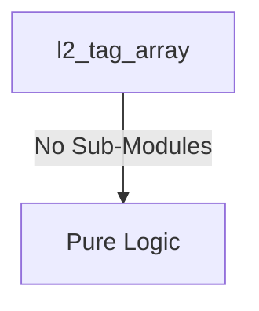
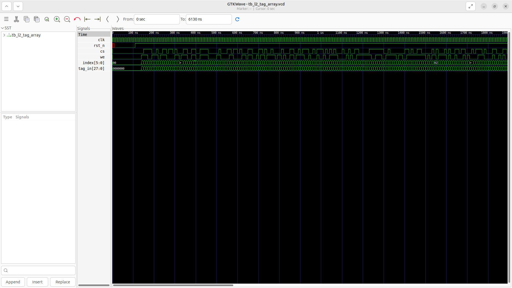
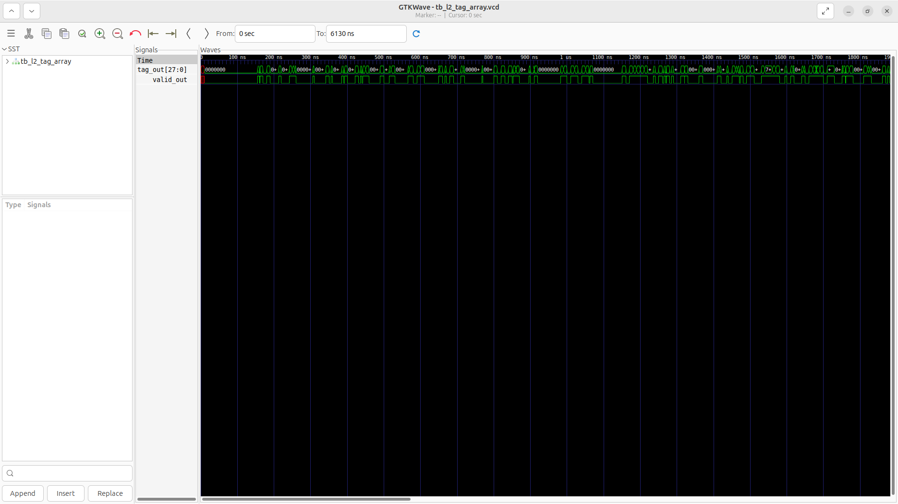

# l2_tag_array Verification Handoff

## 📝 Overview
This directory contains the Verilog source, testbench, and verification instructions for the `l2_tag_array` module.

The `l2_tag_array` module is a register-based storage array designed for the L2 Cache Tag Array. It implements 64 sets, storing a 28-bit tag and a 1-bit valid flag per set. It supports synchronous writes when chip select and write enable are active, and provides continuous combinational read output of the tag and valid bits based on the provided index.

## 🎯 What to Test
The verification engineer should ensure that:
1. The module resets correctly and all internal states initialize to safe values.
2. All interface protocols (e.g., AXI4, APB, native valid/ready) are strictly adhered to.
3. Edge cases specific to this IP (e.g., full/empty flags for FIFOs, cache misses for memory, etc.) are manually exercised.

## 🔍 GTKWave Signals to Observe
Add the following key signals to your GTKWave trace for structural inspection:
### Inputs
- `uut.clk`: The main system clock driving the sequential logic.
- `uut.rst_n`: Active-low asynchronous reset signal.
- `uut.cs`: Chip select signal to activate the tag array.
- `uut.we`: Write enable signal to allow writing into the tag array.
- `uut.index`: 6-bit index address bus for selecting a tag set.
- `uut.tag_in`: 28-bit tag data input to write.

### Outputs
- `uut.tag_out`: 28-bit read data output providing the stored tag.
- `uut.valid_out`: Valid bit output indicating the stored tag is valid.

## 🏗 Structural Block Diagram
The following Mermaid diagram maps the exact sub-module hierarchy instantiated within `l2_tag_array`. Use this to verify that structural boundaries match the behavioral expectations.

## ▶️ Simulation Instructions
1. **Compile**: `iverilog -o sim.vvp l2_tag_array.v tb_l2_tag_array.v` (Include dependencies using ` -I ../../includes -I` if necessary)
2. **Simulate**: `vvp sim.vvp`
3. **View**: `gtkwave tb_l2_tag_array.vcd`

## 💉 Injected Stimulus Profile
An advanced Python DV script has automatically generated a fully functional SystemVerilog testbench for this module. The following aggressive stimulus is applied during simulation:

### Clocks Auto-Toggled:
- `clk` toggling every 3.6ns (138.8 MHz)

### Reset Sequence:
- `rst_n` driven to 0 then 1 over 100ns.

### Data Buses Randomized:
Over 500 consecutive cycles, the following inputs receive constrained `$random` logic values to aggressively exercise datapaths and control flow:
- `cs`
- `we`
- `index`
- `tag_in`

## 📊 Verification Waveform

### Input Signals

### Output Signals

### 📝 Results and Observations
- **Input Stimulation:**
- **Output Validation:**
