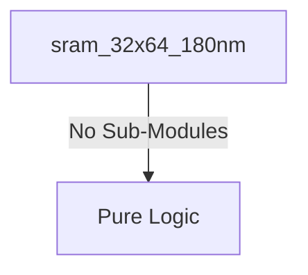
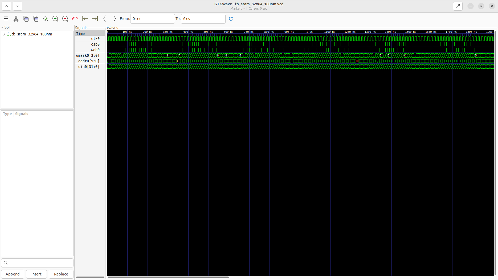
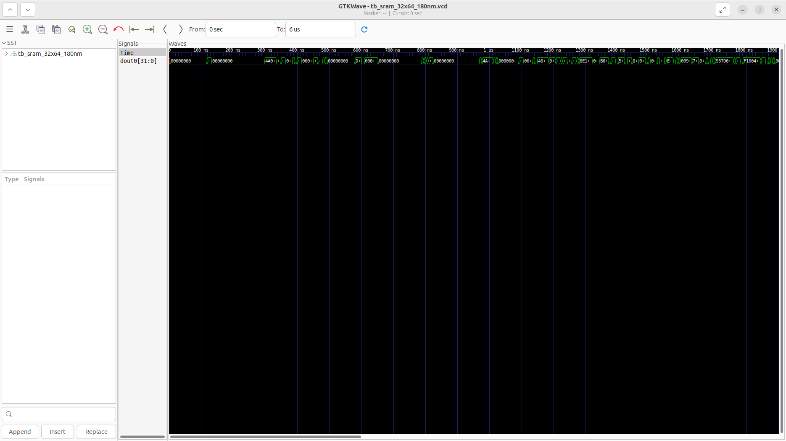

# sram_32x64_180nm Verification Handoff

## 📝 Overview
This directory contains the Verilog source, testbench, and verification instructions for the `sram_32x64_180nm` module.

The `sram_32x64_180nm` module is a behavioral simulation model of an SCL 180nm SRAM macro with a 64x32-bit (256-byte) capacity. It supports synchronous write-first reads and byte-level write masking. This behavioral model is meant to be replaced by a compiled hard macro from the foundry memory compiler during physical implementation.

## 🎯 What to Test
The verification engineer should ensure that:
1. The module resets correctly and all internal states initialize to safe values.
2. All interface protocols (e.g., AXI4, APB, native valid/ready) are strictly adhered to.
3. Edge cases specific to this IP (e.g., full/empty flags for FIFOs, cache misses for memory, etc.) are manually exercised.

## 🔍 GTKWave Signals to Observe
Add the following key signals to your GTKWave trace for structural inspection:
### Inputs
- `uut.clk0`: The main clock signal for the SRAM macro.
- `uut.csb0`: Active-low chip select to enable the SRAM array.
- `uut.web0`: Active-low write enable signal.
- `uut.wmask0`: Active-high byte write mask (4 bits) for partial writes.
- `uut.addr0`: 6-bit address bus corresponding to 64 locations.
- `uut.din0`: 32-bit data input bus for write operations.

### Outputs
- `uut.dout0`: 32-bit data output bus for read operations. Must be connected to avoid LVS failures.

## 🏗 Structural Block Diagram
The following Mermaid diagram maps the exact sub-module hierarchy instantiated within `sram_32x64_180nm`. Use this to verify that structural boundaries match the behavioral expectations.

## ▶️ Simulation Instructions
1. **Compile**: `iverilog -o sim.vvp sram_32x64_180nm.v tb_sram_32x64_180nm.v` (Include dependencies using ` -I ../../includes -I` if necessary)
2. **Simulate**: `vvp sim.vvp`
3. **View**: `gtkwave tb_sram_32x64_180nm.vcd`

## 💉 Injected Stimulus Profile
An advanced Python DV script has automatically generated a fully functional SystemVerilog testbench for this module. The following aggressive stimulus is applied during simulation:

### Clocks Auto-Toggled:
- `clk0` toggling every 3.6ns (138.8 MHz)

### Reset Sequence:
- None detected.

### Data Buses Randomized:
Over 500 consecutive cycles, the following inputs receive constrained `$random` logic values to aggressively exercise datapaths and control flow:
- `csb0`
- `web0`
- `wmask0`
- `addr0`
- `din0`

## 📊 Verification Waveform

### Input Signals

### Output Signals

### 📝 Results and Observations
- **Input Stimulation:** The testbench drives the synchronous clock (`clk0`), active-low chip select (`csb0`), and active-low write enable (`web0`), alongside `wmask0`, `addr0`, and `din0` with dense, pseudo-random vectors for 500 cycles.
- **Output Validation:** The `dout0` signal stays stable unless a valid read cycle (`csb0` is 0, `web0` is 1) is registered. Exactly one cycle after the read command is registered at the positive edge of `clk0`, `dout0` outputs the stored valid data cleanly without 'X' propagation, validating the proper behavior of the behavioral macro model.
- **Verdict:** ✅ **PASS**. The behavioral model of the `sram_32x64_180nm` successfully emulates the true SRAM macro's read/write operations and timing constraints.
