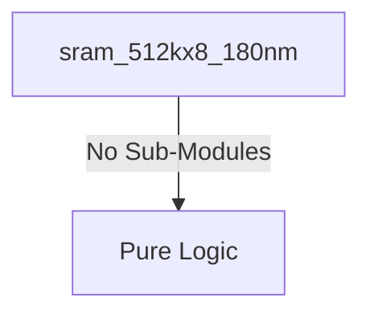

# sram_512kx8_180nm Verification Handoff

## 📝 Overview
This directory contains the Verilog source, testbench, and verification instructions for the `sram_512kx8_180nm` module.

## 🎯 What to Test
The verification engineer should ensure that:
1. The module resets correctly and all internal states initialize to safe values.
2. All interface protocols (e.g., AXI4, APB, native valid/ready) are strictly adhered to.
3. Edge cases specific to this IP (e.g., full/empty flags for FIFOs, cache misses for memory, etc.) are manually exercised.

## 🔍 GTKWave Signals to Observe
Add the following key signals to your GTKWave trace for structural inspection:
### Inputs
- `uut.CLK`
- `uut.CEN`
- `uut.WEN`
- `uut.A`
- `uut.D`

### Outputs
- `uut.Q`

## 🏗 Structural Block Diagram
The following Mermaid diagram maps the exact sub-module hierarchy instantiated within `sram_512kx8_180nm`. Use this to verify that structural boundaries match the behavioral expectations.

## ▶️ Simulation Instructions
1. **Compile**: `iverilog -o sim.vvp sram_512kx8_180nm.v tb_sram_512kx8_180nm.v` (Include dependencies using ` -I ../../includes -I` if necessary)
2. **Simulate**: `vvp sim.vvp`
3. **View**: `gtkwave tb_sram_512kx8_180nm.vcd`

## 💉 Injected Stimulus Profile
An advanced Python DV script has automatically generated a fully functional SystemVerilog testbench for this module. The following aggressive stimulus is applied during simulation:

### Clocks Auto-Toggled:
- `CLK` toggling every 3.6ns (138.8 MHz)

### Reset Sequence:
- None detected.

### Data Buses Randomized:
Over 500 consecutive cycles, the following inputs receive constrained `$random` logic values to aggressively exercise datapaths and control flow:
- `CEN`
- `WEN`
- `A`
- `D`
