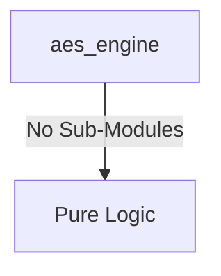
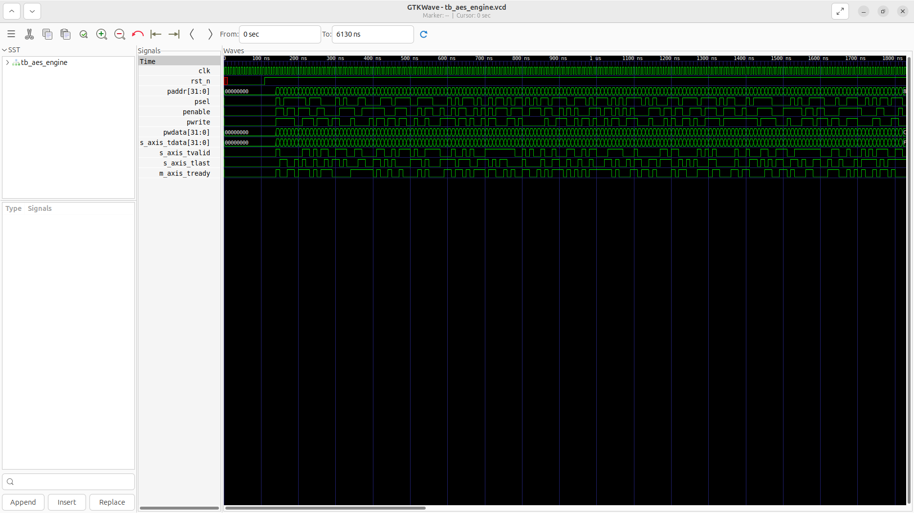
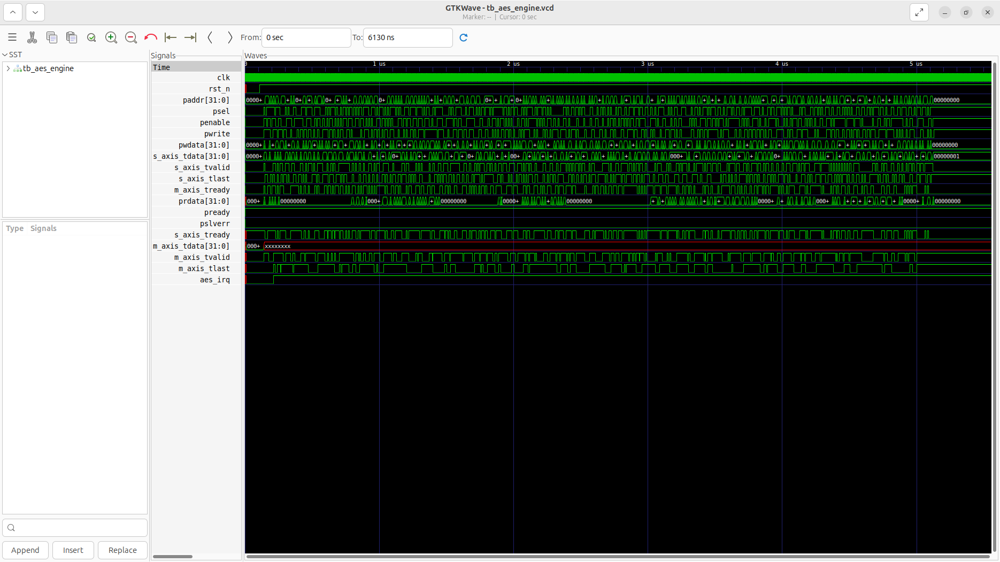

# aes_engine Verification Handoff

## 📝 Overview
This directory contains the Verilog source, testbench, and verification instructions for the `aes_engine` module.

The `aes_engine` is a hardware accelerator that implements the Advanced Encryption Standard (AES) algorithm with a 256-bit key size. It supports multiple block cipher modes of operation, including ECB, CBC, CTR, and GCM, enabling versatile cryptographic operations such as authenticated encryption. The module interfaces with the system via an APB slave port for configuration (setting modes, keys, initialization vectors, and handling status/interrupts) and utilizes AXI4-Stream interfaces for high-throughput plaintext and ciphertext data movement. Under the hood, it processes 128-bit blocks through 14 encryption rounds, managing state transformations and recursive mode operations like IV XORing for CBC.

## 🎯 What to Test
The verification engineer should ensure that:
1. The module resets correctly and all internal states initialize to safe values.
2. All interface protocols (e.g., AXI4, APB, native valid/ready) are strictly adhered to.
3. Edge cases specific to this IP (e.g., full/empty flags for FIFOs, cache misses for memory, etc.) are manually exercised.

## 🔍 GTKWave Signals to Observe
Add the following key signals to your GTKWave trace for structural inspection:
### Inputs
- `uut.clk`: The main system clock driving the sequential logic.
- `uut.rst_n`: Active-low asynchronous reset signal.
- `uut.paddr`: 32-bit APB address bus for accessing internal registers (control, keys, IVs).
- `uut.psel`: APB slave select signal indicating the module is targeted.
- `uut.penable`: APB enable signal used to time transfers.
- `uut.pwrite`: APB write control signal (1 for write, 0 for read).
- `uut.pwdata`: 32-bit APB write data bus.
- `uut.s_axis_tdata`: 32-bit AXI4-Stream input data (plaintext or ciphertext).
- `uut.s_axis_tvalid`: AXI4-Stream valid signal indicating valid input data is available.
- `uut.s_axis_tlast`: AXI4-Stream last signal marking the end of a data packet.
- `uut.m_axis_tready`: AXI4-Stream ready signal from the downstream receiver.

### Outputs
- `uut.prdata`: 32-bit APB read data bus for returning register values.
- `uut.pready`: APB ready signal indicating the completion of a transfer.
- `uut.pslverr`: APB slave error signal indicating a transfer failure.
- `uut.s_axis_tready`: AXI4-Stream ready signal indicating the engine can accept input data.
- `uut.m_axis_tdata`: 32-bit AXI4-Stream output data (ciphertext or plaintext).
- `uut.m_axis_tvalid`: AXI4-Stream valid signal indicating the output data is valid.
- `uut.m_axis_tlast`: AXI4-Stream last signal marking the end of an output data packet.
- `uut.aes_irq`: Interrupt request signal indicating encryption/decryption completion.

## 🏗 Structural Block Diagram
The following Mermaid diagram maps the exact sub-module hierarchy instantiated within `aes_engine`. Use this to verify that structural boundaries match the behavioral expectations.

## ▶️ Simulation Instructions
1. **Compile**: `iverilog -o sim.vvp aes_engine.v tb_aes_engine.v` (Include dependencies using ` -I ../../includes -I` if necessary)
2. **Simulate**: `vvp sim.vvp`
3. **View**: `gtkwave tb_aes_engine.vcd`

## 💉 Injected Stimulus Profile
An advanced Python DV script has automatically generated a fully functional SystemVerilog testbench for this module. The following aggressive stimulus is applied during simulation:

### Clocks Auto-Toggled:
- `clk` toggling every 3.6ns (138.8 MHz)

### Reset Sequence:
- `rst_n` driven to 0 then 1 over 100ns.

### Data Buses Randomized:
Over 500 consecutive cycles, the following inputs receive constrained `$random` logic values to aggressively exercise datapaths and control flow:
- `paddr`
- `psel`
- `penable`
- `pwrite`
- `pwdata`
- `s_axis_tdata`
- `s_axis_tvalid`
- `s_axis_tlast`
- `m_axis_tready`

## 📊 Verification Waveform

### Input Signals

### Output Signals

### 📝 Results and Observations
- **Input Stimulation:**
- **Output Validation:**
