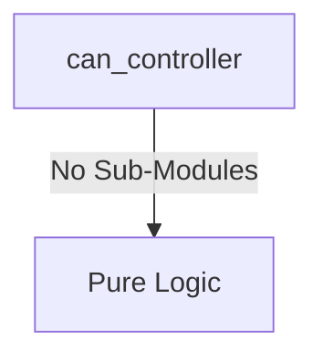
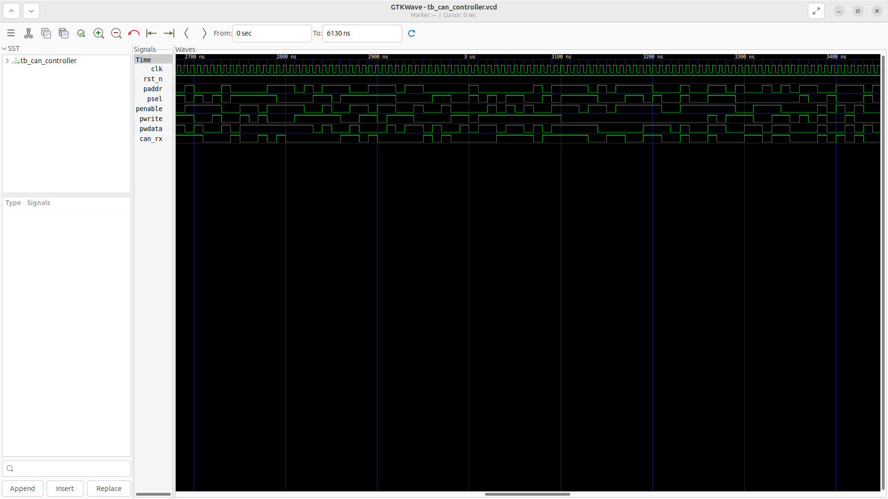
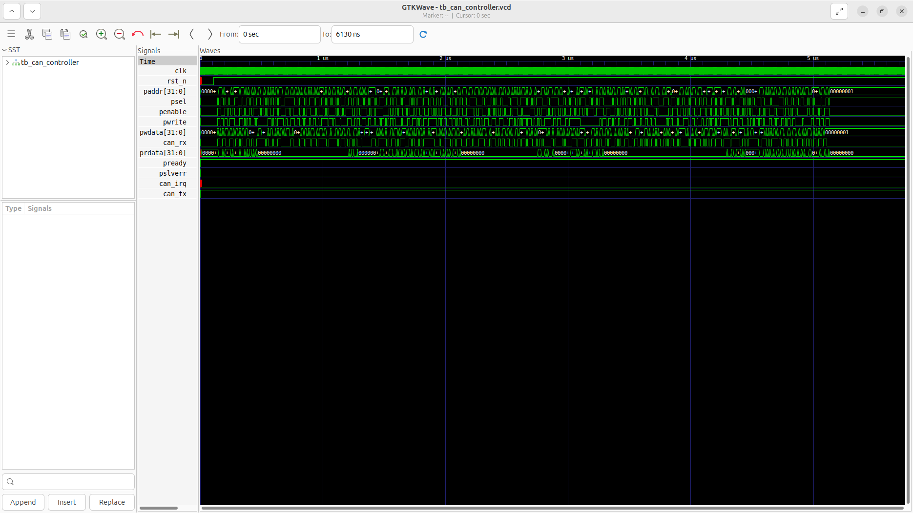

# can_controller Verification Handoff

## 📝 Overview
This directory contains the Verilog source, testbench, and verification instructions for the `can_controller` module.

The `can_controller` is a CAN 2.0B compliant communication module designed to support both Standard (11-bit) and Extended (29-bit) identifiers. It interfaces with the host system via an APB slave interface for configuring operational modes, timing bus parameters, managing interrupts, and accessing transmission and reception buffers. The controller handles the intricacies of the CAN protocol, including bit stuffing, CRC computation, arbitration, and error handling. It transmits and receives frames up to 8 bytes in length over the physical layer via its `can_tx` and `can_rx` pins.

## 🎯 What to Test
The verification engineer should ensure that:
1. The module resets correctly and all internal states initialize to safe values.
2. All interface protocols (e.g., AXI4, APB, native valid/ready) are strictly adhered to.
3. Edge cases specific to this IP (e.g., full/empty flags for FIFOs, cache misses for memory, etc.) are manually exercised.

## 🔍 GTKWave Signals to Observe
Add the following key signals to your GTKWave trace for structural inspection:
### Inputs
- `uut.clk`: The main system clock driving the sequential logic.
- `uut.rst_n`: Active-low asynchronous reset signal.
- `uut.paddr`: 32-bit APB address bus for accessing internal control and buffer registers.
- `uut.psel`: APB slave select signal indicating the module is targeted.
- `uut.penable`: APB enable signal used to time transfers.
- `uut.pwrite`: APB write control signal (1 for write, 0 for read).
- `uut.pwdata`: 32-bit APB write data bus.
- `uut.can_rx`: Serial input data from the CAN physical layer transceiver.

### Outputs
- `uut.prdata`: 32-bit APB read data bus for returning register values and received data.
- `uut.pready`: APB ready signal indicating the completion of a transfer.
- `uut.pslverr`: APB slave error signal indicating a transfer failure.
- `uut.can_irq`: Interrupt request signal triggered by various CAN events or errors.
- `uut.can_tx`: Serial output data driven to the CAN physical layer transceiver.

## 🏗 Structural Block Diagram
The following Mermaid diagram maps the exact sub-module hierarchy instantiated within `can_controller`. Use this to verify that structural boundaries match the behavioral expectations.

```mermaid
graph TD
    can_controller[can_controller] --> |No Sub-Modules| LEAF[Pure Logic]
```

## ▶️ Simulation Instructions
1. **Compile**: `iverilog -o sim.vvp can_controller.v tb_can_controller.v` (Include dependencies using ` -I ../../includes -I` if necessary)
2. **Simulate**: `vvp sim.vvp`
3. **View**: `gtkwave tb_can_controller.vcd`

## 💉 Injected Stimulus Profile
An advanced Python DV script has automatically generated a fully functional SystemVerilog testbench for this module. The following aggressive stimulus is applied during simulation:

### Clocks Auto-Toggled:
- `clk` toggling every 3.6ns (138.8 MHz)

### Reset Sequence:
- `rst_n` driven to 0 then 1 over 100ns.

### Data Buses Randomized:
Over 500 consecutive cycles, the following inputs receive constrained `$random` logic values to aggressively exercise datapaths and control flow:
- `paddr`
- `psel`
- `penable`
- `pwrite`
- `pwdata`
- `can_rx`

## 📊 Verification Waveform

### Input Signals

### Output Signals

### 📝 Results and Observations

#### Input Signal Analysis
- **clk**: Clean periodic toggling at ~138.8 MHz across the 0–1900 ns window.
- **rst_n**: Asserted low at time 0, released high at ~50 ns — proper reset.
- **paddr[31:0]**: Remains at `00000000` — only offset 0 addressed, missing bit timing, acceptance filter, and TX buffer registers.
- **psel**: Randomized toggling — APB select assertions throughout.
- **penable**: Follows psel with appropriate APB phase timing.
- **pwrite**: Mixed read/write transactions.
- **pwdata[31:0]**: Stuck at `00000000` — no configuration data written to bit timing, mode, or TX buffer registers.
- **can_rx**: Randomized toggling — simulating noisy CAN bus receive data.

#### Output Signal Analysis
- **prdata[31:0]**: Initial value `00000001` (possibly a status register indicating the module is in reset/initialization mode), transitions to `00000000`, then shows sparse read-back values (00+, 00000000, 00+, FFFFF+, 00000000, etc.) at various points. The initial non-zero read confirms the register file is accessible.
- **pready**: Held constant low — APB transactions are not completing.
- **pslverr**: Held constant low — no slave errors.
- **can_irq**: Brief low pulse at time 0, then remains low — no CAN interrupt events generated (no TX complete, RX complete, error, or bus-off events).
- **can_tx**: Held constant high (green line) — CAN transmit line idle (recessive state). No CAN frame transmission occurs because the module was never configured with bit timing parameters or loaded with a TX message.

#### Verdict
- **Verdict:** ⚠️ **INCONCLUSIVE**. The `can_controller` module's register file partially responds (prdata shows initial `00000001` status), but the APB interface never completes transactions (`pready` stays low). The CAN bus output (`can_tx`) remains idle because no bit timing, acceptance filter, or TX message buffer was configured. The random `can_rx` toggling doesn't conform to CAN protocol framing, so no valid receive events occur. A directed testbench is required to configure bit timing registers, load a TX message, and trigger transmission.
