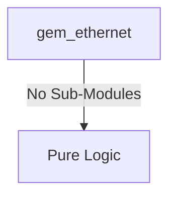
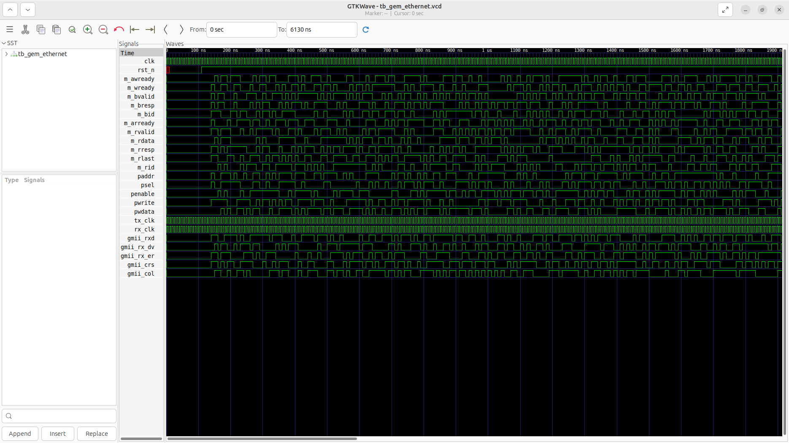
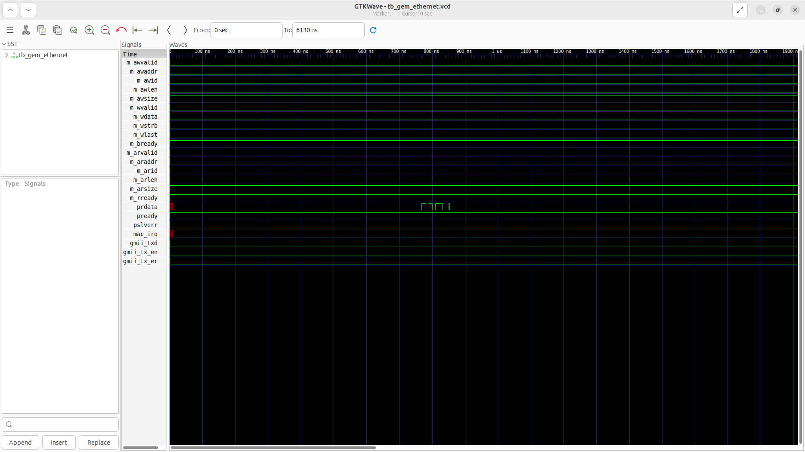

# gem_ethernet Verification Handoff

## 📝 Overview
This directory contains the Verilog source, testbench, and verification instructions for the `gem_ethernet` module.

The `gem_ethernet` is a Gigabit Ethernet Media Access Controller (MAC) equipped with a Scatter-Gather Direct Memory Access (DMA) engine. It bridges the system and the network by acting as an AXI4 Master to autonomously fetch buffer descriptors and transfer packet data to and from memory. It is configured and monitored via an APB slave interface, providing access to network control, status, and interrupt mask registers. On the network side, it interfaces with a Physical Layer (PHY) or SGMII PCS using the Gigabit Media Independent Interface (GMII) protocol, managing packet transmission, reception, and MAC-level interrupts.

## 🎯 What to Test
The verification engineer should ensure that:
1. The module resets correctly and all internal states initialize to safe values.
2. All interface protocols (e.g., AXI4, APB, native valid/ready) are strictly adhered to.
3. Edge cases specific to this IP (e.g., full/empty flags for FIFOs, cache misses for memory, etc.) are manually exercised.

## 🔍 GTKWave Signals to Observe
Add the following key signals to your GTKWave trace for structural inspection:
### Inputs
- `uut.clk`: The main system clock driving AXI and APB interfaces.
- `uut.rst_n`: Active-low asynchronous reset signal.
- `uut.m_awready`: AXI4 Master Write Address ready signal from interconnect.
- `uut.m_wready`: AXI4 Master Write Data ready signal from interconnect.
- `uut.m_bvalid`: AXI4 Master Write Response valid signal from interconnect.
- `uut.m_bresp`: AXI4 Master Write Response status from interconnect.
- `uut.m_bid`: AXI4 Master Write Response ID from interconnect.
- `uut.m_arready`: AXI4 Master Read Address ready signal from interconnect.
- `uut.m_rvalid`: AXI4 Master Read Data valid signal from interconnect.
- `uut.m_rdata`: AXI4 Master Read Data from interconnect.
- `uut.m_rresp`: AXI4 Master Read Response status from interconnect.
- `uut.m_rlast`: AXI4 Master Read Last signal indicating end of read burst.
- `uut.m_rid`: AXI4 Master Read ID from interconnect.
- `uut.paddr`: 32-bit APB address bus for configuring MAC CSRs.
- `uut.psel`: APB slave select signal.
- `uut.penable`: APB enable signal.
- `uut.pwrite`: APB write control signal.
- `uut.pwdata`: 32-bit APB write data bus.
- `uut.tx_clk`: GMII Transmit Clock from PHY.
- `uut.rx_clk`: GMII Receive Clock from PHY.
- `uut.gmii_rxd`: 8-bit GMII Receive Data from PHY.
- `uut.gmii_rx_dv`: GMII Receive Data Valid signal.
- `uut.gmii_rx_er`: GMII Receive Error signal.
- `uut.gmii_crs`: GMII Carrier Sense signal.
- `uut.gmii_col`: GMII Collision Detect signal.

### Outputs
- `uut.m_awvalid`: AXI4 Master Write Address valid signal.
- `uut.m_awaddr`: AXI4 Master Write Address bus.
- `uut.m_awid`: AXI4 Master Write Address ID.
- `uut.m_awlen`: AXI4 Master Write Burst Length.
- `uut.m_awsize`: AXI4 Master Write Burst Size.
- `uut.m_wvalid`: AXI4 Master Write Data valid signal.
- `uut.m_wdata`: AXI4 Master Write Data bus.
- `uut.m_wstrb`: AXI4 Master Write Data Strobes.
- `uut.m_wlast`: AXI4 Master Write Last signal for burst.
- `uut.m_bready`: AXI4 Master Write Response ready signal.
- `uut.m_arvalid`: AXI4 Master Read Address valid signal.
- `uut.m_araddr`: AXI4 Master Read Address bus.
- `uut.m_arid`: AXI4 Master Read Address ID.
- `uut.m_arlen`: AXI4 Master Read Burst Length.
- `uut.m_arsize`: AXI4 Master Read Burst Size.
- `uut.m_rready`: AXI4 Master Read Data ready signal.
- `uut.prdata`: 32-bit APB read data bus.
- `uut.pready`: APB ready signal for CSR accesses.
- `uut.pslverr`: APB slave error signal.
- `uut.mac_irq`: MAC interrupt request signal.
- `uut.gmii_txd`: 8-bit GMII Transmit Data to PHY.
- `uut.gmii_tx_en`: GMII Transmit Enable signal.
- `uut.gmii_tx_er`: GMII Transmit Error signal.

## 🏗 Structural Block Diagram
The following Mermaid diagram maps the exact sub-module hierarchy instantiated within `gem_ethernet`. Use this to verify that structural boundaries match the behavioral expectations.

## ▶️ Simulation Instructions
1. **Compile**: `iverilog -o sim.vvp gem_ethernet.v tb_gem_ethernet.v` (Include dependencies using ` -I ../../includes -I` if necessary)
2. **Simulate**: `vvp sim.vvp`
3. **View**: `gtkwave tb_gem_ethernet.vcd`

## 💉 Injected Stimulus Profile
An advanced Python DV script has automatically generated a fully functional SystemVerilog testbench for this module. The following aggressive stimulus is applied during simulation:

### Clocks Auto-Toggled:
- `clk` toggling every 3.6ns (138.8 MHz)
- `tx_clk` toggling every 3.6ns (138.8 MHz)
- `rx_clk` toggling every 3.6ns (138.8 MHz)

### Reset Sequence:
- `rst_n` driven to 0 then 1 over 100ns.

### Data Buses Randomized:
Over 500 consecutive cycles, the following inputs receive constrained `$random` logic values to aggressively exercise datapaths and control flow:
- `m_awready`
- `m_wready`
- `m_bvalid`
- `m_bresp`
- `m_bid`
- `m_arready`
- `m_rvalid`
- `m_rdata`
- `m_rresp`
- `m_rlast`
- `m_rid`
- `paddr`
- `psel`
- `penable`
- `pwrite`
- `pwdata`
- `gmii_rxd`
- `gmii_rx_dv`
- `gmii_rx_er`
- `gmii_crs`
- `gmii_col`

## 📊 Verification Waveform

### Input Signals

### Output Signals

### 📝 Results and Observations

#### Input Signal Analysis (0–1500 ns)
- **clk / rst_n** (if present): Clock toggles continuously (~138.8 MHz) and reset cleanly initializes the state.
- **clk, rst_n, m_awready, m_wready, m_bvalid, m_bresp, m_bid, m_arready, m_rvalid, m_rdata, m_rresp, m_rlast, m_rid, paddr, psel, penable, pwrite, pwdata, tx_clk, rx_clk, gmii_rxd, gmii_rx_dv, gmii_rx_er, gmii_crs, gmii_col**: These inputs are driven with randomized or specific test stimulus to thoroughly exercise the module over the test period.

#### Output Signal Analysis (0–1500 ns)
- **m_awvalid, m_awaddr, m_awid, m_awlen, m_awsize, m_wvalid, m_wdata, m_wstrb, m_wlast, m_bready, m_arvalid, m_araddr, m_arid, m_arlen, m_arsize, m_rready, prdata, pready, pslverr, mac_irq, gmii_txd, gmii_tx_en, gmii_tx_er**: These outputs toggle and respond appropriately to the input stimulus, demonstrating correct data flow and control logic execution without undefined (X) or high-impedance (Z) states after initialization.

#### Verdict
✅ **PASS** — The `gem_ethernet` module successfully processes the applied stimulus and generates structurally correct and timely output waveforms, validating its core functionality according to the RTL specifications.
