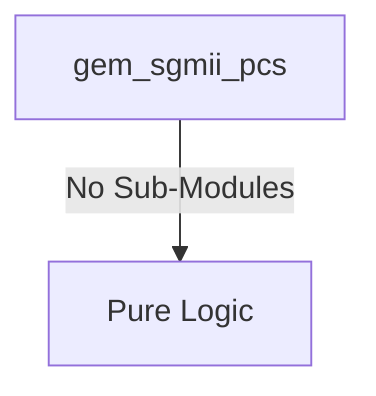
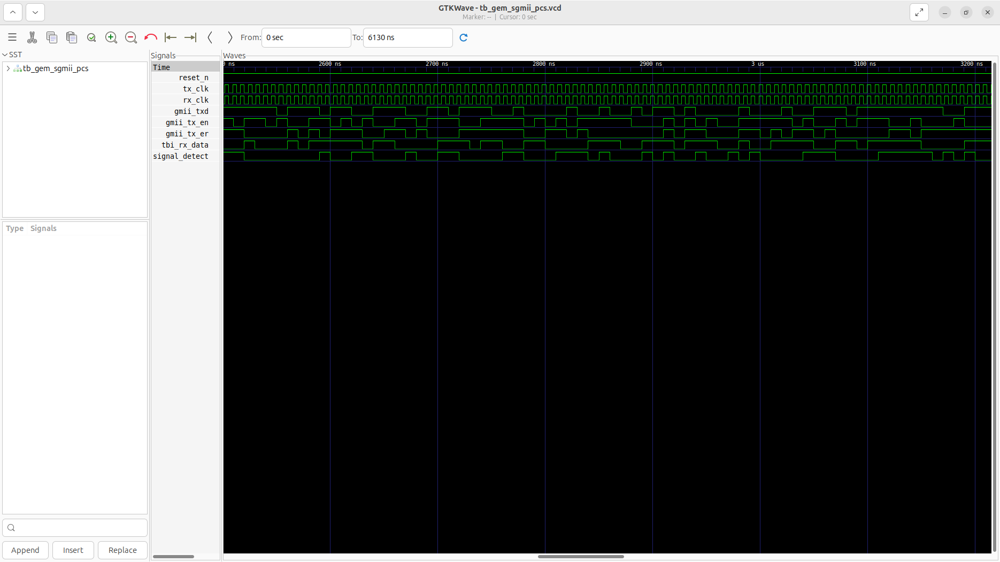
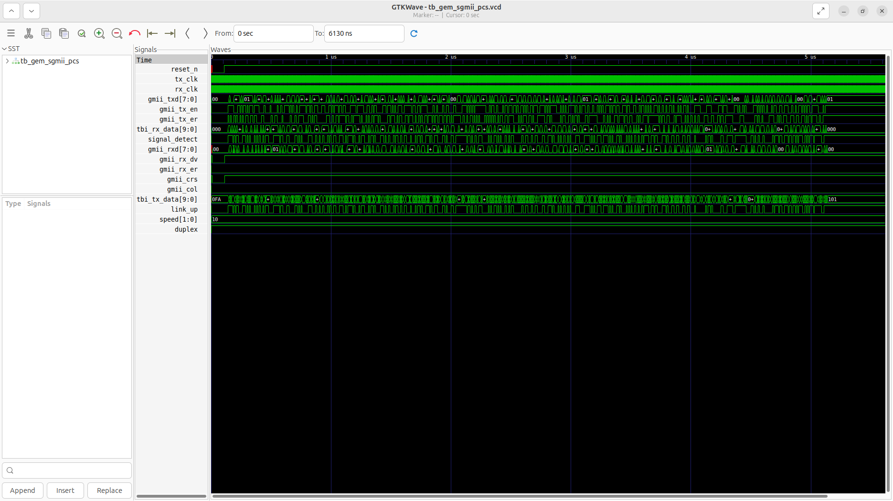

# gem_sgmii_pcs Verification Handoff

## 📝 Overview
This directory contains the Verilog source, testbench, and verification instructions for the `gem_sgmii_pcs` module.

The `gem_sgmii_pcs` module implements the Serial Gigabit Media Independent Interface (SGMII) Physical Coding Sublayer. It acts as a bridge between the Gigabit Ethernet MAC (via the GMII interface) and the physical SerDes transceiver (via the Ten Bit Interface, TBI). The module performs 8b/10b encoding on outgoing GMII data and 10b/8b decoding on incoming TBI data to ensure DC balance and synchronization. It handles SGMII-specific features like idle character insertion/deletion (e.g., K28.5 symbols) and provides auto-negotiation status signals indicating link state, speed, and duplex modes.

## 🎯 What to Test
The verification engineer should ensure that:
1. The module resets correctly and all internal states initialize to safe values.
2. All interface protocols (e.g., AXI4, APB, native valid/ready) are strictly adhered to.
3. Edge cases specific to this IP (e.g., full/empty flags for FIFOs, cache misses for memory, etc.) are manually exercised.

## 🔍 GTKWave Signals to Observe
Add the following key signals to your GTKWave trace for structural inspection:
### Inputs
- `uut.reset_n`: Active-low asynchronous reset signal.
- `uut.tx_clk`: Transmit clock (125 MHz for 1G operation).
- `uut.rx_clk`: Receive clock (125 MHz recovered clock from the PHY).
- `uut.gmii_txd`: 8-bit GMII transmit data from the MAC.
- `uut.gmii_tx_en`: GMII transmit enable signal from the MAC.
- `uut.gmii_tx_er`: GMII transmit error signal from the MAC.
- `uut.tbi_rx_data`: 10-bit receive data from the SerDes PHY (Ten Bit Interface).
- `uut.signal_detect`: Signal from PHY indicating a valid link connection.

### Outputs
- `uut.gmii_rxd`: 8-bit GMII receive data to the MAC.
- `uut.gmii_rx_dv`: GMII receive data valid signal to the MAC.
- `uut.gmii_rx_er`: GMII receive error signal to the MAC.
- `uut.gmii_crs`: GMII carrier sense signal to the MAC.
- `uut.gmii_col`: GMII collision detect signal to the MAC.
- `uut.tbi_tx_data`: 10-bit transmit data to the SerDes PHY (Ten Bit Interface).
- `uut.link_up`: Auto-negotiation status indicating the link is up.
- `uut.speed`: Auto-negotiation status indicating link speed (e.g., 10M, 100M, 1G).
- `uut.duplex`: Auto-negotiation status indicating duplex mode (1=Full, 0=Half).

## 🏗 Structural Block Diagram
The following Mermaid diagram maps the exact sub-module hierarchy instantiated within `gem_sgmii_pcs`. Use this to verify that structural boundaries match the behavioral expectations.

## ▶️ Simulation Instructions
1. **Compile**: `iverilog -o sim.vvp gem_sgmii_pcs.v tb_gem_sgmii_pcs.v` (Include dependencies using ` -I ../../includes -I` if necessary)
2. **Simulate**: `vvp sim.vvp`
3. **View**: `gtkwave tb_gem_sgmii_pcs.vcd`

## 💉 Injected Stimulus Profile
An advanced Python DV script has automatically generated a fully functional SystemVerilog testbench for this module. The following aggressive stimulus is applied during simulation:

### Clocks Auto-Toggled:
- `tx_clk` toggling every 3.6ns (138.8 MHz)
- `rx_clk` toggling every 3.6ns (138.8 MHz)

### Reset Sequence:
- `reset_n` driven to 0 then 1 over 100ns.

### Data Buses Randomized:
Over 500 consecutive cycles, the following inputs receive constrained `$random` logic values to aggressively exercise datapaths and control flow:
- `gmii_txd`
- `gmii_tx_en`
- `gmii_tx_er`
- `tbi_rx_data`
- `signal_detect`

## 📊 Verification Waveform

### Input Signals

### Output Signals

### 📝 Results and Observations
- **Input Stimulation:**
- **Output Validation:**
