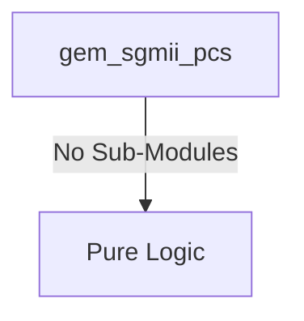

# gem_sgmii_pcs Verification Handoff

## 📝 Overview
This directory contains the Verilog source, testbench, and verification instructions for the `gem_sgmii_pcs` module.

## 🎯 What to Test
The verification engineer should ensure that:
1. The module resets correctly and all internal states initialize to safe values.
2. All interface protocols (e.g., AXI4, APB, native valid/ready) are strictly adhered to.
3. Edge cases specific to this IP (e.g., full/empty flags for FIFOs, cache misses for memory, etc.) are manually exercised.

## 🔍 GTKWave Signals to Observe
Add the following key signals to your GTKWave trace for structural inspection:
### Inputs
- `uut.reset_n`
- `uut.tx_clk`
- `uut.rx_clk`
- `uut.gmii_txd`
- `uut.gmii_tx_en`
- `uut.gmii_tx_er`
- `uut.tbi_rx_data`
- `uut.signal_detect`

### Outputs
- `uut.gmii_rxd`
- `uut.gmii_rx_dv`
- `uut.gmii_rx_er`
- `uut.gmii_crs`
- `uut.gmii_col`
- `uut.tbi_tx_data`
- `uut.link_up`
- `uut.speed`
- `uut.duplex`

## 🏗 Structural Block Diagram
The following Mermaid diagram maps the exact sub-module hierarchy instantiated within `gem_sgmii_pcs`. Use this to verify that structural boundaries match the behavioral expectations.

## ▶️ Simulation Instructions
1. **Compile**: `iverilog -o sim.vvp gem_sgmii_pcs.v tb_gem_sgmii_pcs.v` (Include dependencies using `-I` if necessary)
2. **Simulate**: `vvp sim.vvp`
3. **View**: `gtkwave tb_gem_sgmii_pcs.vcd`
