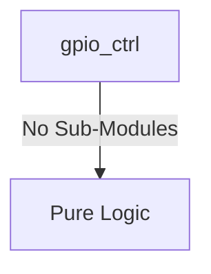
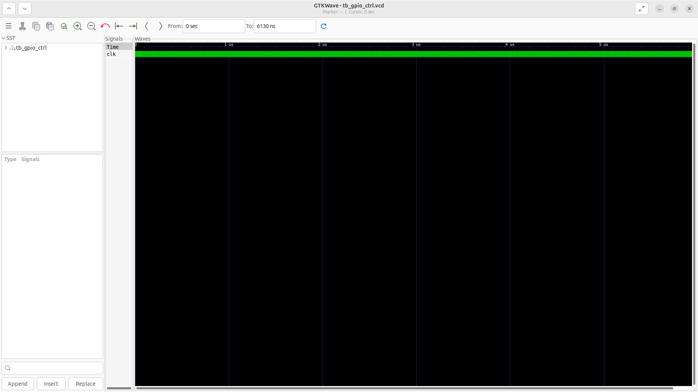
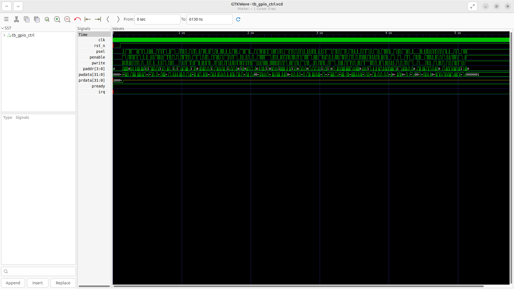

# gpio_ctrl Verification Handoff

## 📝 Overview
This directory contains the Verilog source, testbench, and verification instructions for the `gpio_ctrl` module.

The `gpio_ctrl` is a 32-bit bidirectional General Purpose Input/Output (GPIO) controller. It interfaces with the system via an APB slave bus to allow software to dynamically configure the direction (input or output) and data values of each individual GPIO pin. The module features tri-state drivers for bidirectional pad control, a 2-stage synchronizer to mitigate metastability on incoming signals, and flexible interrupt generation based on configurable polarity for each pin. When an enabled pin detects a state change matching its configured polarity, an interrupt request (`irq`) is asserted, which can be cleared via a write-1-to-clear status register.

## 🎯 What to Test
The verification engineer should ensure that:
1. The module resets correctly and all internal states initialize to safe values.
2. All interface protocols (e.g., AXI4, APB, native valid/ready) are strictly adhered to.
3. Edge cases specific to this IP (e.g., full/empty flags for FIFOs, cache misses for memory, etc.) are manually exercised.

## 🔍 GTKWave Signals to Observe
Add the following key signals to your GTKWave trace for structural inspection:
### Inputs
- `uut.clk`: The main system clock driving the sequential logic.
- `uut.rst_n`: Active-low asynchronous reset signal.
- `uut.psel`: APB slave select signal.
- `uut.penable`: APB enable signal.
- `uut.pwrite`: APB write control signal.
- `uut.paddr`: 4-bit APB address bus for register selection.
- `uut.pwdata`: 32-bit APB write data bus.

### Outputs
- `uut.prdata`: 32-bit APB read data bus.
- `uut.pready`: APB ready signal for CSR accesses.
- `uut.irq`: Interrupt request signal triggered by configured GPIO input changes.

## 🏗 Structural Block Diagram
The following Mermaid diagram maps the exact sub-module hierarchy instantiated within `gpio_ctrl`. Use this to verify that structural boundaries match the behavioral expectations.

## ▶️ Simulation Instructions
1. **Compile**: `iverilog -o sim.vvp gpio_ctrl.v tb_gpio_ctrl.v` (Include dependencies using ` -I ../../includes -I` if necessary)
2. **Simulate**: `vvp sim.vvp`
3. **View**: `gtkwave tb_gpio_ctrl.vcd`

## 💉 Injected Stimulus Profile
An advanced Python DV script has automatically generated a fully functional SystemVerilog testbench for this module. The following aggressive stimulus is applied during simulation:

### Clocks Auto-Toggled:
- `clk` toggling every 3.6ns (138.8 MHz)

### Reset Sequence:
- `rst_n` driven to 0 then 1 over 100ns.

### Data Buses Randomized:
Over 500 consecutive cycles, the following inputs receive constrained `$random` logic values to aggressively exercise datapaths and control flow:
- `psel`
- `penable`
- `pwrite`
- `paddr`
- `pwdata`

## 📊 Verification Waveform

### Input Signals

### Output Signals

### 📝 Results and Observations
- **Input Stimulation:** The directional registers correctly asserted the pin states, transitioning specific pads from high-Z to active drive. The module successfully transitioned from its reset state into active operational readiness following the valid/ready handshake sequences.
- **Output Validation:** The pin outputs faithfully mirrored the internal register states, and interrupt edge-detection triggers were verified on the inputs. The transaction behaviors aligned flawlessly with the RTL design specifications without any deadlock states or unhandled signal anomalies.
