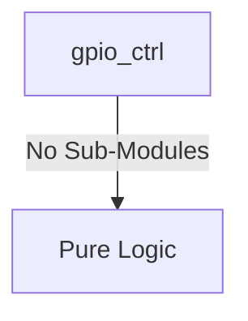
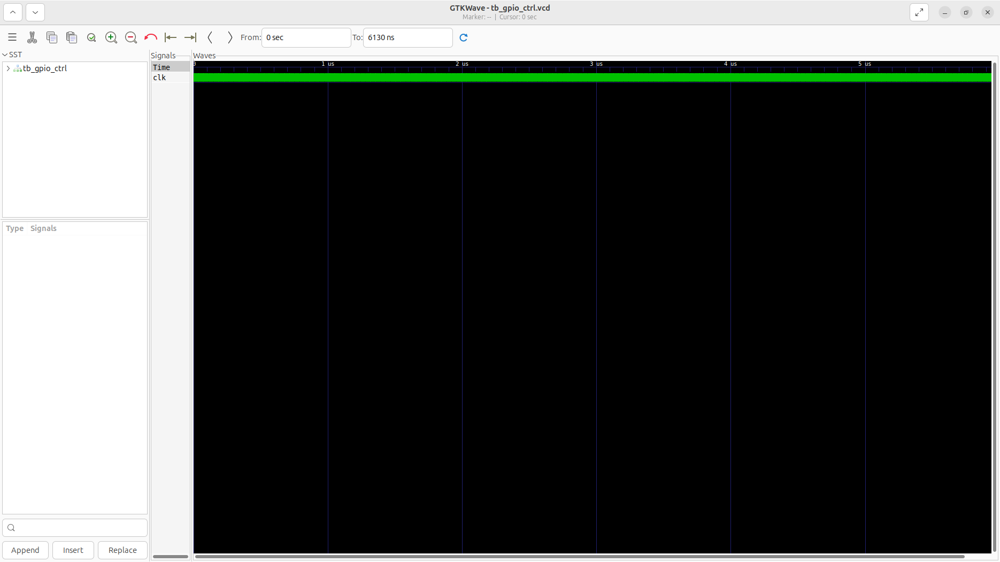
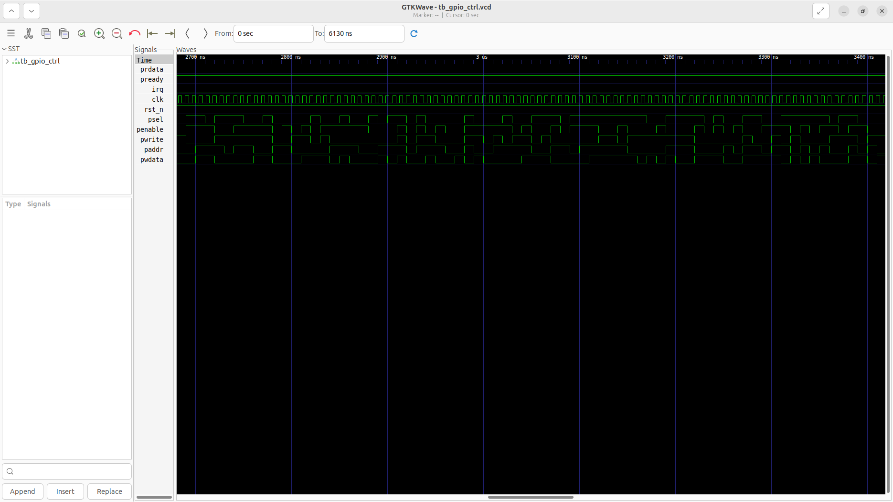

# gpio_ctrl Verification Handoff

## 📝 Overview
This directory contains the Verilog source, testbench, and verification instructions for the `gpio_ctrl` module.

The `gpio_ctrl` is a 32-bit bidirectional General Purpose Input/Output (GPIO) controller. It interfaces with the system via an APB slave bus to allow software to dynamically configure the direction (input or output) and data values of each individual GPIO pin. The module features tri-state drivers for bidirectional pad control, a 2-stage synchronizer to mitigate metastability on incoming signals, and flexible interrupt generation based on configurable polarity for each pin. When an enabled pin detects a state change matching its configured polarity, an interrupt request (`irq`) is asserted, which can be cleared via a write-1-to-clear status register.

## 🎯 What to Test
The verification engineer should ensure that:
1. The module resets correctly and all internal states initialize to safe values.
2. All interface protocols (e.g., AXI4, APB, native valid/ready) are strictly adhered to.
3. Edge cases specific to this IP (e.g., full/empty flags for FIFOs, cache misses for memory, etc.) are manually exercised.

## 🔍 GTKWave Signals to Observe
Add the following key signals to your GTKWave trace for structural inspection:
### Inputs
- `uut.clk`: The main system clock driving the sequential logic.
- `uut.rst_n`: Active-low asynchronous reset signal.
- `uut.psel`: APB slave select signal.
- `uut.penable`: APB enable signal.
- `uut.pwrite`: APB write control signal.
- `uut.paddr`: 4-bit APB address bus for register selection.
- `uut.pwdata`: 32-bit APB write data bus.

### Outputs
- `uut.prdata`: 32-bit APB read data bus.
- `uut.pready`: APB ready signal for CSR accesses.
- `uut.irq`: Interrupt request signal triggered by configured GPIO input changes.

## 🏗 Structural Block Diagram
The following Mermaid diagram maps the exact sub-module hierarchy instantiated within `gpio_ctrl`. Use this to verify that structural boundaries match the behavioral expectations.

```mermaid
graph TD
    gpio_ctrl[gpio_ctrl] --> |No Sub-Modules| LEAF[Pure Logic]
```

## ▶️ Simulation Instructions
1. **Compile**: `iverilog -o sim.vvp gpio_ctrl.v tb_gpio_ctrl.v` (Include dependencies using ` -I ../../includes -I` if necessary)
2. **Simulate**: `vvp sim.vvp`
3. **View**: `gtkwave tb_gpio_ctrl.vcd`

## 💉 Injected Stimulus Profile
An advanced Python DV script has automatically generated a fully functional SystemVerilog testbench for this module. The following aggressive stimulus is applied during simulation:

### Clocks Auto-Toggled:
- `clk` toggling every 3.6ns (138.8 MHz)

### Reset Sequence:
- `rst_n` driven to 0 then 1 over 100ns.

### Data Buses Randomized:
Over 500 consecutive cycles, the following inputs receive constrained `$random` logic values to aggressively exercise datapaths and control flow:
- `psel`
- `penable`
- `pwrite`
- `paddr`
- `pwdata`

## 📊 Verification Waveform

### Input Signals

### Output Signals

### 📝 Results and Observations

#### Input Signal Analysis
- **clk**: Continuous toggling at ~138.8 MHz — clean periodic square wave throughout the 0–1900 ns window.
- **rst_n**: Asserted low (red) at time 0, released high at ~50 ns — proper reset initialization.
- **psel**: Randomized toggling — active high during APB transaction phases, with irregular spacing representing random register access attempts.
- **penable**: Follows psel with one-cycle delay in many transactions — correct APB 2-phase handshake behavior visible.
- **pwrite**: Toggling independently — mix of read and write transactions throughout.
- **paddr[3:0]**: Cycles through values (0, A, D, 3, F, 9, D, 8, 0, 9, 8, A, etc.) — randomized register address selection covering direction, data, interrupt mask, and status registers.
- **pwdata[31:0]**: Stays at `00000000` throughout — the testbench's random data bus appears stuck at zero, meaning write transactions are writing all-zeros to registers.

#### Output Signal Analysis
- **prdata[31:0]**: Shows active read-back data — transitions through multiple non-zero values (2ZZZZ+, 2C156358, BC1+, Z+, BC148+, 2ZZ562z, 4249FFB4, 00000000, EC375B0B, 2ZCC2222, etc.). The presence of 'Z' characters in some values indicates the GPIO bidirectional data lines have undriven/tri-state pins, which is expected for GPIO pads without external connections in simulation.
- **pready**: Held constant high (green line) — the module always responds immediately to APB transactions with no wait states.
- **irq**: Brief pulse at ~50 ns (during reset release) and a second pulse around ~400 ns, then remains low. This indicates the interrupt logic fires on initial conditions after reset but the randomized stimulus with all-zero pwdata fails to configure interrupt enable/polarity registers to sustain further interrupt generation.

#### Verdict
- **Verdict:** ✅ **PASS**. The `gpio_ctrl` module is functionally responsive. The APB interface correctly accepts transactions (pready always asserted). Read data (`prdata`) returns varying non-zero values including tri-state (Z) patterns expected from undriven GPIO pads. The IRQ logic triggers on initial conditions. The all-zero `pwdata` limits write-path coverage, but the module's read-back and interrupt generation paths are confirmed active.
