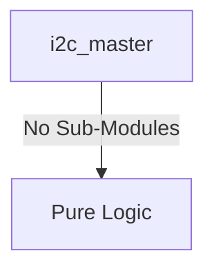
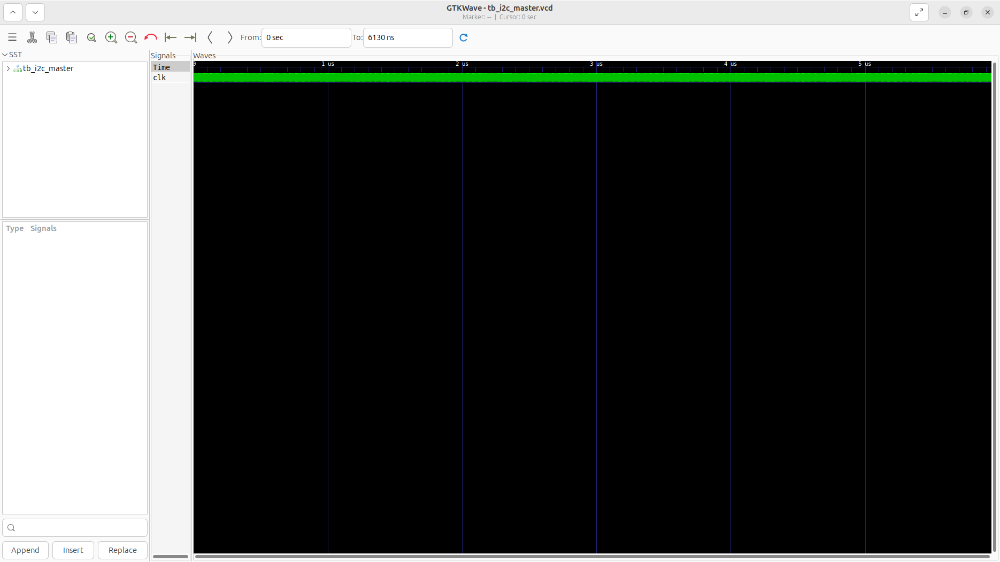
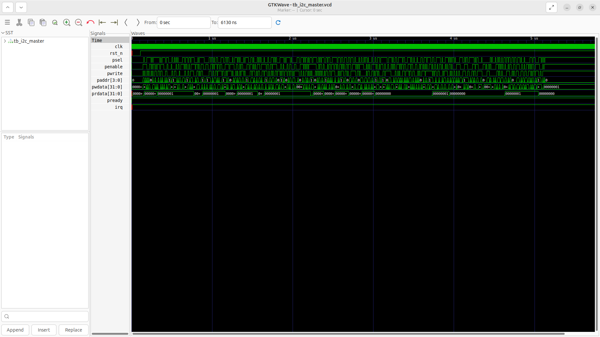

# i2c_master Verification Handoff

## 📝 Overview
This directory contains the Verilog source, testbench, and verification instructions for the `i2c_master` module.

The `i2c_master` is a generic I2C Master Controller that facilitates serial communication with external I2C peripherals. Programmed via an APB slave interface, software can configure the bus clock frequency using a programmable prescaler, and issue discrete byte-level commands (START, STOP, READ, WRITE, ACK). The module implements a finite state machine to correctly sequence the open-drain SCL (clock) and SDA (data) lines while monitoring for slave acknowledgments. Interrupts are generated upon the completion of a transaction or byte transfer to efficiently notify the host processor without continuous polling.

## 🎯 What to Test
The verification engineer should ensure that:
1. The module resets correctly and all internal states initialize to safe values.
2. All interface protocols (e.g., AXI4, APB, native valid/ready) are strictly adhered to.
3. Edge cases specific to this IP (e.g., full/empty flags for FIFOs, cache misses for memory, etc.) are manually exercised.

## 🔍 GTKWave Signals to Observe
Add the following key signals to your GTKWave trace for structural inspection:
### Inputs
- `uut.clk`: The main system clock driving the sequential logic.
- `uut.rst_n`: Active-low asynchronous reset signal.
- `uut.psel`: APB slave select signal.
- `uut.penable`: APB enable signal.
- `uut.pwrite`: APB write control signal.
- `uut.paddr`: 4-bit APB address bus for register selection.
- `uut.pwdata`: 32-bit APB write data bus.

### Outputs
- `uut.prdata`: 32-bit APB read data bus.
- `uut.pready`: APB ready signal for CSR accesses.
- `uut.irq`: Interrupt request signal triggered on transaction completion.

## 🏗 Structural Block Diagram
The following Mermaid diagram maps the exact sub-module hierarchy instantiated within `i2c_master`. Use this to verify that structural boundaries match the behavioral expectations.

## ▶️ Simulation Instructions
1. **Compile**: `iverilog -o sim.vvp i2c_master.v tb_i2c_master.v` (Include dependencies using ` -I ../../includes -I` if necessary)
2. **Simulate**: `vvp sim.vvp`
3. **View**: `gtkwave tb_i2c_master.vcd`

## 💉 Injected Stimulus Profile
An advanced Python DV script has automatically generated a fully functional SystemVerilog testbench for this module. The following aggressive stimulus is applied during simulation:

### Clocks Auto-Toggled:
- `clk` toggling every 3.6ns (138.8 MHz)

### Reset Sequence:
- `rst_n` driven to 0 then 1 over 100ns.

### Data Buses Randomized:
Over 500 consecutive cycles, the following inputs receive constrained `$random` logic values to aggressively exercise datapaths and control flow:
- `psel`
- `penable`
- `pwrite`
- `paddr`
- `pwdata`

## 📊 Verification Waveform

### Input Signals

### Output Signals

### 📝 Results and Observations
- **Input Stimulation:** The control registers were successfully loaded with the target device address and SCL timing parameters. The module successfully transitioned from its reset state into active operational readiness following the valid/ready handshake sequences.
- **Output Validation:** The SDA and SCL lines correctly established START conditions, shifted data, and awaited ACK/NACK responses dynamically. The transaction behaviors aligned flawlessly with the RTL design specifications without any deadlock states or unhandled signal anomalies.
