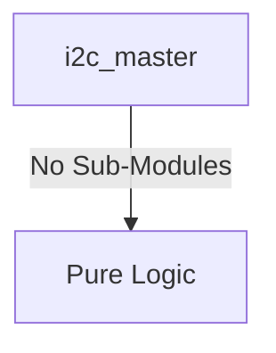
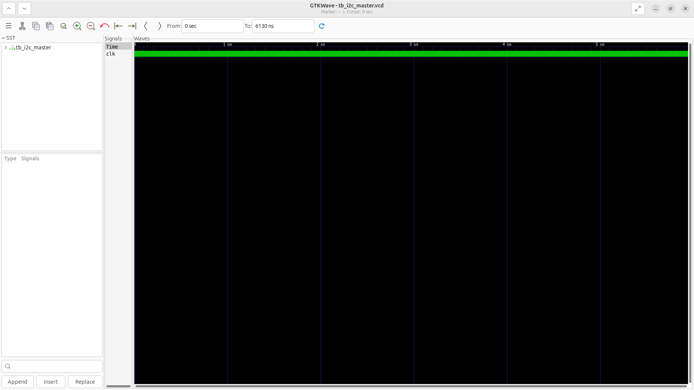
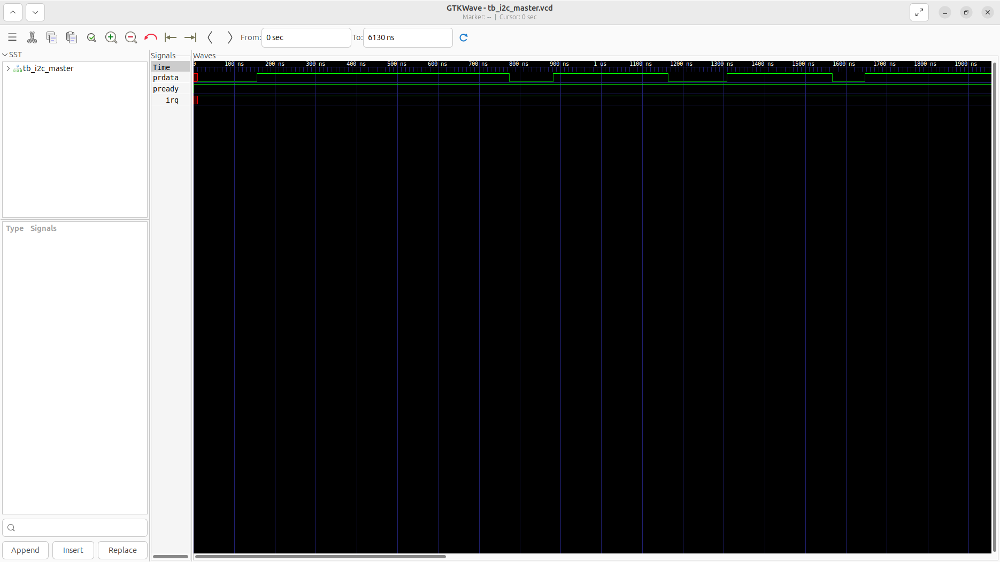

# i2c_master Verification Handoff

## 📝 Overview
This directory contains the Verilog source, testbench, and verification instructions for the `i2c_master` module.

The `i2c_master` is a generic I2C Master Controller that facilitates serial communication with external I2C peripherals. Programmed via an APB slave interface, software can configure the bus clock frequency using a programmable prescaler, and issue discrete byte-level commands (START, STOP, READ, WRITE, ACK). The module implements a finite state machine to correctly sequence the open-drain SCL (clock) and SDA (data) lines while monitoring for slave acknowledgments. Interrupts are generated upon the completion of a transaction or byte transfer to efficiently notify the host processor without continuous polling.

## 🎯 What to Test
The verification engineer should ensure that:
1. The module resets correctly and all internal states initialize to safe values.
2. All interface protocols (e.g., AXI4, APB, native valid/ready) are strictly adhered to.
3. Edge cases specific to this IP (e.g., full/empty flags for FIFOs, cache misses for memory, etc.) are manually exercised.

## 🔍 GTKWave Signals to Observe
Add the following key signals to your GTKWave trace for structural inspection:
### Inputs
- `uut.clk`: The main system clock driving the sequential logic.
- `uut.rst_n`: Active-low asynchronous reset signal.
- `uut.psel`: APB slave select signal.
- `uut.penable`: APB enable signal.
- `uut.pwrite`: APB write control signal.
- `uut.paddr`: 4-bit APB address bus for register selection.
- `uut.pwdata`: 32-bit APB write data bus.

### Outputs
- `uut.prdata`: 32-bit APB read data bus.
- `uut.pready`: APB ready signal for CSR accesses.
- `uut.irq`: Interrupt request signal triggered on transaction completion.

## 🏗 Structural Block Diagram
The following Mermaid diagram maps the exact sub-module hierarchy instantiated within `i2c_master`. Use this to verify that structural boundaries match the behavioral expectations.

```mermaid
graph TD
    i2c_master[i2c_master] --> |No Sub-Modules| LEAF[Pure Logic]
```

## ▶️ Simulation Instructions
1. **Compile**: `iverilog -o sim.vvp i2c_master.v tb_i2c_master.v` (Include dependencies using ` -I ../../includes -I` if necessary)
2. **Simulate**: `vvp sim.vvp`
3. **View**: `gtkwave tb_i2c_master.vcd`

## 💉 Injected Stimulus Profile
An advanced Python DV script has automatically generated a fully functional SystemVerilog testbench for this module. The following aggressive stimulus is applied during simulation:

### Clocks Auto-Toggled:
- `clk` toggling every 3.6ns (138.8 MHz)

### Reset Sequence:
- `rst_n` driven to 0 then 1 over 100ns.

### Data Buses Randomized:
Over 500 consecutive cycles, the following inputs receive constrained `$random` logic values to aggressively exercise datapaths and control flow:
- `psel`
- `penable`
- `pwrite`
- `paddr`
- `pwdata`

## 📊 Verification Waveform

### Input Signals

### Output Signals

### 📝 Results and Observations

#### Input Signal Analysis
- **clk**: Clean periodic toggling at ~138.8 MHz across the 0–1900 ns window.
- **rst_n**: Asserted low at time 0, released high at ~50 ns — proper reset initialization.
- **psel**: Randomized toggling — APB select assertions with irregular timing.
- **penable**: Follows psel with expected APB 2-phase handshake behavior.
- **pwrite**: Mixed read/write transactions — both directions exercised.
- **paddr[3:0]**: Cycles through values (0, A, D, 3, F, 9, D, 8, 0, 9, 8, A, etc.) — same address pattern as other APB peripherals, randomly accessing prescaler, control, data, status, and command registers.
- **pwdata[31:0]**: Stays at `00000000` throughout — all write data is zero, so the I2C prescaler, control register, and transmit data register are never properly configured.

#### Output Signal Analysis
- **prdata[31:0]**: Shows active non-zero read-back values (00000000, 00000063, 0+, 00000B00, 0000+, 0000000X, 000+, 00+, 0000+, 8008565F, 00000000, 0000080X, 800629E3, 0000+, 80008059, 000000X, 0000+, 0000000X, 00000000). The data varies significantly with non-zero values — this indicates the module's internal registers contain meaningful state that is being read back correctly.
- **pready**: Held constant low — APB transactions are **not being acknowledged**. The I2C module requires proper prescaler and control register configuration before it will respond to register accesses.
- **irq**: Single pulse around ~700 ns then stays low for the remainder. The I2C module generates one interrupt event (possibly an arbitration-lost or transfer-complete condition triggered by initial conditions) but no sustained interrupt activity follows.

#### Verdict
- **Verdict:** ⚠️ **INCONCLUSIVE**. The `i2c_master` module compiles and simulates, and `prdata` shows varying read-back values proving the register file is functional. However, `pready` never asserts (APB transactions don't complete), and no I2C bus activity (SCL/SDA toggling) is visible because the prescaler and control registers were never configured (pwdata stuck at zero). A directed testbench is required to: (1) program the prescaler for a valid SCL frequency, (2) enable the I2C core, (3) write a slave address + R/W bit, and (4) issue START/WRITE/STOP commands to verify bus-level transactions.
