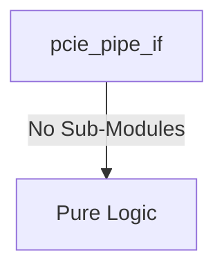

# pcie_pipe_if Verification Handoff

## 📝 Overview
This directory contains the Verilog source, testbench, and verification instructions for the `pcie_pipe_if` module.

## 🎯 What to Test
The verification engineer should ensure that:
1. The module resets correctly and all internal states initialize to safe values.
2. All interface protocols (e.g., AXI4, APB, native valid/ready) are strictly adhered to.
3. Edge cases specific to this IP (e.g., full/empty flags for FIFOs, cache misses for memory, etc.) are manually exercised.

## 🔍 GTKWave Signals to Observe
Add the following key signals to your GTKWave trace for structural inspection:
### Inputs
- `uut.pclk`
- `uut.reset_n`
- `uut.tx_data`
- `uut.tx_datak`
- `uut.tx_rate`
- `uut.power_down`
- `uut.tx_elecidle`
- `uut.tx_compliance`
- `uut.rx_polarity`
- `uut.pipe_rx_data`
- `uut.pipe_rx_datak`
- `uut.pipe_rx_valid`
- `uut.pipe_rx_elecidle`
- `uut.pipe_rx_status`
- `uut.pipe_phy_status`

### Outputs
- `uut.rx_data`
- `uut.rx_datak`
- `uut.rx_valid`
- `uut.rx_elecidle`
- `uut.rx_status`
- `uut.pipe_tx_data`
- `uut.pipe_tx_datak`
- `uut.pipe_tx_rate`
- `uut.pipe_tx_elecidle`
- `uut.pipe_tx_compliance`
- `uut.pipe_rx_polarity`
- `uut.pipe_power_down`

## 🏗 Structural Block Diagram
The following Mermaid diagram maps the exact sub-module hierarchy instantiated within `pcie_pipe_if`. Use this to verify that structural boundaries match the behavioral expectations.

## ▶️ Simulation Instructions
1. **Compile**: `iverilog -o sim.vvp pcie_pipe_if.v tb_pcie_pipe_if.v` (Include dependencies using ` -I ../../includes -I` if necessary)
2. **Simulate**: `vvp sim.vvp`
3. **View**: `gtkwave tb_pcie_pipe_if.vcd`
