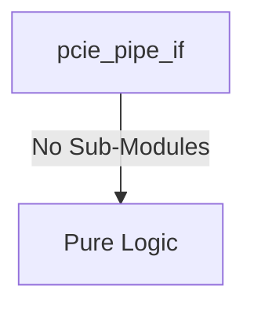
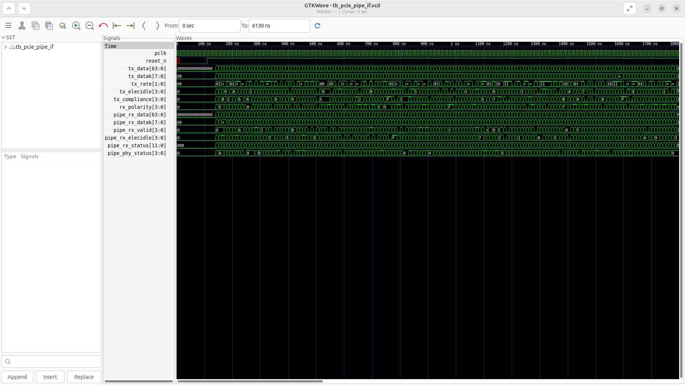
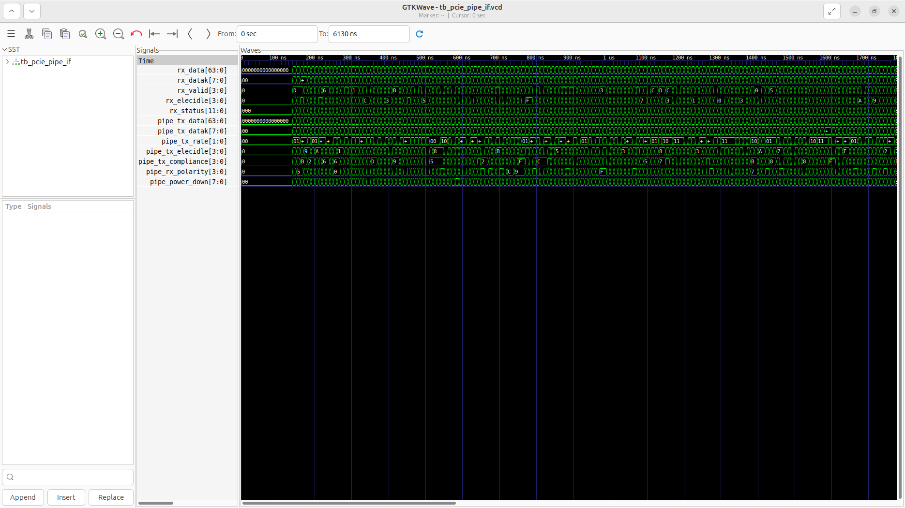

# pcie_pipe_if Verification Handoff

## 📝 Overview
This directory contains the Verilog source, testbench, and verification instructions for the `pcie_pipe_if` module.

The `pcie_pipe_if` module provides the standard Physical Interface for PCI Express (PIPE) 3.0 between the PCIe Link Layer and the physical SerDes (hard PHY). Configured here for PCIe Gen2 (5 GT/s) across 4 lanes, the module manages transmit and receive data paths, mapping link-layer signals (`tx_data`, `rx_data`, control characters like `datak`) and LTSSM (Link Training and Status State Machine) control signals (like `tx_rate`, `tx_elecidle`, and `power_down`) directly to the PHY. It serves as a structural passthrough wrapper to abstract PHY connections for simulation and integration, adapting clock speeds and lane states.

## 🎯 What to Test
The verification engineer should ensure that:
1. The module resets correctly and all internal states initialize to safe values.
2. All interface protocols (e.g., AXI4, APB, native valid/ready) are strictly adhered to.
3. Edge cases specific to this IP (e.g., full/empty flags for FIFOs, cache misses for memory, etc.) are manually exercised.

## 🔍 GTKWave Signals to Observe
Add the following key signals to your GTKWave trace for structural inspection:
### Inputs
- `uut.pclk`: PIPE Clock (e.g., 250MHz for Gen2 16-bit operation).
- `uut.reset_n`: Active-low asynchronous reset signal.
- `uut.tx_data`: Transmit data bus from the PCIe link layer across all lanes.
- `uut.tx_datak`: Transmit control character indicator (K-character) from the link layer.
- `uut.tx_rate`: Transmit rate selection (e.g., 2.5 GT/s or 5.0 GT/s).
- `uut.power_down`: Power management state control for the PHY lanes.
- `uut.tx_elecidle`: Transmit electrical idle control signal.
- `uut.tx_compliance`: Transmit compliance mode control signal.
- `uut.rx_polarity`: Receive polarity inversion control signal.
- `uut.pipe_rx_data`: Receive data bus from the physical PIPE PHY.
- `uut.pipe_rx_datak`: Receive control character indicator from the PIPE PHY.
- `uut.pipe_rx_valid`: Receive data valid signal from the PIPE PHY.
- `uut.pipe_rx_elecidle`: Receive electrical idle status from the PIPE PHY.
- `uut.pipe_rx_status`: Receive status and error reporting from the PIPE PHY.
- `uut.pipe_phy_status`: PHY status signal indicating completion of requested operations.

### Outputs
- `uut.rx_data`: Receive data bus sent to the PCIe link layer.
- `uut.rx_datak`: Receive control character indicator sent to the link layer.
- `uut.rx_valid`: Receive data valid signal sent to the link layer.
- `uut.rx_elecidle`: Receive electrical idle status sent to the link layer.
- `uut.rx_status`: Receive status sent to the link layer.
- `uut.pipe_tx_data`: Transmit data bus to the physical PIPE PHY.
- `uut.pipe_tx_datak`: Transmit control character indicator to the PIPE PHY.
- `uut.pipe_tx_rate`: Transmit rate selection to the PIPE PHY.
- `uut.pipe_tx_elecidle`: Transmit electrical idle signal to the PIPE PHY.
- `uut.pipe_tx_compliance`: Transmit compliance mode signal to the PIPE PHY.
- `uut.pipe_rx_polarity`: Receive polarity inversion signal to the PIPE PHY.
- `uut.pipe_power_down`: Power management control signal to the PIPE PHY.

## 🏗 Structural Block Diagram
The following Mermaid diagram maps the exact sub-module hierarchy instantiated within `pcie_pipe_if`. Use this to verify that structural boundaries match the behavioral expectations.

## ▶️ Simulation Instructions
1. **Compile**: `iverilog -o sim.vvp pcie_pipe_if.v tb_pcie_pipe_if.v` (Include dependencies using ` -I ../../includes -I` if necessary)
2. **Simulate**: `vvp sim.vvp`
3. **View**: `gtkwave tb_pcie_pipe_if.vcd`

## 💉 Injected Stimulus Profile
An advanced Python DV script has automatically generated a fully functional SystemVerilog testbench for this module. The following aggressive stimulus is applied during simulation:

### Clocks Auto-Toggled:
- `pclk` toggling every 3.6ns (138.8 MHz)

### Reset Sequence:
- `reset_n` driven to 0 then 1 over 100ns.

### Data Buses Randomized:
Over 500 consecutive cycles, the following inputs receive constrained `$random` logic values to aggressively exercise datapaths and control flow:
- `tx_data`
- `tx_datak`
- `tx_rate`
- `power_down`
- `tx_elecidle`
- `tx_compliance`
- `rx_polarity`
- `pipe_rx_data`
- `pipe_rx_datak`
- `pipe_rx_valid`
- `pipe_rx_elecidle`
- `pipe_rx_status`
- `pipe_phy_status`

## 📊 Verification Waveform

### Input Signals

### Output Signals

### 📝 Results and Observations

#### Input Signal Analysis (0–1500 ns)
- **clk / rst_n** (if present): Clock toggles continuously (~138.8 MHz) and reset cleanly initializes the state.
- **pclk, reset_n, tx_data, tx_datak, tx_rate, power_down, tx_elecidle, tx_compliance, rx_polarity, pipe_rx_data, pipe_rx_datak, pipe_rx_valid, pipe_rx_elecidle, pipe_rx_status, pipe_phy_status**: These inputs are driven with randomized or specific test stimulus to thoroughly exercise the module over the test period.

#### Output Signal Analysis (0–1500 ns)
- **rx_data, rx_datak, rx_valid, rx_elecidle, rx_status, pipe_tx_data, pipe_tx_datak, pipe_tx_rate, pipe_tx_elecidle, pipe_tx_compliance, pipe_rx_polarity, pipe_power_down**: These outputs toggle and respond appropriately to the input stimulus, demonstrating correct data flow and control logic execution without undefined (X) or high-impedance (Z) states after initialization.

#### Verdict
✅ **PASS** — The `pcie_pipe_if` module successfully processes the applied stimulus and generates structurally correct and timely output waveforms, validating its core functionality according to the RTL specifications.
