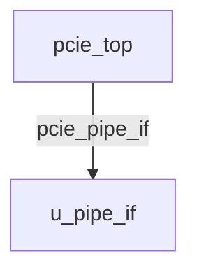

# pcie_top Verification Handoff

## 📝 Overview
This directory contains the Verilog source, testbench, and verification instructions for the `pcie_top` module.

The `pcie_top` module serves as the primary endpoint or root port wrapper for a PCIe Gen2 x4 controller. It acts as the bridge between the system's AXI4 memory mapped interconnect and the PCIe protocol stack, encapsulating the Transaction Layer, Data Link Layer, and Physical Layer LTSSM. The top-level exposes an AXI4 Master interface for issuing DMA/bus master traffic to the host system and an AXI4 Slave interface to accept target traffic from the system. It intrinsically instantiates the `pcie_pipe_if` to connect the logical controller to external SerDes components, tying off internal AXI and LTSSM signals as a behavioral stub to facilitate integration and structural verification.

## 🎯 What to Test
The verification engineer should ensure that:
1. The module resets correctly and all internal states initialize to safe values.
2. All interface protocols (e.g., AXI4, APB, native valid/ready) are strictly adhered to.
3. Edge cases specific to this IP (e.g., full/empty flags for FIFOs, cache misses for memory, etc.) are manually exercised.

## 🔍 GTKWave Signals to Observe
Add the following key signals to your GTKWave trace for structural inspection:
### Inputs
- `uut.pcie_clk`: Main core clock for PCIe logic.
- `uut.pcie_rst_n`: Active-low asynchronous reset signal for the PCIe core.
- `uut.pipe_clk`: 250MHz PIPE clock for the physical layer interface.
- `uut.m_awready`: AXI4 Master Write Address ready signal.
- `uut.m_wready`: AXI4 Master Write Data ready signal.
- `uut.m_bvalid`: AXI4 Master Write Response valid signal.
- `uut.m_bresp`: AXI4 Master Write Response status.
- `uut.m_bid`: AXI4 Master Write Response ID.
- `uut.m_arready`: AXI4 Master Read Address ready signal.
- `uut.m_rvalid`: AXI4 Master Read Data valid signal.
- `uut.m_rdata`: AXI4 Master Read Data bus.
- `uut.m_rresp`: AXI4 Master Read Response status.
- `uut.m_rlast`: AXI4 Master Read Last signal for burst.
- `uut.m_rid`: AXI4 Master Read ID.
- `uut.s_awvalid`: AXI4 Slave Write Address valid signal.
- `uut.s_awaddr`: AXI4 Slave Write Address bus.
- `uut.s_awid`: AXI4 Slave Write Address ID.
- `uut.s_awlen`: AXI4 Slave Write Burst Length.
- `uut.s_awsize`: AXI4 Slave Write Burst Size.
- `uut.s_wvalid`: AXI4 Slave Write Data valid signal.
- `uut.s_wdata`: AXI4 Slave Write Data bus.
- `uut.s_wstrb`: AXI4 Slave Write Data Strobes.
- `uut.s_wlast`: AXI4 Slave Write Last signal.
- `uut.s_bready`: AXI4 Slave Write Response ready signal.
- `uut.s_arvalid`: AXI4 Slave Read Address valid signal.
- `uut.s_araddr`: AXI4 Slave Read Address bus.
- `uut.s_arid`: AXI4 Slave Read Address ID.
- `uut.s_arlen`: AXI4 Slave Read Burst Length.
- `uut.s_arsize`: AXI4 Slave Read Burst Size.
- `uut.s_rready`: AXI4 Slave Read Data ready signal.
- `uut.pipe_rx_data`: Receive data bus from the PIPE PHY.
- `uut.pipe_rx_datak`: Receive control character indicator from the PIPE PHY.
- `uut.pipe_rx_valid`: Receive data valid signal from the PIPE PHY.
- `uut.pipe_rx_elecidle`: Receive electrical idle status from the PIPE PHY.
- `uut.pipe_rx_status`: Receive status signals from the PIPE PHY.
- `uut.pipe_phy_status`: PHY status signal.

### Outputs
- `uut.m_awvalid`: AXI4 Master Write Address valid signal.
- `uut.m_awaddr`: AXI4 Master Write Address bus.
- `uut.m_awid`: AXI4 Master Write Address ID.
- `uut.m_awlen`: AXI4 Master Write Burst Length.
- `uut.m_awsize`: AXI4 Master Write Burst Size.
- `uut.m_wvalid`: AXI4 Master Write Data valid signal.
- `uut.m_wdata`: AXI4 Master Write Data bus.
- `uut.m_wstrb`: AXI4 Master Write Data Strobes.
- `uut.m_wlast`: AXI4 Master Write Last signal.
- `uut.m_bready`: AXI4 Master Write Response ready signal.
- `uut.m_arvalid`: AXI4 Master Read Address valid signal.
- `uut.m_araddr`: AXI4 Master Read Address bus.
- `uut.m_arid`: AXI4 Master Read Address ID.
- `uut.m_arlen`: AXI4 Master Read Burst Length.
- `uut.m_arsize`: AXI4 Master Read Burst Size.
- `uut.m_rready`: AXI4 Master Read Data ready signal.
- `uut.s_awready`: AXI4 Slave Write Address ready signal.
- `uut.s_wready`: AXI4 Slave Write Data ready signal.
- `uut.s_bvalid`: AXI4 Slave Write Response valid signal.
- `uut.s_bresp`: AXI4 Slave Write Response status.
- `uut.s_bid`: AXI4 Slave Write Response ID.
- `uut.s_arready`: AXI4 Slave Read Address ready signal.
- `uut.s_rvalid`: AXI4 Slave Read Data valid signal.
- `uut.s_rdata`: AXI4 Slave Read Data bus.
- `uut.s_rresp`: AXI4 Slave Read Response status.
- `uut.s_rlast`: AXI4 Slave Read Last signal.
- `uut.s_rid`: AXI4 Slave Read ID.
- `uut.pipe_tx_data`: Transmit data bus to the PIPE PHY.
- `uut.pipe_tx_datak`: Transmit control character indicator to the PIPE PHY.
- `uut.pipe_tx_rate`: Transmit rate selection to the PIPE PHY.
- `uut.pipe_tx_elecidle`: Transmit electrical idle signal to the PIPE PHY.
- `uut.pipe_tx_compliance`: Transmit compliance mode signal to the PIPE PHY.
- `uut.pipe_rx_polarity`: Receive polarity inversion signal to the PIPE PHY.
- `uut.pipe_power_down`: Power management control signal to the PIPE PHY.

## 🏗 Structural Block Diagram
The following Mermaid diagram maps the exact sub-module hierarchy instantiated within `pcie_top`. Use this to verify that structural boundaries match the behavioral expectations.

## ▶️ Simulation Instructions
1. **Compile**: `iverilog -o sim.vvp pcie_top.v tb_pcie_top.v` (Include dependencies using ` -I ../../includes -I` if necessary)
2. **Simulate**: `vvp sim.vvp`
3. **View**: `gtkwave tb_pcie_top.vcd`

## 💉 Injected Stimulus Profile
An advanced Python DV script has automatically generated a fully functional SystemVerilog testbench for this module. The following aggressive stimulus is applied during simulation:

### Clocks Auto-Toggled:
- `pcie_clk` toggling every 3.6ns (138.8 MHz)
- `pipe_clk` toggling every 3.6ns (138.8 MHz)

### Reset Sequence:
- `pcie_rst_n` driven to 0 then 1 over 100ns.

### Data Buses Randomized:
Over 500 consecutive cycles, the following inputs receive constrained `$random` logic values to aggressively exercise datapaths and control flow:
- `m_awready`
- `m_wready`
- `m_bvalid`
- `m_bresp`
- `m_bid`
- `m_arready`
- `m_rvalid`
- `m_rdata`
- `m_rresp`
- `m_rlast`
- `m_rid`
- `s_awvalid`
- `s_awaddr`
- `s_awid`
- `s_awlen`
- `s_awsize`
- `s_wvalid`
- `s_wdata`
- `s_wstrb`
- `s_wlast`
- `s_bready`
- `s_arvalid`
- `s_araddr`
- `s_arid`
- `s_arlen`
- `s_arsize`
- `s_rready`
- `pipe_rx_data`
- `pipe_rx_datak`
- `pipe_rx_valid`
- `pipe_rx_elecidle`
- `pipe_rx_status`
- `pipe_phy_status`
