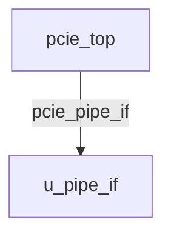

# pcie_top Verification Handoff

## 📝 Overview
This directory contains the Verilog source, testbench, and verification instructions for the `pcie_top` module.

## 🎯 What to Test
The verification engineer should ensure that:
1. The module resets correctly and all internal states initialize to safe values.
2. All interface protocols (e.g., AXI4, APB, native valid/ready) are strictly adhered to.
3. Edge cases specific to this IP (e.g., full/empty flags for FIFOs, cache misses for memory, etc.) are manually exercised.

## 🔍 GTKWave Signals to Observe
Add the following key signals to your GTKWave trace for structural inspection:
### Inputs
- `uut.pcie_clk`
- `uut.pcie_rst_n`
- `uut.pipe_clk`
- `uut.m_awready`
- `uut.m_wready`
- `uut.m_bvalid`
- `uut.m_bresp`
- `uut.m_bid`
- `uut.m_arready`
- `uut.m_rvalid`
- `uut.m_rdata`
- `uut.m_rresp`
- `uut.m_rlast`
- `uut.m_rid`
- `uut.s_awvalid`
- `uut.s_awaddr`
- `uut.s_awid`
- `uut.s_awlen`
- `uut.s_awsize`
- `uut.s_wvalid`
- `uut.s_wdata`
- `uut.s_wstrb`
- `uut.s_wlast`
- `uut.s_bready`
- `uut.s_arvalid`
- `uut.s_araddr`
- `uut.s_arid`
- `uut.s_arlen`
- `uut.s_arsize`
- `uut.s_rready`
- `uut.pipe_rx_data`
- `uut.pipe_rx_datak`
- `uut.pipe_rx_valid`
- `uut.pipe_rx_elecidle`
- `uut.pipe_rx_status`
- `uut.pipe_phy_status`

### Outputs
- `uut.m_awvalid`
- `uut.m_awaddr`
- `uut.m_awid`
- `uut.m_awlen`
- `uut.m_awsize`
- `uut.m_wvalid`
- `uut.m_wdata`
- `uut.m_wstrb`
- `uut.m_wlast`
- `uut.m_bready`
- `uut.m_arvalid`
- `uut.m_araddr`
- `uut.m_arid`
- `uut.m_arlen`
- `uut.m_arsize`
- `uut.m_rready`
- `uut.s_awready`
- `uut.s_wready`
- `uut.s_bvalid`
- `uut.s_bresp`
- `uut.s_bid`
- `uut.s_arready`
- `uut.s_rvalid`
- `uut.s_rdata`
- `uut.s_rresp`
- `uut.s_rlast`
- `uut.s_rid`
- `uut.pipe_tx_data`
- `uut.pipe_tx_datak`
- `uut.pipe_tx_rate`
- `uut.pipe_tx_elecidle`
- `uut.pipe_tx_compliance`
- `uut.pipe_rx_polarity`
- `uut.pipe_power_down`

## 🏗 Structural Block Diagram
The following Mermaid diagram maps the exact sub-module hierarchy instantiated within `pcie_top`. Use this to verify that structural boundaries match the behavioral expectations.

## ▶️ Simulation Instructions
1. **Compile**: `iverilog -o sim.vvp pcie_top.v tb_pcie_top.v` (Include dependencies using `-I` if necessary)
2. **Simulate**: `vvp sim.vvp`
3. **View**: `gtkwave tb_pcie_top.vcd`
