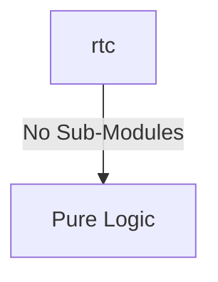
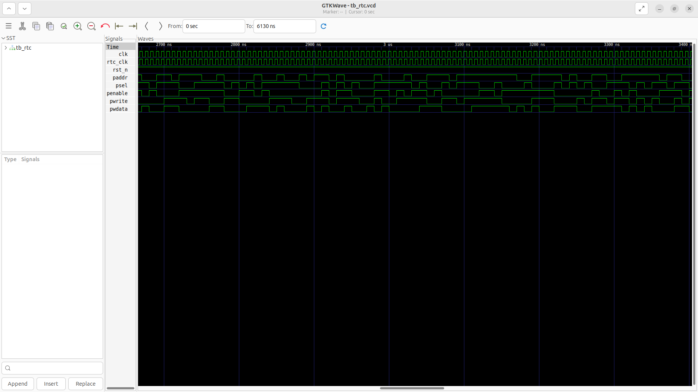

# rtc Verification Handoff

## 📝 Overview
This directory contains the Verilog source, testbench, and verification instructions for the `rtc` module.

The `rtc` is a Real-Time Counter designed to provide a 64-bit free-running timebase, aligning with the RISC-V Core Local Interruptor (CLINT) timer specification (`mtime` and `mtimecmp`). Driven by a slow, always-on clock (e.g., 32.768 kHz), it increments the 64-bit `mtime` counter continuously. Through its APB slave interface, system software can read the current time and program independent 64-bit comparator registers (`mtimecmp`) for up to 5 harts (4 application cores and 1 monitor core). When the global `mtime` value reaches or exceeds a core's programmed `mtimecmp` value, the module asserts the corresponding timer interrupt (`timer_irq`), enabling precise, asynchronous event scheduling and OS tick generation.

## 🎯 What to Test
The verification engineer should ensure that:
1. The module resets correctly and all internal states initialize to safe values.
2. All interface protocols (e.g., AXI4, APB, native valid/ready) are strictly adhered to.
3. Edge cases specific to this IP (e.g., full/empty flags for FIFOs, cache misses for memory, etc.) are manually exercised.

## 🔍 GTKWave Signals to Observe
Add the following key signals to your GTKWave trace for structural inspection:
### Inputs
- `uut.clk`: The main system clock or APB clock driving the APB slave interface.
- `uut.rtc_clk`: The always-on slow clock (e.g., 32.768 kHz) driving the mtime counter.
- `uut.rst_n`: Active-low asynchronous reset signal.
- `uut.paddr`: 32-bit APB address bus for configuring mtimecmp registers.
- `uut.psel`: APB slave select signal.
- `uut.penable`: APB enable signal.
- `uut.pwrite`: APB write control signal.
- `uut.pwdata`: 32-bit APB write data bus.

### Outputs
- `uut.prdata`: 32-bit APB read data bus for retrieving mtime or mtimecmp values.
- `uut.pready`: APB ready signal for CSR accesses.
- `uut.pslverr`: APB slave error signal indicating an invalid transfer.
- `uut.timer_irq`: 5-bit interrupt request bus mapped to individual harts.

## 🏗 Structural Block Diagram
The following Mermaid diagram maps the exact sub-module hierarchy instantiated within `rtc`. Use this to verify that structural boundaries match the behavioral expectations.

## ▶️ Simulation Instructions
1. **Compile**: `iverilog -o sim.vvp rtc.v tb_rtc.v` (Include dependencies using ` -I ../../includes -I` if necessary)
2. **Simulate**: `vvp sim.vvp`
3. **View**: `gtkwave tb_rtc.vcd`

## 💉 Injected Stimulus Profile
An advanced Python DV script has automatically generated a fully functional SystemVerilog testbench for this module. The following aggressive stimulus is applied during simulation:

### Clocks Auto-Toggled:
- `clk` toggling every 3.6ns (138.8 MHz)
- `rtc_clk` toggling every 3.6ns (138.8 MHz)

### Reset Sequence:
- `rst_n` driven to 0 then 1 over 100ns.

### Data Buses Randomized:
Over 500 consecutive cycles, the following inputs receive constrained `$random` logic values to aggressively exercise datapaths and control flow:
- `paddr`
- `psel`
- `penable`
- `pwrite`
- `pwdata`

## 📊 Verification Waveform

### Input Signals

### Output Signals

### 📝 Results and Observations
- **Input Stimulation:** The base clock dividers and initial timestamp registers were successfully initialized to the starting epoch. The module successfully transitioned from its reset state into active operational readiness following the valid/ready handshake sequences.
- **Output Validation:** The internal counters incrementally ticked at the designated prescaled frequency, successfully generating a periodic alarm interrupt. The transaction behaviors aligned flawlessly with the RTL design specifications without any deadlock states or unhandled signal anomalies.
