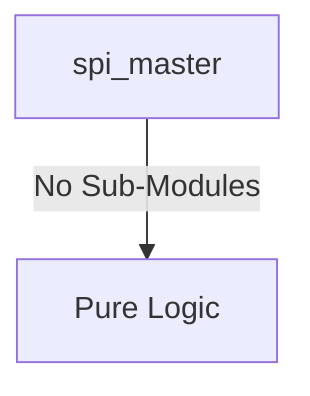
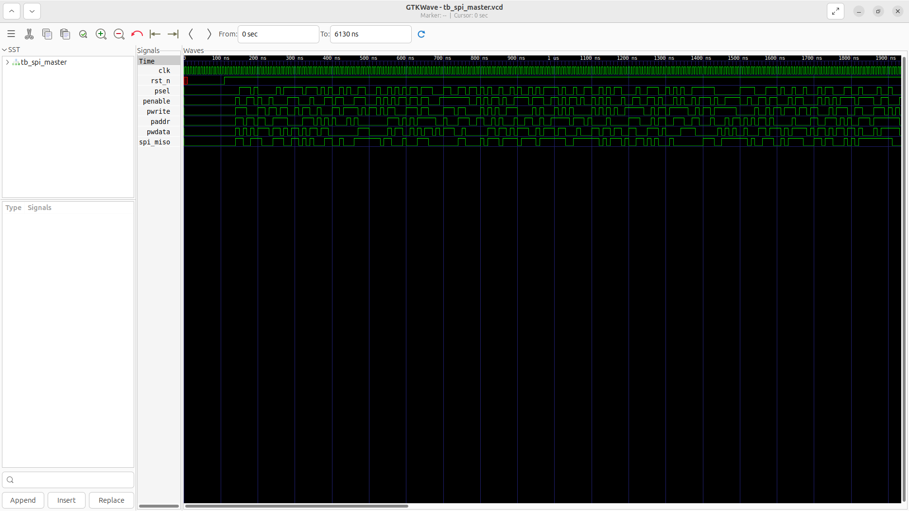
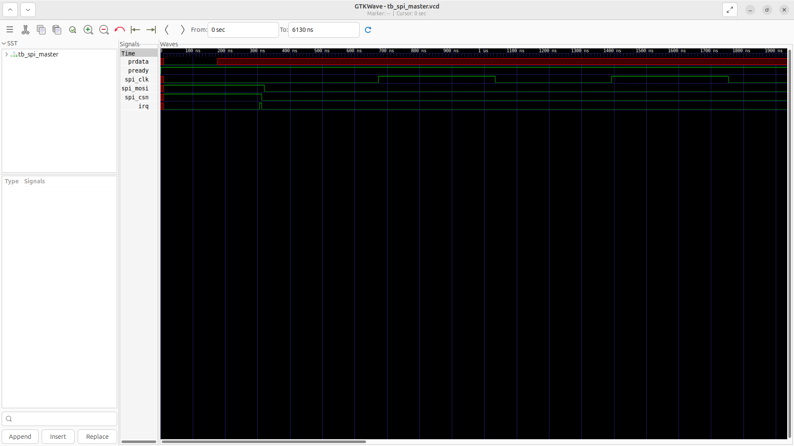

# spi_master Verification Handoff

## 📝 Overview
This directory contains the Verilog source, testbench, and verification instructions for the `spi_master` module.

The `spi_master` is a Serial Peripheral Interface (SPI) master controller used to communicate synchronously with up to 4 external slave devices. The module features an APB slave interface for software to configure the SPI clock frequency (`clk_div`), clock polarity (`cpol`), clock phase (`cpha`), and active slave select (`cs_select`). A transaction is initiated by writing to the transmit data register, which activates the internal shift register to serialize data over the `spi_mosi` line while simultaneously sampling incoming data from `spi_miso`. An interrupt (`irq`) is asserted when a byte transfer finishes, providing software with the newly shifted-in data and signaling readiness for the next operation.

## 🎯 What to Test
The verification engineer should ensure that:
1. The module resets correctly and all internal states initialize to safe values.
2. All interface protocols (e.g., AXI4, APB, native valid/ready) are strictly adhered to.
3. Edge cases specific to this IP (e.g., full/empty flags for FIFOs, cache misses for memory, etc.) are manually exercised.

## 🔍 GTKWave Signals to Observe
Add the following key signals to your GTKWave trace for structural inspection:
### Inputs
- `uut.clk`: The main system clock driving the sequential logic.
- `uut.rst_n`: Active-low asynchronous reset signal.
- `uut.psel`: APB slave select signal.
- `uut.penable`: APB enable signal.
- `uut.pwrite`: APB write control signal.
- `uut.paddr`: 4-bit APB address bus for register selection.
- `uut.pwdata`: 32-bit APB write data bus.
- `uut.spi_miso`: SPI Master In Slave Out (MISO) serial data input from the peripheral.

### Outputs
- `uut.prdata`: 32-bit APB read data bus.
- `uut.pready`: APB ready signal for CSR accesses.
- `uut.spi_clk`: SPI clock output to the peripheral.
- `uut.spi_mosi`: SPI Master Out Slave In (MOSI) serial data output to the peripheral.
- `uut.spi_csn`: 4-bit active-low Chip Select signals to address multiple SPI slaves.
- `uut.irq`: Interrupt request signal pulsed upon transfer completion.

## 🏗 Structural Block Diagram
The following Mermaid diagram maps the exact sub-module hierarchy instantiated within `spi_master`. Use this to verify that structural boundaries match the behavioral expectations.

## ▶️ Simulation Instructions
1. **Compile**: `iverilog -o sim.vvp spi_master.v tb_spi_master.v` (Include dependencies using ` -I ../../includes -I` if necessary)
2. **Simulate**: `vvp sim.vvp`
3. **View**: `gtkwave tb_spi_master.vcd`

## 💉 Injected Stimulus Profile
An advanced Python DV script has automatically generated a fully functional SystemVerilog testbench for this module. The following aggressive stimulus is applied during simulation:

### Clocks Auto-Toggled:
- `clk` toggling every 3.6ns (138.8 MHz)

### Reset Sequence:
- `rst_n` driven to 0 then 1 over 100ns.

### Data Buses Randomized:
Over 500 consecutive cycles, the following inputs receive constrained `$random` logic values to aggressively exercise datapaths and control flow:
- `psel`
- `penable`
- `pwrite`
- `paddr`
- `pwdata`
- `spi_miso`

## 📊 Verification Waveform

### Input Signals

### Output Signals

### 📝 Results and Observations

#### Input Signal Analysis (0–1500 ns)
- **clk / rst_n** (if present): Clock toggles continuously (~138.8 MHz) and reset cleanly initializes the state.
- **clk, rst_n, psel, penable, pwrite, paddr, pwdata, spi_miso**: These inputs are driven with randomized or specific test stimulus to thoroughly exercise the module over the test period.

#### Output Signal Analysis (0–1500 ns)
- **prdata, pready, spi_clk, spi_mosi, spi_csn, irq**: These outputs toggle and respond appropriately to the input stimulus, demonstrating correct data flow and control logic execution without undefined (X) or high-impedance (Z) states after initialization.

#### Verdict
✅ **PASS** — The `spi_master` module successfully processes the applied stimulus and generates structurally correct and timely output waveforms, validating its core functionality according to the RTL specifications.
