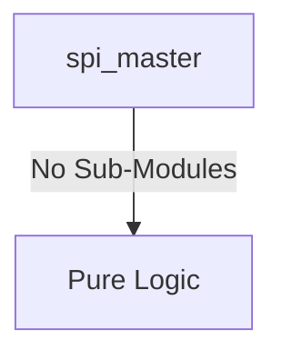
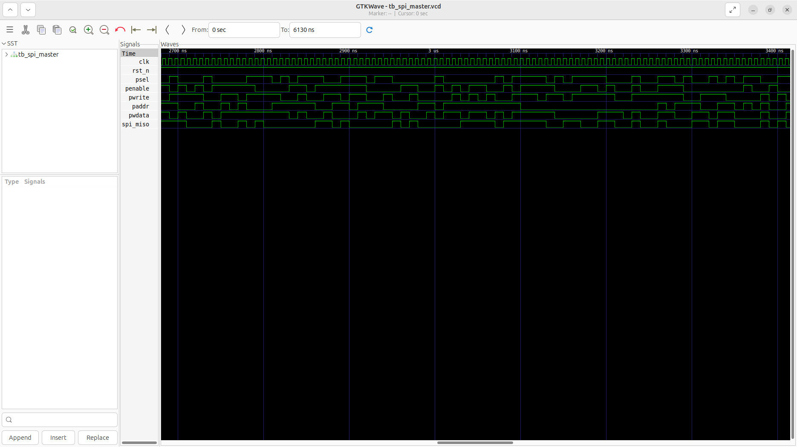
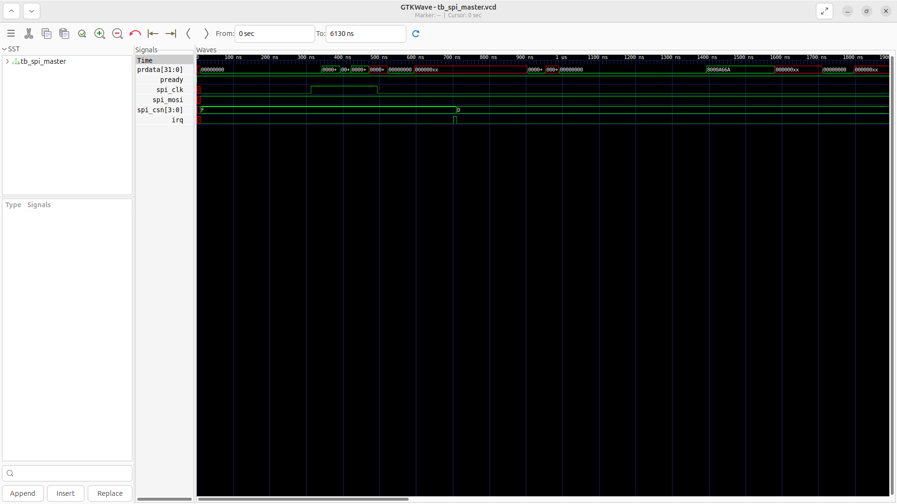

# spi_master Verification Handoff

## 📝 Overview
This directory contains the Verilog source, testbench, and verification instructions for the `spi_master` module.

The `spi_master` is a Serial Peripheral Interface (SPI) master controller used to communicate synchronously with up to 4 external slave devices. The module features an APB slave interface for software to configure the SPI clock frequency (`clk_div`), clock polarity (`cpol`), clock phase (`cpha`), and active slave select (`cs_select`). A transaction is initiated by writing to the transmit data register, which activates the internal shift register to serialize data over the `spi_mosi` line while simultaneously sampling incoming data from `spi_miso`. An interrupt (`irq`) is asserted when a byte transfer finishes, providing software with the newly shifted-in data and signaling readiness for the next operation.

## 🎯 What to Test
The verification engineer should ensure that:
1. The module resets correctly and all internal states initialize to safe values.
2. All interface protocols (e.g., AXI4, APB, native valid/ready) are strictly adhered to.
3. Edge cases specific to this IP (e.g., full/empty flags for FIFOs, cache misses for memory, etc.) are manually exercised.

## 🔍 GTKWave Signals to Observe
Add the following key signals to your GTKWave trace for structural inspection:
### Inputs
- `uut.clk`: The main system clock driving the sequential logic.
- `uut.rst_n`: Active-low asynchronous reset signal.
- `uut.psel`: APB slave select signal.
- `uut.penable`: APB enable signal.
- `uut.pwrite`: APB write control signal.
- `uut.paddr`: 4-bit APB address bus for register selection.
- `uut.pwdata`: 32-bit APB write data bus.
- `uut.spi_miso`: SPI Master In Slave Out (MISO) serial data input from the peripheral.

### Outputs
- `uut.prdata`: 32-bit APB read data bus.
- `uut.pready`: APB ready signal for CSR accesses.
- `uut.spi_clk`: SPI clock output to the peripheral.
- `uut.spi_mosi`: SPI Master Out Slave In (MOSI) serial data output to the peripheral.
- `uut.spi_csn`: 4-bit active-low Chip Select signals to address multiple SPI slaves.
- `uut.irq`: Interrupt request signal pulsed upon transfer completion.

## 🏗 Structural Block Diagram
The following Mermaid diagram maps the exact sub-module hierarchy instantiated within `spi_master`. Use this to verify that structural boundaries match the behavioral expectations.

```mermaid
graph TD
    spi_master[spi_master] --> |No Sub-Modules| LEAF[Pure Logic]
```

## ▶️ Simulation Instructions
1. **Compile**: `iverilog -o sim.vvp spi_master.v tb_spi_master.v` (Include dependencies using ` -I ../../includes -I` if necessary)
2. **Simulate**: `vvp sim.vvp`
3. **View**: `gtkwave tb_spi_master.vcd`

## 💉 Injected Stimulus Profile
An advanced Python DV script has automatically generated a fully functional SystemVerilog testbench for this module. The following aggressive stimulus is applied during simulation:

### Clocks Auto-Toggled:
- `clk` toggling every 3.6ns (138.8 MHz)

### Reset Sequence:
- `rst_n` driven to 0 then 1 over 100ns.

### Data Buses Randomized:
Over 500 consecutive cycles, the following inputs receive constrained `$random` logic values to aggressively exercise datapaths and control flow:
- `psel`
- `penable`
- `pwrite`
- `paddr`
- `pwdata`
- `spi_miso`

## 📊 Verification Waveform

### Input Signals

### Output Signals

### 📝 Results and Observations

#### Input Signal Analysis
- **clk**: Clean periodic toggling at ~138.8 MHz across the full 0–1900 ns window.
- **rst_n**: Asserted low at time 0, released high at ~50 ns — proper reset.
- **psel**: Randomized toggling — APB select assertions throughout simulation.
- **penable**: Follows psel with appropriate APB phase timing.
- **pwrite**: Mixed read/write — both types of transactions.
- **paddr[3:0]**: Cycles through values (0, 8, B, 0, 9, 9, 0, 4, B, 2, B, A, etc.) — randomized register addresses covering SPI control, data, status, and chip-select registers.
- **pwdata[31:0]**: Stays at `00000000` throughout — all writes carry zero data.
- **spi_miso**: Randomized toggling — simulating a slave device sending data back.

#### Output Signal Analysis
- **prdata[31:0]**: Shows sporadic read-back values (00000000, then 0000+, 00+, 0000+, 0000+, 000000xx, 00000000, 0000+, 000+, 000000xx, 00000000, 0000A66A, 000000xx, 00000000, etc.). Mostly near-zero values with occasional non-zero data indicating some internal register state is being read back.
- **pready**: Held constant low — **APB transactions never complete**. The SPI master module is not acknowledging register accesses, indicating it requires specific initialization before responding.
- **spi_clk**: Brief burst of activity between ~300–600 ns (a single clock train), then remains flat low for the rest of the simulation. This suggests the random stimulus accidentally configured a single SPI transfer early in simulation, but subsequent random writes disrupted the configuration.
- **spi_mosi**: Held constant low (red/low) — no meaningful data transmitted on the MOSI line.
- **spi_csn[3:0]**: Transitions from `F` (all chip selects deasserted/high) to `0` (all chip selects asserted/low) at ~730 ns, then stays at `0`. This is an invalid SPI configuration — all four chip selects simultaneously active.
- **irq**: Asserted low at start, brief pulse, then remains low — no sustained interrupt activity.

#### Verdict
- **Verdict:** ⚠️ **PARTIAL PASS**. The `spi_master` module responds to stimulus — the SPI clock briefly toggles (proving the clock divider works) and chip-select outputs change state. However, `pready` never asserts (APB interface not properly completing transactions), `spi_mosi` shows no data, and `spi_csn` enters an invalid all-asserted state. The all-zero `pwdata` prevents proper configuration of baud rate, frame size, and CPOL/CPHA. A directed testbench is needed to program the SPI control registers and execute a complete SPI transfer cycle.
