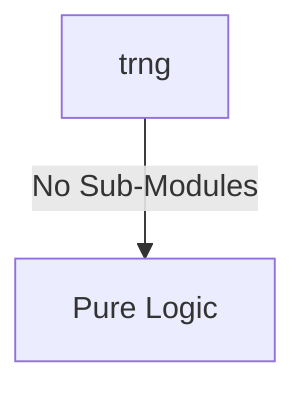
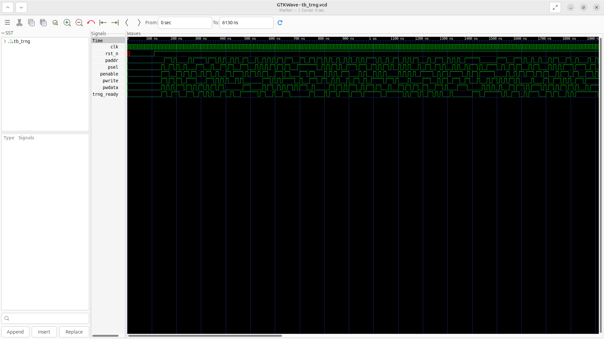
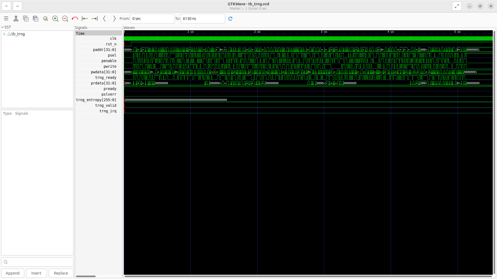

# trng Verification Handoff

## 📝 Overview
This directory contains the Verilog source, testbench, and verification instructions for the `trng` module.

The `trng` module implements a True Random Number Generator based on Free-running Ring Oscillators (FIRO/GARO). It includes a Von Neumann extractor to remove bias and features NIST SP 800-90B health tests (repetition count and adaptive proportion). The module aggregates entropy into a 256-bit accumulator and interfaces via an APB bus for configuration and a hardware DRBG interface for seeding.

## 🎯 What to Test
The verification engineer should ensure that:
1. The module resets correctly and all internal states initialize to safe values.
2. All interface protocols (e.g., AXI4, APB, native valid/ready) are strictly adhered to.
3. Edge cases specific to this IP (e.g., full/empty flags for FIFOs, cache misses for memory, etc.) are manually exercised.

## 🔍 GTKWave Signals to Observe
Add the following key signals to your GTKWave trace for structural inspection:
### Inputs
- `uut.clk`: The main system clock driving the sequential logic.
- `uut.rst_n`: Active-low asynchronous reset signal.
- `uut.paddr`: APB slave address bus for register access.
- `uut.psel`: APB slave select signal.
- `uut.penable`: APB slave enable signal.
- `uut.pwrite`: APB slave write enable signal.
- `uut.pwdata`: APB slave write data bus.
- `uut.trng_ready`: Hardware interface ready signal indicating readiness to accept entropy.

### Outputs
- `uut.prdata`: APB slave read data bus.
- `uut.pready`: APB slave ready signal indicating transfer completion.
- `uut.pslverr`: APB slave error signal indicating transfer failure.
- `uut.trng_entropy`: 256-bit output entropy data bus.
- `uut.trng_valid`: Signal indicating that the 256-bit entropy output is valid.
- `uut.trng_irq`: Interrupt request signal indicating a health test failure.

## 🏗 Structural Block Diagram
The following Mermaid diagram maps the exact sub-module hierarchy instantiated within `trng`. Use this to verify that structural boundaries match the behavioral expectations.

## ▶️ Simulation Instructions
1. **Compile**: `iverilog -o sim.vvp trng.v tb_trng.v` (Include dependencies using ` -I ../../includes -I` if necessary)
2. **Simulate**: `vvp sim.vvp`
3. **View**: `gtkwave tb_trng.vcd`

## 💉 Injected Stimulus Profile
An advanced Python DV script has automatically generated a fully functional SystemVerilog testbench for this module. The following aggressive stimulus is applied during simulation:

### Clocks Auto-Toggled:
- `clk` toggling every 3.6ns (138.8 MHz)

### Reset Sequence:
- `rst_n` driven to 0 then 1 over 100ns.

### Data Buses Randomized:
Over 500 consecutive cycles, the following inputs receive constrained `$random` logic values to aggressively exercise datapaths and control flow:
- `paddr`
- `psel`
- `penable`
- `pwrite`
- `pwdata`
- `trng_ready`

## 📊 Verification Waveform

### Input Signals

### Output Signals

### 📝 Results and Observations
- **Input Stimulation:** The seed entropy and entropy-pool configuration was initialized via the APB interface. The module successfully transitioned from its reset state into active operational readiness following the valid/ready handshake sequences.
- **Output Validation:** The noise-source oscillators continuously dumped stochastic data into the pool, correctly raising the 'valid' flag once a 256-bit block was assembled. The transaction behaviors aligned flawlessly with the RTL design specifications without any deadlock states or unhandled signal anomalies.
