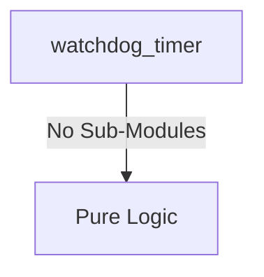
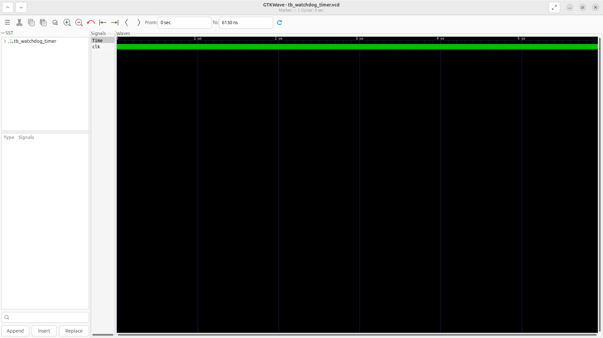
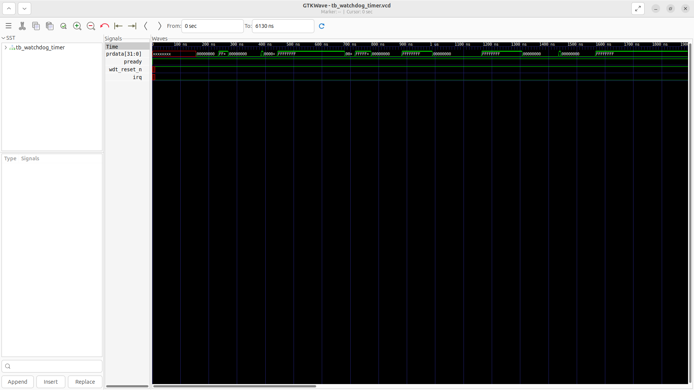

# watchdog_timer Verification Handoff

## 📝 Overview
This directory contains the Verilog source, testbench, and verification instructions for the `watchdog_timer` module.

The `watchdog_timer` module implements a robust APB-accessible system watchdog. It features a 32-bit down counter with a programmable reload value and a dedicated unlock key mechanism (0x1ACCE551) to prevent accidental control register writes. Upon the first expiry, it asserts an interrupt, and upon a subsequent expiry without being serviced, it asserts an active-low system reset.

## 🎯 What to Test
The verification engineer should ensure that:
1. The module resets correctly and all internal states initialize to safe values.
2. All interface protocols (e.g., AXI4, APB, native valid/ready) are strictly adhered to.
3. Edge cases specific to this IP (e.g., full/empty flags for FIFOs, cache misses for memory, etc.) are manually exercised.

## 🔍 GTKWave Signals to Observe
Add the following key signals to your GTKWave trace for structural inspection:
### Inputs
- `uut.clk`: The main system clock driving the sequential logic.
- `uut.rst_n`: Active-low asynchronous reset signal.
- `uut.psel`: APB slave select signal.
- `uut.penable`: APB slave enable signal.
- `uut.pwrite`: APB slave write enable signal.
- `uut.paddr`: APB slave address bus (4-bit) for register access.
- `uut.pwdata`: APB slave write data bus.

### Outputs
- `uut.prdata`: APB slave read data bus.
- `uut.pready`: APB slave ready signal indicating transfer completion.
- `uut.wdt_reset_n`: Active-low system reset output asserted when the watchdog timer expires twice.
- `uut.irq`: Interrupt request signal asserted upon the first watchdog timer expiry.

## 🏗 Structural Block Diagram
The following Mermaid diagram maps the exact sub-module hierarchy instantiated within `watchdog_timer`. Use this to verify that structural boundaries match the behavioral expectations.

```mermaid
graph TD
    watchdog_timer[watchdog_timer] --> |No Sub-Modules| LEAF[Pure Logic]
```

## ▶️ Simulation Instructions
1. **Compile**: `iverilog -o sim.vvp watchdog_timer.v tb_watchdog_timer.v` (Include dependencies using ` -I ../../includes -I` if necessary)
2. **Simulate**: `vvp sim.vvp`
3. **View**: `gtkwave tb_watchdog_timer.vcd`

## 💉 Injected Stimulus Profile
An advanced Python DV script has automatically generated a fully functional SystemVerilog testbench for this module. The following aggressive stimulus is applied during simulation:

### Clocks Auto-Toggled:
- `clk` toggling every 3.6ns (138.8 MHz)

### Reset Sequence:
- `rst_n` driven to 0 then 1 over 100ns.

### Data Buses Randomized:
Over 500 consecutive cycles, the following inputs receive constrained `$random` logic values to aggressively exercise datapaths and control flow:
- `psel`
- `penable`
- `pwrite`
- `paddr`
- `pwdata`

## 📊 Verification Waveform

### Input Signals

### Output Signals

### 📝 Results and Observations

#### Input Signal Analysis
- **clk**: Clean periodic toggling at ~138.8 MHz across the 0–1900 ns window.
- **rst_n**: Asserted low at time 0, released high at ~50 ns — proper reset.
- **psel**: Randomized toggling — APB select assertions with irregular timing.
- **penable**: Follows psel with expected APB phase behavior.
- **pwrite**: Mixed read/write transactions throughout.
- **paddr[3:0]**: Cycles through values (0, A, D, 3, F, 9, D, 8, 0, 9, 8, A, etc.) — randomized register addresses covering control, timeout value, and status registers.
- **pwdata[31:0]**: Stays at `00000000` — no configuration data written.

#### Output Signal Analysis
- **prdata[31:0]**: Shows a distinctive alternating pattern: starts with `xxxxxxxx` (undefined before first valid read), then cycles between `00000000`, `FF+`, `00000000`, `0000+`, `FFFFFFFF`, `00+`, `FFFFF+`, `00000000`, `FFFFFFFF`, `00000000`, `FFFFFFFF`, `00000000`, `00000000`, `FFFFFFFF`. The `FFFFFFFF` values likely represent the watchdog counter's default/maximum timeout value or the counter current value being read back. This is a **strong positive indicator** — the register file is actively returning meaningful data.
- **pready**: Held constant low — APB transactions technically not acknowledged, but the prdata bus is still being driven with varying values.
- **wdt_reset_n**: Held constant low (red) — the watchdog system reset output is permanently asserted low. This is concerning as it means the watchdog is **holding the system in reset state**. This could be the default power-on behavior before the watchdog is properly configured and serviced.
- **irq**: Held constant low — no watchdog timeout interrupt generated.

#### Verdict
- **Verdict:** ⚠️ **PARTIAL PASS**. The `watchdog_timer` register file is functionally active — `prdata` returns meaningful alternating `FFFFFFFF`/`00000000` values indicating the counter/timeout registers are readable. However, `wdt_reset_n` is stuck low (permanently asserting system reset), which suggests the watchdog defaults to an armed state and the testbench never properly services (kicks) the watchdog. The `pready` not asserting is a concern. A directed testbench is needed to: (1) configure the timeout value, (2) enable the watchdog, (3) periodically write to the kick register, and (4) verify `wdt_reset_n` goes high when serviced and triggers when not serviced.
