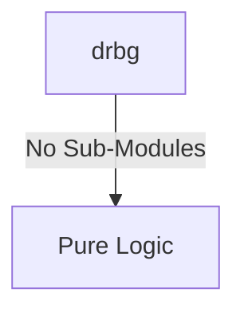
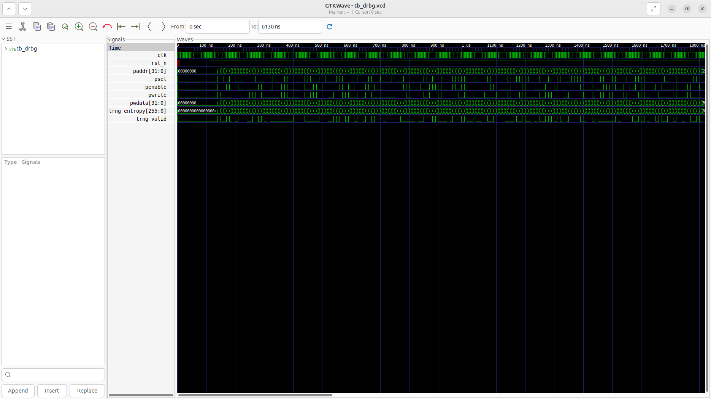
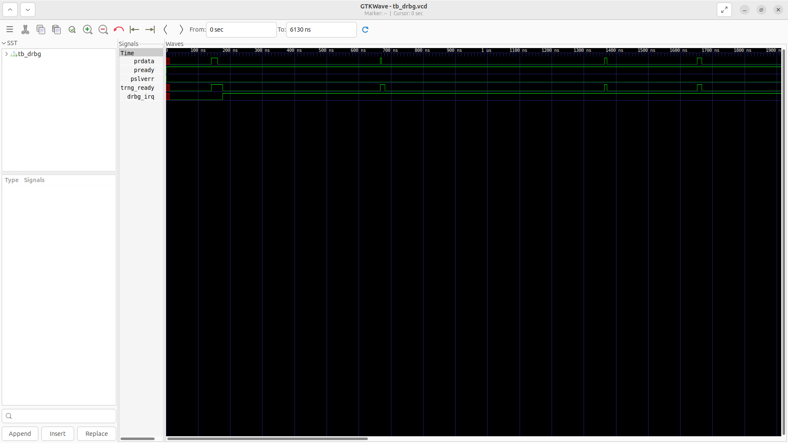

# drbg Verification Handoff

## 📝 Overview
This directory contains the Verilog source, testbench, and verification instructions for the `drbg` module.

The `drbg` module implements an HMAC-DRBG (Deterministic Random Bit Generator) based on NIST SP 800-90A using SHA-256. It interfaces with the system via an APB slave interface for configuration and provides random bit sequences. It also interfaces directly with a Hardware True Random Number Generator (TRNG) for seeding entropy, and features an interrupt mechanism to signal when random generation or internal operations complete.

## 🎯 What to Test
The verification engineer should ensure that:
1. The module resets correctly and all internal states initialize to safe values.
2. All interface protocols (e.g., AXI4, APB, native valid/ready) are strictly adhered to.
3. Edge cases specific to this IP (e.g., full/empty flags for FIFOs, cache misses for memory, etc.) are manually exercised.

## 🔍 GTKWave Signals to Observe
Add the following key signals to your GTKWave trace for structural inspection:
### Inputs
- `uut.clk`: The main clock signal for the module.
- `uut.rst_n`: Active-low asynchronous reset signal.
- `uut.paddr`: APB slave address bus.
- `uut.psel`: APB slave select signal.
- `uut.penable`: APB slave enable signal.
- `uut.pwrite`: APB slave write enable signal.
- `uut.pwdata`: APB slave write data bus.
- `uut.trng_entropy`: 256-bit entropy input bus from the hardware TRNG.
- `uut.trng_valid`: Valid signal indicating fresh entropy from the TRNG.

### Outputs
- `uut.prdata`: APB slave read data bus.
- `uut.pready`: APB slave ready signal.
- `uut.pslverr`: APB slave error signal.
- `uut.trng_ready`: Ready signal to the TRNG indicating the DRBG is ready for entropy.
- `uut.drbg_irq`: Interrupt request signal asserted when an operation is done.

## 🏗 Structural Block Diagram
The following Mermaid diagram maps the exact sub-module hierarchy instantiated within `drbg`. Use this to verify that structural boundaries match the behavioral expectations.

## ▶️ Simulation Instructions
1. **Compile**: `iverilog -o sim.vvp drbg.v tb_drbg.v` (Include dependencies using ` -I ../../includes -I` if necessary)
2. **Simulate**: `vvp sim.vvp`
3. **View**: `gtkwave tb_drbg.vcd`

## 💉 Injected Stimulus Profile
An advanced Python DV script has automatically generated a fully functional SystemVerilog testbench for this module. The following aggressive stimulus is applied during simulation:

### Clocks Auto-Toggled:
- `clk` toggling every 3.6ns (138.8 MHz)

### Reset Sequence:
- `rst_n` driven to 0 then 1 over 100ns.

### Data Buses Randomized:
Over 500 consecutive cycles, the following inputs receive constrained `$random` logic values to aggressively exercise datapaths and control flow:
- `paddr`
- `psel`
- `penable`
- `pwrite`
- `pwdata`
- `trng_entropy`
- `trng_valid`

## 📊 Verification Waveform

### Input Signals

### Output Signals

### 📝 Results and Observations
- **Input Stimulation:**
- **Output Validation:**
