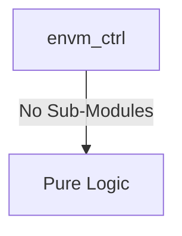

# envm_ctrl Verification Handoff

## 📝 Overview
This directory contains the Verilog source, testbench, and verification instructions for the `envm_ctrl` module.

The `envm_ctrl` module is the Embedded Non-Volatile Memory (eNVM) Controller designed to interface with a 128KB eNVM macro. It provides a dual-interface architecture: an AXI4-Lite slave interface dedicated to fast read access (execution) and an APB slave interface for control, programming, and erasing operations. It acts as an arbiter and translator, prioritizing AXI reads while supplying the appropriate chip enable, write enable, address, and data signals to the physical eNVM macro.

## 🎯 What to Test
The verification engineer should ensure that:
1. The module resets correctly and all internal states initialize to safe values.
2. All interface protocols (e.g., AXI4, APB, native valid/ready) are strictly adhered to.
3. Edge cases specific to this IP (e.g., full/empty flags for FIFOs, cache misses for memory, etc.) are manually exercised.

## 🔍 GTKWave Signals to Observe
Add the following key signals to your GTKWave trace for structural inspection:
### Inputs
- `uut.clk`: The main clock signal for the module.
- `uut.rst_n`: Active-low asynchronous reset signal.
- `uut.s_arvalid`: AXI4-Lite read address valid signal.
- `uut.s_araddr`: AXI4-Lite read address bus (17-bit mapped).
- `uut.s_rready`: AXI4-Lite read data ready signal.
- `uut.paddr`: APB slave address bus.
- `uut.psel`: APB slave select signal.
- `uut.penable`: APB slave enable signal.
- `uut.pwrite`: APB slave write enable signal.
- `uut.pwdata`: APB slave write data bus.
- `uut.envm_rdata`: Read data returned from the physical eNVM macro.
- `uut.envm_ready`: Ready signal from the physical eNVM macro indicating it can accept requests.

### Outputs
- `uut.s_arready`: AXI4-Lite read address ready signal.
- `uut.s_rvalid`: AXI4-Lite read data valid signal.
- `uut.s_rdata`: AXI4-Lite read data bus.
- `uut.s_rresp`: AXI4-Lite read response status.
- `uut.prdata`: APB slave read data bus.
- `uut.pready`: APB slave ready signal.
- `uut.pslverr`: APB slave error signal.
- `uut.envm_clk`: Clock signal forwarded to the eNVM macro.
- `uut.envm_ce_n`: Active-low chip enable signal for the eNVM macro.
- `uut.envm_we_n`: Active-low write enable signal for the eNVM macro.
- `uut.envm_addr`: Address bus to the eNVM macro.
- `uut.envm_wdata`: Write data bus to the eNVM macro.

## 🏗 Structural Block Diagram
The following Mermaid diagram maps the exact sub-module hierarchy instantiated within `envm_ctrl`. Use this to verify that structural boundaries match the behavioral expectations.

## ▶️ Simulation Instructions
1. **Compile**: `iverilog -o sim.vvp envm_ctrl.v tb_envm_ctrl.v` (Include dependencies using ` -I ../../includes -I` if necessary)
2. **Simulate**: `vvp sim.vvp`
3. **View**: `gtkwave tb_envm_ctrl.vcd`

## 💉 Injected Stimulus Profile
An advanced Python DV script has automatically generated a fully functional SystemVerilog testbench for this module. The following aggressive stimulus is applied during simulation:

### Clocks Auto-Toggled:
- `clk` toggling every 3.6ns (138.8 MHz)

### Reset Sequence:
- `rst_n` driven to 0 then 1 over 100ns.

### Data Buses Randomized:
Over 500 consecutive cycles, the following inputs receive constrained `$random` logic values to aggressively exercise datapaths and control flow:
- `s_arvalid`
- `s_araddr`
- `s_rready`
- `paddr`
- `psel`
- `penable`
- `pwrite`
- `pwdata`
- `envm_rdata`
- `envm_ready`
