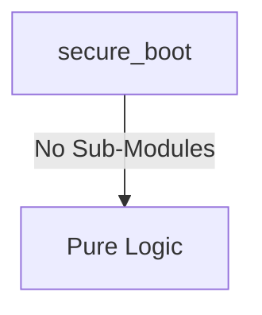

# secure_boot Verification Handoff

## 📝 Overview
This directory contains the Verilog source, testbench, and verification instructions for the `secure_boot` module.

The `secure_boot` module acts as the Hardware Root-of-Trust for the system, enforcing an ECDSA P-256 signature verification of the boot image. Initiated automatically on power-on reset, it operates a finite state machine that sequentially reads the boot image from the eNVM, computes its SHA-256 hash, reads the appended ECDSA signature, and performs verification. It subsequently dictates the boot flow by driving signals to either de-assert the core reset upon success or halt the system upon failure, while providing status visibility via an APB interface.

## 🎯 What to Test
The verification engineer should ensure that:
1. The module resets correctly and all internal states initialize to safe values.
2. All interface protocols (e.g., AXI4, APB, native valid/ready) are strictly adhered to.
3. Edge cases specific to this IP (e.g., full/empty flags for FIFOs, cache misses for memory, etc.) are manually exercised.

## 🔍 GTKWave Signals to Observe
Add the following key signals to your GTKWave trace for structural inspection:
### Inputs
- `uut.clk`: The main clock signal for the module.
- `uut.rst_n`: Active-low asynchronous reset signal.
- `uut.paddr`: APB slave address bus for status monitoring.
- `uut.psel`: APB slave select signal.
- `uut.penable`: APB slave enable signal.
- `uut.pwrite`: APB slave write enable signal.
- `uut.pwdata`: APB slave write data bus.
- `uut.envm_rdata`: Data read from the eNVM controller during the boot image fetch.
- `uut.envm_valid`: Indicates valid data is available from the eNVM controller.

### Outputs
- `uut.prdata`: APB slave read data bus returning status information.
- `uut.pready`: APB slave ready signal.
- `uut.pslverr`: APB slave error signal.
- `uut.envm_addr`: Address bus for direct reads from the eNVM controller.
- `uut.envm_req`: Request signal asserting a read to the eNVM controller.
- `uut.boot_pass`: Boot success signal that de-asserts core reset to start execution.
- `uut.boot_fail`: Boot failure signal that halts the system and flags an error.

## 🏗 Structural Block Diagram
The following Mermaid diagram maps the exact sub-module hierarchy instantiated within `secure_boot`. Use this to verify that structural boundaries match the behavioral expectations.

## ▶️ Simulation Instructions
1. **Compile**: `iverilog -o sim.vvp secure_boot.v tb_secure_boot.v` (Include dependencies using ` -I ../../includes -I` if necessary)
2. **Simulate**: `vvp sim.vvp`
3. **View**: `gtkwave tb_secure_boot.vcd`

## 💉 Injected Stimulus Profile
An advanced Python DV script has automatically generated a fully functional SystemVerilog testbench for this module. The following aggressive stimulus is applied during simulation:

### Clocks Auto-Toggled:
- `clk` toggling every 3.6ns (138.8 MHz)

### Reset Sequence:
- `rst_n` driven to 0 then 1 over 100ns.

### Data Buses Randomized:
Over 500 consecutive cycles, the following inputs receive constrained `$random` logic values to aggressively exercise datapaths and control flow:
- `paddr`
- `psel`
- `penable`
- `pwrite`
- `pwdata`
- `envm_rdata`
- `envm_valid`
