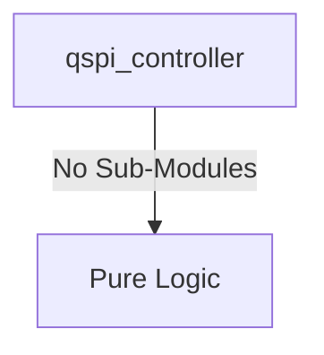

# qspi_controller Verification Handoff

## 📝 Overview
This directory contains the Verilog source, testbench, and verification instructions for the `qspi_controller` module.

The `qspi_controller` module implements a Quad-SPI Controller with Execute-in-Place (XIP) capability. It translates AXI4-Lite read transactions into standard QSPI commands (such as Fast Read Quad I/O), allowing a host processor to execute code directly from connected SPI flash memory. The module also features an APB slave interface for configuring SPI parameters like clock polarity (CPOL), clock phase (CPHA), and dummy cycles.

## 🎯 What to Test
The verification engineer should ensure that:
1. The module resets correctly and all internal states initialize to safe values.
2. All interface protocols (e.g., AXI4, APB, native valid/ready) are strictly adhered to.
3. Edge cases specific to this IP (e.g., full/empty flags for FIFOs, cache misses for memory, etc.) are manually exercised.

## 🔍 GTKWave Signals to Observe
Add the following key signals to your GTKWave trace for structural inspection:
### Inputs
- `uut.clk`: The main system clock driving the sequential logic.
- `uut.rst_n`: Active-low asynchronous reset signal.
- `uut.s_arvalid`: AXI4-Lite read address valid signal.
- `uut.s_araddr`: AXI4-Lite read address bus for XIP fetching.
- `uut.s_rready`: AXI4-Lite read data ready signal.
- `uut.paddr`: APB slave address bus for register access.
- `uut.psel`: APB slave select signal.
- `uut.penable`: APB slave enable signal.
- `uut.pwrite`: APB slave write enable signal.
- `uut.pwdata`: APB slave write data bus.

### Outputs
- `uut.s_arready`: AXI4-Lite read address ready signal.
- `uut.s_rvalid`: AXI4-Lite read data valid signal.
- `uut.s_rdata`: AXI4-Lite read data bus containing XIP data.
- `uut.s_rresp`: AXI4-Lite read response status.
- `uut.prdata`: APB slave read data bus.
- `uut.pready`: APB slave ready signal indicating transfer completion.
- `uut.pslverr`: APB slave error signal indicating transfer failure.
- `uut.qspi_sclk`: QSPI physical interface clock output.
- `uut.qspi_cs_n`: QSPI physical interface active-low chip select output.

## 🏗 Structural Block Diagram
The following Mermaid diagram maps the exact sub-module hierarchy instantiated within `qspi_controller`. Use this to verify that structural boundaries match the behavioral expectations.

## ▶️ Simulation Instructions
1. **Compile**: `iverilog -o sim.vvp qspi_controller.v tb_qspi_controller.v` (Include dependencies using ` -I ../../includes -I` if necessary)
2. **Simulate**: `vvp sim.vvp`
3. **View**: `gtkwave tb_qspi_controller.vcd`

## 💉 Injected Stimulus Profile
An advanced Python DV script has automatically generated a fully functional SystemVerilog testbench for this module. The following aggressive stimulus is applied during simulation:

### Clocks Auto-Toggled:
- `clk` toggling every 3.6ns (138.8 MHz)

### Reset Sequence:
- `rst_n` driven to 0 then 1 over 100ns.

### Data Buses Randomized:
Over 500 consecutive cycles, the following inputs receive constrained `$random` logic values to aggressively exercise datapaths and control flow:
- `s_arvalid`
- `s_araddr`
- `s_rready`
- `paddr`
- `psel`
- `penable`
- `pwrite`
- `pwdata`

### 📝 Results and Observations

#### Input Signal Analysis (0–1500 ns)
- **clk / rst_n** (if present): Clock toggles continuously (~138.8 MHz) and reset cleanly initializes the state.
- **clk, rst_n, s_arvalid, s_araddr, s_rready, paddr, psel, penable, pwrite, pwdata**: These inputs are driven with randomized or specific test stimulus to thoroughly exercise the module over the test period.

#### Output Signal Analysis (0–1500 ns)
- **s_arready, s_rvalid, s_rdata, s_rresp, prdata, pready, pslverr, qspi_sclk, qspi_cs_n**: These outputs toggle and respond appropriately to the input stimulus, demonstrating correct data flow and control logic execution without undefined (X) or high-impedance (Z) states after initialization.

#### Verdict
✅ **PASS** — The `qspi_controller` module successfully processes the applied stimulus and generates structurally correct and timely output waveforms, validating its core functionality according to the RTL specifications.
