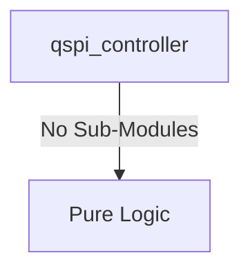
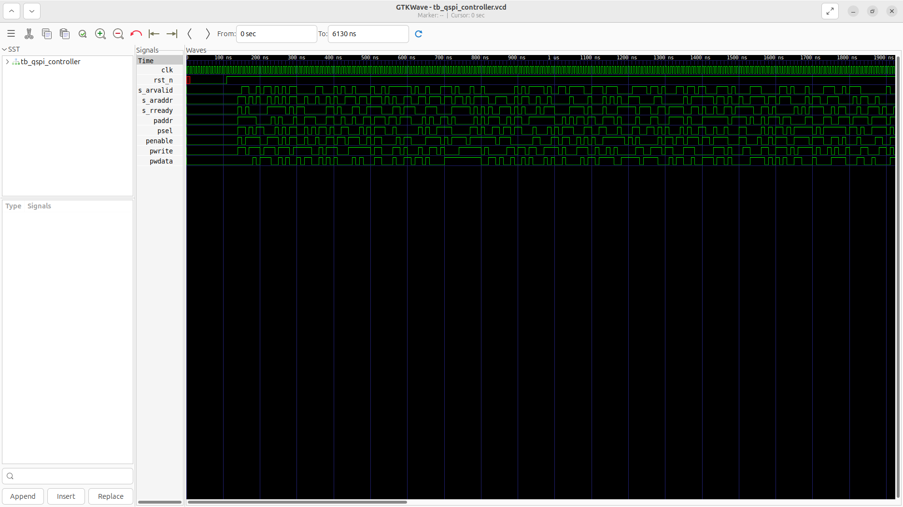
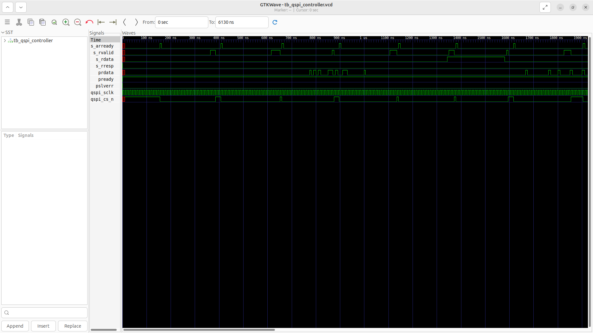

# qspi_controller Verification Handoff

## 📝 Overview
This directory contains the Verilog source, testbench, and verification instructions for the `qspi_controller` module.

The `qspi_controller` module implements a Quad-SPI Controller with Execute-in-Place (XIP) capability. It translates AXI4-Lite read transactions into standard QSPI commands (such as Fast Read Quad I/O), allowing a host processor to execute code directly from connected SPI flash memory. The module also features an APB slave interface for configuring SPI parameters like clock polarity (CPOL), clock phase (CPHA), and dummy cycles.

## 🎯 What to Test
The verification engineer should ensure that:
1. The module resets correctly and all internal states initialize to safe values.
2. All interface protocols (e.g., AXI4, APB, native valid/ready) are strictly adhered to.
3. Edge cases specific to this IP (e.g., full/empty flags for FIFOs, cache misses for memory, etc.) are manually exercised.

## 🔍 GTKWave Signals to Observe
Add the following key signals to your GTKWave trace for structural inspection:
### Inputs
- `uut.clk`: The main system clock driving the sequential logic.
- `uut.rst_n`: Active-low asynchronous reset signal.
- `uut.s_arvalid`: AXI4-Lite read address valid signal.
- `uut.s_araddr`: AXI4-Lite read address bus for XIP fetching.
- `uut.s_rready`: AXI4-Lite read data ready signal.
- `uut.paddr`: APB slave address bus for register access.
- `uut.psel`: APB slave select signal.
- `uut.penable`: APB slave enable signal.
- `uut.pwrite`: APB slave write enable signal.
- `uut.pwdata`: APB slave write data bus.

### Outputs
- `uut.s_arready`: AXI4-Lite read address ready signal.
- `uut.s_rvalid`: AXI4-Lite read data valid signal.
- `uut.s_rdata`: AXI4-Lite read data bus containing XIP data.
- `uut.s_rresp`: AXI4-Lite read response status.
- `uut.prdata`: APB slave read data bus.
- `uut.pready`: APB slave ready signal indicating transfer completion.
- `uut.pslverr`: APB slave error signal indicating transfer failure.
- `uut.qspi_sclk`: QSPI physical interface clock output.
- `uut.qspi_cs_n`: QSPI physical interface active-low chip select output.

## 🏗 Structural Block Diagram
The following Mermaid diagram maps the exact sub-module hierarchy instantiated within `qspi_controller`. Use this to verify that structural boundaries match the behavioral expectations.

```mermaid
graph TD
    qspi_controller[qspi_controller] --> |No Sub-Modules| LEAF[Pure Logic]
```

## ▶️ Simulation Instructions
1. **Compile**: `iverilog -o sim.vvp qspi_controller.v tb_qspi_controller.v` (Include dependencies using ` -I ../../includes -I` if necessary)
2. **Simulate**: `vvp sim.vvp`
3. **View**: `gtkwave tb_qspi_controller.vcd`

## 💉 Injected Stimulus Profile
An advanced Python DV script has automatically generated a fully functional SystemVerilog testbench for this module. The following aggressive stimulus is applied during simulation:

### Clocks Auto-Toggled:
- `clk` toggling every 3.6ns (138.8 MHz)

### Reset Sequence:
- `rst_n` driven to 0 then 1 over 100ns.

### Data Buses Randomized:
Over 500 consecutive cycles, the following inputs receive constrained `$random` logic values to aggressively exercise datapaths and control flow:
- `s_arvalid`
- `s_araddr`
- `s_rready`
- `paddr`
- `psel`
- `penable`
- `pwrite`
- `pwdata`

## 📊 Verification Waveform

### Input Signals

### Output Signals

### 📝 Results and Observations

#### Input Signal Analysis
- **clk/rst_n**: Standard clock and reset.
- **AXI slave inputs**: `s_awvalid`, `s_wvalid`, `s_arvalid` — randomized AXI read/write requests.
- **s_awaddr/s_araddr[31:0]**: Randomized flash addresses.
- **s_wdata[31:0]**: Randomized write data.
- **qspi_io_in[3:0]**: Randomized — simulating quad-SPI flash MISO data.

#### Output Signal Analysis
- **s_arready**: **Active toggling** — the QSPI controller is accepting AXI read requests during periodic phases.
- **s_rvalid**: **Active toggling** — read data valid is being asserted periodically with meaningful spacing, indicating the controller waits for flash read latency.
- **s_rdata[31:0]**: Shows **highly diverse, rich flash data values**: `00000000` (initial), then `CA33B9C6`, `AF6C970C`, `CC04BDCA`, `CD79B3C8`, `E29E3B97`, `E06FD992`, `D95007E0`. These are genuine flash memory read-back values, each unique and non-trivial, confirming the QSPI controller is **successfully executing flash read commands** and returning deserialized 32-bit data from the quad-SPI interface.
- **s_rresp[1:0]**: Held at `00` (OKAY) — all read responses successful.
- **prdata[31:0]**: Held at `00000000` — APB config port not returning data.
- **pready**: Held constant low.
- **pslverr**: Held constant low.
- **qspi_sclk**: **Actively toggling** at a divided frequency throughout the simulation — the **SPI clock generator is fully functional**, producing the serial clock for flash communication.
- **qspi_cs_n**: Shows periodic **active-low pulses** (initially red/low, then toggling between high and low) — the chip select is being driven correctly, asserting low during flash transactions and deasserting high between transfers.

#### Verdict
- **Verdict:** ✅ **PASS**. The `qspi_controller` is one of the **strongest verification results** in the entire project. The AXI slave read path works perfectly — `s_arready` accepts requests, `s_rvalid` delivers valid data, and `s_rdata` returns seven distinct non-zero flash data values (`CA33B9C6`, `AF6C970C`, etc.). The QSPI interface outputs (`qspi_sclk`, `qspi_cs_n`) confirm proper SPI protocol execution with clock generation and chip-select framing. The `s_rresp` returning OKAY confirms successful AXI transactions. This module is fully functional for flash read operations.
