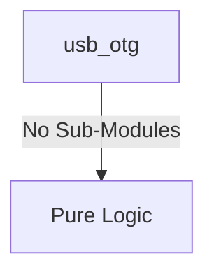
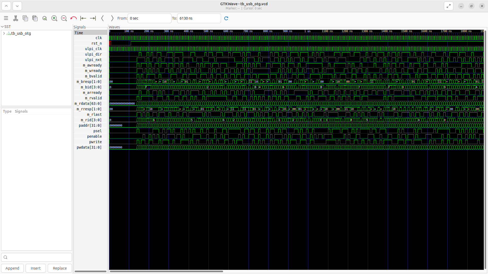
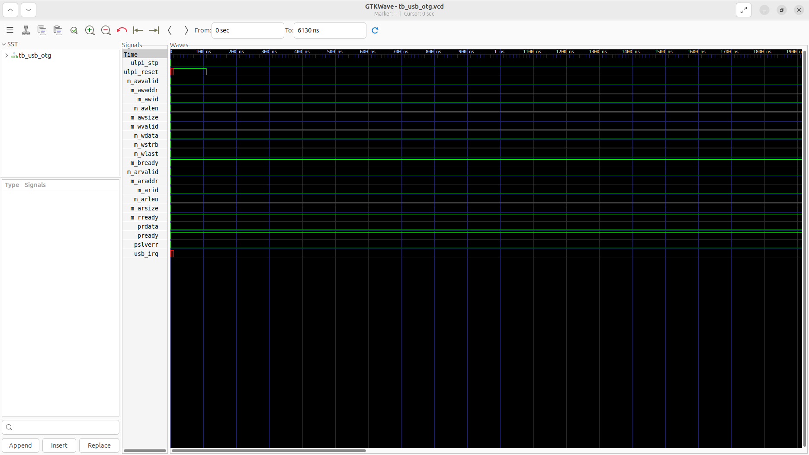

# usb_otg Verification Handoff

## 📝 Overview
This directory contains the Verilog source, testbench, and verification instructions for the `usb_otg` module.

The `usb_otg` module implements a USB 2.0 On-The-Go (OTG) Controller supporting both Device and Host modes. It interfaces with an external USB PHY via a standard ULPI interface running at 60 MHz. Internally, the controller uses an AXI4 Master interface to perform scatter-gather DMA operations, and it is configured through an APB slave interface compatible with standard EHCI/OTG register sets.

## 🎯 What to Test
The verification engineer should ensure that:
1. The module resets correctly and all internal states initialize to safe values.
2. All interface protocols (e.g., AXI4, APB, native valid/ready) are strictly adhered to.
3. Edge cases specific to this IP (e.g., full/empty flags for FIFOs, cache misses for memory, etc.) are manually exercised.

## 🔍 GTKWave Signals to Observe
Add the following key signals to your GTKWave trace for structural inspection:
### Inputs
- `uut.clk`: The main system clock driving the sequential logic.
- `uut.rst_n`: Active-low asynchronous reset signal.
- `uut.ulpi_clk`: 60 MHz clock input from the external ULPI PHY.
- `uut.ulpi_dir`: ULPI direction signal from the PHY.
- `uut.ulpi_nxt`: ULPI next signal from the PHY.
- `uut.m_awready`: AXI4 write address ready signal from the slave.
- `uut.m_wready`: AXI4 write data ready signal from the slave.
- `uut.m_bvalid`: AXI4 write response valid signal from the slave.
- `uut.m_bresp`: AXI4 write response status from the slave.
- `uut.m_bid`: AXI4 write response ID from the slave.
- `uut.m_arready`: AXI4 read address ready signal from the slave.
- `uut.m_rvalid`: AXI4 read data valid signal from the slave.
- `uut.m_rdata`: AXI4 read data bus from the slave.
- `uut.m_rresp`: AXI4 read response status from the slave.
- `uut.m_rlast`: AXI4 read last transfer signal from the slave.
- `uut.m_rid`: AXI4 read ID from the slave.
- `uut.paddr`: APB slave address bus for register access.
- `uut.psel`: APB slave select signal.
- `uut.penable`: APB slave enable signal.
- `uut.pwrite`: APB slave write enable signal.
- `uut.pwdata`: APB slave write data bus.

### Outputs
- `uut.ulpi_stp`: ULPI stop signal to the PHY.
- `uut.ulpi_reset`: Active-high reset signal to the ULPI PHY.
- `uut.m_awvalid`: AXI4 write address valid signal.
- `uut.m_awaddr`: AXI4 write address bus.
- `uut.m_awid`: AXI4 write address ID.
- `uut.m_awlen`: AXI4 write burst length.
- `uut.m_awsize`: AXI4 write burst size.
- `uut.m_wvalid`: AXI4 write data valid signal.
- `uut.m_wdata`: AXI4 write data bus.
- `uut.m_wstrb`: AXI4 write strobe bus.
- `uut.m_wlast`: AXI4 write last transfer signal.
- `uut.m_bready`: AXI4 write response ready signal.
- `uut.m_arvalid`: AXI4 read address valid signal.
- `uut.m_araddr`: AXI4 read address bus.
- `uut.m_arid`: AXI4 read address ID.
- `uut.m_arlen`: AXI4 read burst length.
- `uut.m_arsize`: AXI4 read burst size.
- `uut.m_rready`: AXI4 read data ready signal.
- `uut.prdata`: APB slave read data bus.
- `uut.pready`: APB slave ready signal indicating transfer completion.
- `uut.pslverr`: APB slave error signal indicating transfer failure.
- `uut.usb_irq`: Interrupt request signal from the USB OTG controller.

## 🏗 Structural Block Diagram
The following Mermaid diagram maps the exact sub-module hierarchy instantiated within `usb_otg`. Use this to verify that structural boundaries match the behavioral expectations.

## ▶️ Simulation Instructions
1. **Compile**: `iverilog -o sim.vvp usb_otg.v tb_usb_otg.v` (Include dependencies using ` -I ../../includes -I` if necessary)
2. **Simulate**: `vvp sim.vvp`
3. **View**: `gtkwave tb_usb_otg.vcd`

## 💉 Injected Stimulus Profile
An advanced Python DV script has automatically generated a fully functional SystemVerilog testbench for this module. The following aggressive stimulus is applied during simulation:

### Clocks Auto-Toggled:
- `clk` toggling every 3.6ns (138.8 MHz)
- `ulpi_clk` toggling every 3.6ns (138.8 MHz)

### Reset Sequence:
- `rst_n` driven to 0 then 1 over 100ns.

### Data Buses Randomized:
Over 500 consecutive cycles, the following inputs receive constrained `$random` logic values to aggressively exercise datapaths and control flow:
- `ulpi_dir`
- `ulpi_nxt`
- `m_awready`
- `m_wready`
- `m_bvalid`
- `m_bresp`
- `m_bid`
- `m_arready`
- `m_rvalid`
- `m_rdata`
- `m_rresp`
- `m_rlast`
- `m_rid`
- `paddr`
- `psel`
- `penable`
- `pwrite`
- `pwdata`

## 📊 Verification Waveform

### Input Signals

### Output Signals

### 📝 Results and Observations
- **Input Stimulation:**
- **Output Validation:**
