# titan_x_top Verification Handoff

## 📝 Overview
This directory contains the Verilog source, testbench, and verification instructions for the `titan_x_top` module.

## 🎯 What to Test
The verification engineer should ensure that:
1. The module resets correctly and all internal states initialize to safe values.
2. All interface protocols (e.g., AXI4, APB, native valid/ready) are strictly adhered to.
3. Edge cases specific to this IP (e.g., full/empty flags for FIFOs, cache misses for memory, etc.) are manually exercised.

## 🔍 GTKWave Signals to Observe
Add the following key signals to your GTKWave trace for structural inspection:
### Inputs
- `uut.clk`
- `uut.rst_n`
- `uut.pipe_clk`
- `uut.eth_tx_clk`
- `uut.eth_rx_clk`
- `uut.ulpi_clk`
- `uut.mipi_rxbyteclkhs`
- `uut.hdmi_clk_pixel`
- `uut.hdmi_clk_tmds`
- `uut.rtc_clk`
- `uut.uart_rx`
- `uut.can_rx`

### Outputs
- `uut.ddr_addr`
- `uut.ddr_ba`
- `uut.ddr_bg`
- `uut.ddr_ck_p`
- `uut.ddr_ck_n`
- `uut.ddr_cke`
- `uut.ddr_cs_n`
- `uut.ddr_ras_n`
- `uut.ddr_cas_n`
- `uut.ddr_we_n`
- `uut.ddr_reset_n`
- `uut.ddr_odt`
- `uut.ddr_act_n`
- `uut.hdmi_tmds_clk_p`
- `uut.hdmi_tmds_clk_n`
- `uut.hdmi_tmds_data_p`
- `uut.hdmi_tmds_data_n`
- `uut.uart_tx`
- `uut.can_tx`

## 🏗 Structural Block Diagram
The following Mermaid diagram maps the exact sub-module hierarchy instantiated within `titan_x_top`. Use this to verify that structural boundaries match the behavioral expectations.

```mermaid
graph TD
    titan_x_top --> |axi4_crossbar| u_crossbar[u_crossbar]
    titan_x_top --> |rv_core_top| u_core[u_core]
    titan_x_top --> |rv_monitor_core| u_monitor[u_monitor]
    titan_x_top --> |l2_cache_top| u_l2_cache[u_l2_cache]
    titan_x_top --> |ddr_ctrl_top| u_ddr_ctrl[u_ddr_ctrl]
    titan_x_top --> |axi4_to_ahb| u_axi2ahb[u_axi2ahb]
    titan_x_top --> |gem_ethernet| u_gem[u_gem]
    titan_x_top --> |pcie_top| u_pcie[u_pcie]
    titan_x_top --> |usb_otg| u_usb[u_usb]
    titan_x_top --> |secure_boot| u_secure_boot[u_secure_boot]
    titan_x_top --> |envm_ctrl| u_envm[u_envm]
    titan_x_top --> |drbg| u_drbg[u_drbg]
    titan_x_top --> |aes_engine| u_aes[u_aes]
    titan_x_top --> |rtc| u_rtc[u_rtc]
    titan_x_top --> |uart_16550| u_uart0[u_uart0]
    titan_x_top --> |uart_16550| u_uart1[u_uart1]
    titan_x_top --> |uart_16550| u_uart2[u_uart2]
    titan_x_top --> |uart_16550| u_uart3[u_uart3]
    titan_x_top --> |uart_16550| u_uart4[u_uart4]
    titan_x_top --> |can_controller| u_can0[u_can0]
    titan_x_top --> |can_controller| u_can1[u_can1]
    titan_x_top --> |mipi_csi2_rx| u_mipi[u_mipi]
    titan_x_top --> |isp_pipeline| u_isp[u_isp]
    titan_x_top --> |hdmi_ctrl| u_hdmi[u_hdmi]
```

## ▶️ Simulation Instructions
1. **Compile**: `iverilog -o sim.vvp titan_x_top.v tb_titan_x_top.v` (Include dependencies using ` -I ../../includes -I` if necessary)
2. **Simulate**: `vvp sim.vvp`
3. **View**: `gtkwave tb_titan_x_top.vcd`

## 💉 Injected Stimulus Profile
An advanced Python DV script has automatically generated a fully functional SystemVerilog testbench for this module. The following aggressive stimulus is applied during simulation:

### Clocks Auto-Toggled:
- `clk` toggling every 3.6ns (138.8 MHz)
- `pipe_clk` toggling every 3.6ns (138.8 MHz)
- `eth_tx_clk` toggling every 3.6ns (138.8 MHz)
- `eth_rx_clk` toggling every 3.6ns (138.8 MHz)
- `ulpi_clk` toggling every 3.6ns (138.8 MHz)
- `mipi_rxbyteclkhs` toggling every 3.6ns (138.8 MHz)
- `hdmi_clk_pixel` toggling every 3.6ns (138.8 MHz)
- `hdmi_clk_tmds` toggling every 3.6ns (138.8 MHz)
- `rtc_clk` toggling every 3.6ns (138.8 MHz)

### Reset Sequence:
- `rst_n` driven to 0 then 1 over 100ns.

### Data Buses Randomized:
Over 500 consecutive cycles, the following inputs receive constrained `$random` logic values to aggressively exercise datapaths and control flow:
- `uart_rx`
- `can_rx`
