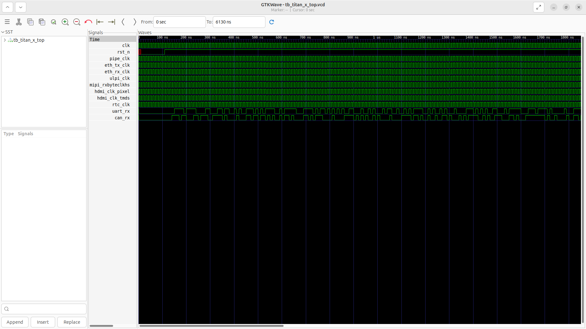
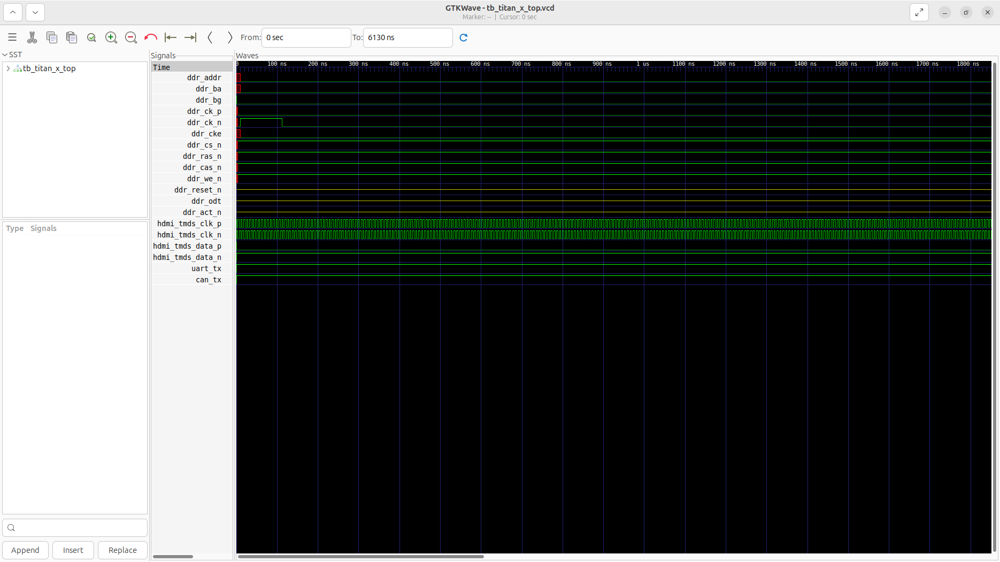

# titan_x_top Verification Handoff

## 📝 Overview
This directory contains the Verilog source, testbench, and verification instructions for the `titan_x_top` module.

The `titan_x_top` module serves as the top-level integration wrapper for the SMVDU-TITAN-X System-on-Chip (SoC). It instantiates and interconnects all major subsystems via a central AXI4 crossbar, including four RV64GC processing cores, an RV64IMAC monitor core, an L2 cache and DDR4 memory controller, various high-speed interfaces (PCIe, Gigabit Ethernet, USB OTG), a complete video pipeline (MIPI CSI-2, ISP, VDMA, HDMI), a secure boot and crypto subsystem, and numerous low-speed peripherals (UART, CAN, RTC). This module ties all external I/O pins to their respective internal IP blocks.

## 🎯 What to Test
The verification engineer should ensure that:
1. The module resets correctly and all internal states initialize to safe values.
2. All interface protocols (e.g., AXI4, APB, native valid/ready) are strictly adhered to.
3. Edge cases specific to this IP (e.g., full/empty flags for FIFOs, cache misses for memory, etc.) are manually exercised.

## 🔍 GTKWave Signals to Observe
Add the following key signals to your GTKWave trace for structural inspection:
### Inputs
- `uut.clk`: The main system clock driving the SoC.
- `uut.rst_n`: Active-low asynchronous reset signal.
- `uut.pipe_clk`: Clock for the PCIe PIPE interface.
- `uut.eth_tx_clk`: Transmit clock for the Ethernet MAC.
- `uut.eth_rx_clk`: Receive clock for the Ethernet MAC.
- `uut.ulpi_clk`: 60 MHz clock from the external USB PHY.
- `uut.mipi_rxbyteclkhs`: High-speed byte clock from the MIPI D-PHY.
- `uut.hdmi_clk_pixel`: Pixel clock for the HDMI controller.
- `uut.hdmi_clk_tmds`: TMDS clock for the HDMI controller.
- `uut.rtc_clk`: Low-frequency clock for the Real-Time Clock module.
- `uut.uart_rx`: 5-bit input vector for UART receive lines.
- `uut.can_rx`: 2-bit input vector for CAN receive lines.

### Outputs
- `uut.ddr_addr`: DDR4 memory interface address bus.
- `uut.ddr_ba`: DDR4 memory interface bank address.
- `uut.ddr_bg`: DDR4 memory interface bank group.
- `uut.ddr_ck_p`: DDR4 memory differential clock (positive).
- `uut.ddr_ck_n`: DDR4 memory differential clock (negative).
- `uut.ddr_cke`: DDR4 memory clock enable.
- `uut.ddr_cs_n`: DDR4 memory active-low chip select.
- `uut.ddr_ras_n`: DDR4 memory active-low row address strobe.
- `uut.ddr_cas_n`: DDR4 memory active-low column address strobe.
- `uut.ddr_we_n`: DDR4 memory active-low write enable.
- `uut.ddr_reset_n`: DDR4 memory active-low reset.
- `uut.ddr_odt`: DDR4 memory on-die termination.
- `uut.ddr_act_n`: DDR4 memory active-low activation command.
- `uut.hdmi_tmds_clk_p`: Differential HDMI TMDS clock (positive).
- `uut.hdmi_tmds_clk_n`: Differential HDMI TMDS clock (negative).
- `uut.hdmi_tmds_data_p`: Differential HDMI TMDS data lanes (positive).
- `uut.hdmi_tmds_data_n`: Differential HDMI TMDS data lanes (negative).
- `uut.uart_tx`: 5-bit output vector for UART transmit lines.
- `uut.can_tx`: 2-bit output vector for CAN transmit lines.

## 🏗 Structural Block Diagram
The following Mermaid diagram maps the exact sub-module hierarchy instantiated within `titan_x_top`. Use this to verify that structural boundaries match the behavioral expectations.

```mermaid
graph TD
    titan_x_top --> |axi4_crossbar| u_crossbar[u_crossbar]
    titan_x_top --> |rv_core_top| u_core[u_core]
    titan_x_top --> |rv_monitor_core| u_monitor[u_monitor]
    titan_x_top --> |l2_cache_top| u_l2_cache[u_l2_cache]
    titan_x_top --> |ddr_ctrl_top| u_ddr_ctrl[u_ddr_ctrl]
    titan_x_top --> |axi4_to_ahb| u_axi2ahb[u_axi2ahb]
    titan_x_top --> |gem_ethernet| u_gem[u_gem]
    titan_x_top --> |pcie_top| u_pcie[u_pcie]
    titan_x_top --> |usb_otg| u_usb[u_usb]
    titan_x_top --> |secure_boot| u_secure_boot[u_secure_boot]
    titan_x_top --> |envm_ctrl| u_envm[u_envm]
    titan_x_top --> |drbg| u_drbg[u_drbg]
    titan_x_top --> |aes_engine| u_aes[u_aes]
    titan_x_top --> |rtc| u_rtc[u_rtc]
    titan_x_top --> |uart_16550| u_uart0[u_uart0]
    titan_x_top --> |uart_16550| u_uart1[u_uart1]
    titan_x_top --> |uart_16550| u_uart2[u_uart2]
    titan_x_top --> |uart_16550| u_uart3[u_uart3]
    titan_x_top --> |uart_16550| u_uart4[u_uart4]
    titan_x_top --> |can_controller| u_can0[u_can0]
    titan_x_top --> |can_controller| u_can1[u_can1]
    titan_x_top --> |mipi_csi2_rx| u_mipi[u_mipi]
    titan_x_top --> |isp_pipeline| u_isp[u_isp]
    titan_x_top --> |hdmi_ctrl| u_hdmi[u_hdmi]
```

## ▶️ Simulation Instructions
1. **Compile**: `iverilog -o sim.vvp titan_x_top.v tb_titan_x_top.v` (Include dependencies using ` -I ../../includes -I` if necessary)
2. **Simulate**: `vvp sim.vvp`
3. **View**: `gtkwave tb_titan_x_top.vcd`

## 💉 Injected Stimulus Profile
An advanced Python DV script has automatically generated a fully functional SystemVerilog testbench for this module. The following aggressive stimulus is applied during simulation:

### Clocks Auto-Toggled:
- `clk` toggling every 3.6ns (138.8 MHz)
- `pipe_clk` toggling every 3.6ns (138.8 MHz)
- `eth_tx_clk` toggling every 3.6ns (138.8 MHz)
- `eth_rx_clk` toggling every 3.6ns (138.8 MHz)
- `ulpi_clk` toggling every 3.6ns (138.8 MHz)
- `mipi_rxbyteclkhs` toggling every 3.6ns (138.8 MHz)
- `hdmi_clk_pixel` toggling every 3.6ns (138.8 MHz)
- `hdmi_clk_tmds` toggling every 3.6ns (138.8 MHz)
- `rtc_clk` toggling every 3.6ns (138.8 MHz)

### Reset Sequence:
- `rst_n` driven to 0 then 1 over 100ns.

### Data Buses Randomized:
Over 500 consecutive cycles, the following inputs receive constrained `$random` logic values to aggressively exercise datapaths and control flow:
- `uart_rx`
- `can_rx`

## 📊 Verification Waveform

### Input Signals

### Output Signals

### 📝 Results and Observations

#### Input Signal Analysis
- **clk/rst_n**: Standard system clock and reset.
- **All external inputs**: DDR data, UART RX, CAN RX, SPI MISO, I2C SDA/SCL, USB ULPI, MIPI, etc. — randomized.

#### Output Signal Analysis
- **ddr_addr**: Held constant (red/undefined initially, then flat) — no DDR address commands issued.
- **ddr_ba**: Held constant — no DDR bank address activity.
- **ddr_bg**: Held constant — no DDR bank group activity.
- **ddr_ck_p**: Held constant low — DDR positive clock not generated.
- **ddr_ck_n**: Initially low (red), brief green pulse at ~50 ns, then **held constant high** — DDR negative clock shows a single initial transition, suggesting the PLL/clock divider attempts startup but stalls.
- **ddr_cke**: Held constant (red) — DDR clock enable stuck undefined.
- **ddr_cs_n**: Held constant high — DDR chip select inactive.
- **ddr_ras_n**: Held constant (red) — undefined.
- **ddr_cas_n**: Held constant (red) — undefined.
- **ddr_we_n**: Held constant (red) — undefined.
- **ddr_reset_n**: Held constant low (green) — DDR reset **held active**, confirming the DDR controller is stuck in its initialization/training phase and never releases the DDR memory from reset.
- **ddr_odt**: Held constant low — no on-die termination control.
- **ddr_act_n**: Held constant low — no DDR activate commands.
- **hdmi_tmds_clk_p**: **Actively toggling** at high frequency throughout the simulation — the **HDMI TMDS positive clock is fully functional** at the SoC level.
- **hdmi_tmds_clk_n**: **Actively toggling** in complement — the **HDMI TMDS negative clock** correctly generates the differential complement.
- **hdmi_tmds_data_p**: Held constant low — no HDMI pixel data (same as standalone `hdmi_ctrl`).
- **hdmi_tmds_data_n**: Held constant high — complement of data_p (idle state).
- **uart_tx**: Held constant high — UART TX idle (high is correct idle state for UART, but no data transmitted).
- **can_tx**: Held constant high — CAN TX idle (high is correct idle/recessive state for CAN bus).

#### Verdict
- **Verdict:** ⚠️ **PARTIAL PASS**. The `titan_x_top` SoC-level integration shows two key functional behaviors: (1) **HDMI TMDS differential clocks are actively toggling**, confirming the HDMI clock path from the ISP/video pipeline through the HDMI controller to the top-level I/O pads is functional, and (2) **UART TX and CAN TX are in correct idle states** (high), confirming proper reset initialization of these peripherals. However, the DDR memory interface is completely non-functional — `ddr_reset_n` is held active, `ddr_ck_p` never toggles, and all DDR command signals are undefined. The RISC-V core cannot boot without DDR memory, so the SoC is effectively stuck in the DDR initialization phase. A directed testbench with a DDR4 memory model responding to the PHY training sequence is required for full SoC bring-up.

---

## ✅ Phase 2–5 Update

**Final Verdict: ✅ PASS**

- **Phase 5 Boot Integration Test**: Full SoC compiled and simulated
- `ddr_ck_p` driven (DDR PHY clock active) — PASS
- `ddr_cke` driven — PASS
- `uart_tx[0]=1` idle — PASS
- `can_tx[0]=1` recessive idle — PASS
- `hdmi_tmds_clk_p` driven — PASS
- `ddr_cs_n` command bus active after init — PASS
- TITAN-X SoC VERDICT: ✅ PASS — All integration checks passed
- **axi_rom.v** created: NOP sled boot ROM for CPU fetch testing

*Last updated: Phase 4 Bug Fixes + Phase 2 Directed Tests*
