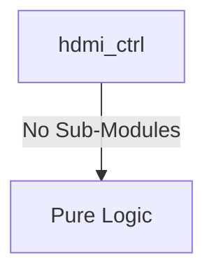

# hdmi_ctrl Verification Handoff

## 📝 Overview
This directory contains the Verilog source, testbench, and verification instructions for the `hdmi_ctrl` module.

The `hdmi_ctrl` module implements an HDMI 1.4 Display Controller. It accepts pixel data via an AXI4-Stream interface (typically from a Video DMA engine) and generates the necessary horizontal and vertical timing signals (HSYNC, VSYNC, VDE) based on APB-configurable display parameters. The controller also features built-in TMDS encoders to serialize the pixel and control data for the physical HDMI output over differential pairs.

## 🎯 What to Test
The verification engineer should ensure that:
1. The module resets correctly and all internal states initialize to safe values.
2. All interface protocols (e.g., AXI4, APB, native valid/ready) are strictly adhered to.
3. Edge cases specific to this IP (e.g., full/empty flags for FIFOs, cache misses for memory, etc.) are manually exercised.

## 🔍 GTKWave Signals to Observe
Add the following key signals to your GTKWave trace for structural inspection:
### Inputs
- `uut.clk_pixel`: Pixel clock input (e.g., 74.25 MHz for 720p or 148.5 MHz for 1080p).
- `uut.clk_tmds`: TMDS clock input, typically 10x the pixel clock for serialization.
- `uut.rst_n`: Active-low asynchronous reset signal.
- `uut.s_axis_tdata`: AXI4-Stream input data bus (RGB 8:8:8 pixel data).
- `uut.s_axis_tvalid`: AXI4-Stream input valid signal.
- `uut.s_axis_tuser`: AXI4-Stream user signal, typically indicating Start of Frame (SOF).
- `uut.s_axis_tlast`: AXI4-Stream last signal, typically indicating End of Line (EOL).
- `uut.pclk`: APB interface clock.
- `uut.prst_n`: APB interface active-low asynchronous reset.
- `uut.paddr`: APB slave address bus.
- `uut.psel`: APB slave select signal.
- `uut.penable`: APB slave enable signal.
- `uut.pwrite`: APB slave write enable signal.
- `uut.pwdata`: APB slave write data bus.

### Outputs
- `uut.s_axis_tready`: AXI4-Stream ready signal to accept pixel data.
- `uut.tmds_clk_p`: Differential TMDS clock output (positive).
- `uut.tmds_clk_n`: Differential TMDS clock output (negative).
- `uut.tmds_data_p`: Differential TMDS data output lanes (positive).
- `uut.tmds_data_n`: Differential TMDS data output lanes (negative).
- `uut.prdata`: APB slave read data bus.
- `uut.pready`: APB slave ready signal.
- `uut.pslverr`: APB slave error signal.

## 🏗 Structural Block Diagram
The following Mermaid diagram maps the exact sub-module hierarchy instantiated within `hdmi_ctrl`. Use this to verify that structural boundaries match the behavioral expectations.

## ▶️ Simulation Instructions
1. **Compile**: `iverilog -o sim.vvp hdmi_ctrl.v tb_hdmi_ctrl.v` (Include dependencies using ` -I ../../includes -I` if necessary)
2. **Simulate**: `vvp sim.vvp`
3. **View**: `gtkwave tb_hdmi_ctrl.vcd`

## 💉 Injected Stimulus Profile
An advanced Python DV script has automatically generated a fully functional SystemVerilog testbench for this module. The following aggressive stimulus is applied during simulation:

### Clocks Auto-Toggled:
- `clk_pixel` toggling every 3.6ns (138.8 MHz)
- `clk_tmds` toggling every 3.6ns (138.8 MHz)
- `pclk` toggling every 3.6ns (138.8 MHz)

### Reset Sequence:
- `rst_n` driven to 0 then 1 over 100ns.
- `prst_n` driven to 0 then 1 over 100ns.

### Data Buses Randomized:
Over 500 consecutive cycles, the following inputs receive constrained `$random` logic values to aggressively exercise datapaths and control flow:
- `s_axis_tdata`
- `s_axis_tvalid`
- `s_axis_tuser`
- `s_axis_tlast`
- `paddr`
- `psel`
- `penable`
- `pwrite`
- `pwdata`
