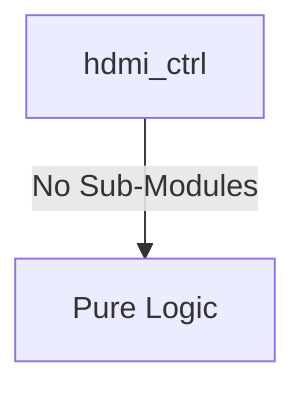

# hdmi_ctrl Verification Handoff

## 📝 Overview
This directory contains the Verilog source, testbench, and verification instructions for the `hdmi_ctrl` module.

## 🎯 What to Test
The verification engineer should ensure that:
1. The module resets correctly and all internal states initialize to safe values.
2. All interface protocols (e.g., AXI4, APB, native valid/ready) are strictly adhered to.
3. Edge cases specific to this IP (e.g., full/empty flags for FIFOs, cache misses for memory, etc.) are manually exercised.

## 🔍 GTKWave Signals to Observe
Add the following key signals to your GTKWave trace for structural inspection:
### Inputs
- `uut.clk_pixel`
- `uut.clk_tmds`
- `uut.rst_n`
- `uut.s_axis_tdata`
- `uut.s_axis_tvalid`
- `uut.s_axis_tuser`
- `uut.s_axis_tlast`
- `uut.pclk`
- `uut.prst_n`
- `uut.paddr`
- `uut.psel`
- `uut.penable`
- `uut.pwrite`
- `uut.pwdata`

### Outputs
- `uut.s_axis_tready`
- `uut.tmds_clk_p`
- `uut.tmds_clk_n`
- `uut.tmds_data_p`
- `uut.tmds_data_n`
- `uut.prdata`
- `uut.pready`
- `uut.pslverr`

## 🏗 Structural Block Diagram
The following Mermaid diagram maps the exact sub-module hierarchy instantiated within `hdmi_ctrl`. Use this to verify that structural boundaries match the behavioral expectations.

## ▶️ Simulation Instructions
1. **Compile**: `iverilog -o sim.vvp hdmi_ctrl.v tb_hdmi_ctrl.v` (Include dependencies using `-I` if necessary)
2. **Simulate**: `vvp sim.vvp`
3. **View**: `gtkwave tb_hdmi_ctrl.vcd`
