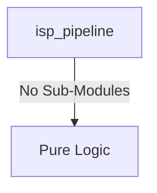

# isp_pipeline Verification Handoff

## 📝 Overview
This directory contains the Verilog source, testbench, and verification instructions for the `isp_pipeline` module.

## 🎯 What to Test
The verification engineer should ensure that:
1. The module resets correctly and all internal states initialize to safe values.
2. All interface protocols (e.g., AXI4, APB, native valid/ready) are strictly adhered to.
3. Edge cases specific to this IP (e.g., full/empty flags for FIFOs, cache misses for memory, etc.) are manually exercised.

## 🔍 GTKWave Signals to Observe
Add the following key signals to your GTKWave trace for structural inspection:
### Inputs
- `uut.clk`
- `uut.rst_n`
- `uut.s_axis_tdata`
- `uut.s_axis_tvalid`
- `uut.s_axis_tuser`
- `uut.s_axis_tlast`
- `uut.m_axis_tready`
- `uut.paddr`
- `uut.psel`
- `uut.penable`
- `uut.pwrite`
- `uut.pwdata`

### Outputs
- `uut.s_axis_tready`
- `uut.m_axis_tdata`
- `uut.m_axis_tvalid`
- `uut.m_axis_tuser`
- `uut.m_axis_tlast`
- `uut.prdata`
- `uut.pready`
- `uut.pslverr`

## 🏗 Structural Block Diagram
The following Mermaid diagram maps the exact sub-module hierarchy instantiated within `isp_pipeline`. Use this to verify that structural boundaries match the behavioral expectations.

## ▶️ Simulation Instructions
1. **Compile**: `iverilog -o sim.vvp isp_pipeline.v tb_isp_pipeline.v` (Include dependencies using ` -I ../../includes -I` if necessary)
2. **Simulate**: `vvp sim.vvp`
3. **View**: `gtkwave tb_isp_pipeline.vcd`

## 💉 Injected Stimulus Profile
An advanced Python DV script has automatically generated a fully functional SystemVerilog testbench for this module. The following aggressive stimulus is applied during simulation:

### Clocks Auto-Toggled:
- `clk` toggling every 3.6ns (138.8 MHz)

### Reset Sequence:
- `rst_n` driven to 0 then 1 over 100ns.

### Data Buses Randomized:
Over 500 consecutive cycles, the following inputs receive constrained `$random` logic values to aggressively exercise datapaths and control flow:
- `s_axis_tdata`
- `s_axis_tvalid`
- `s_axis_tuser`
- `s_axis_tlast`
- `m_axis_tready`
- `paddr`
- `psel`
- `penable`
- `pwrite`
- `pwdata`
