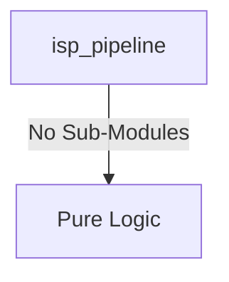
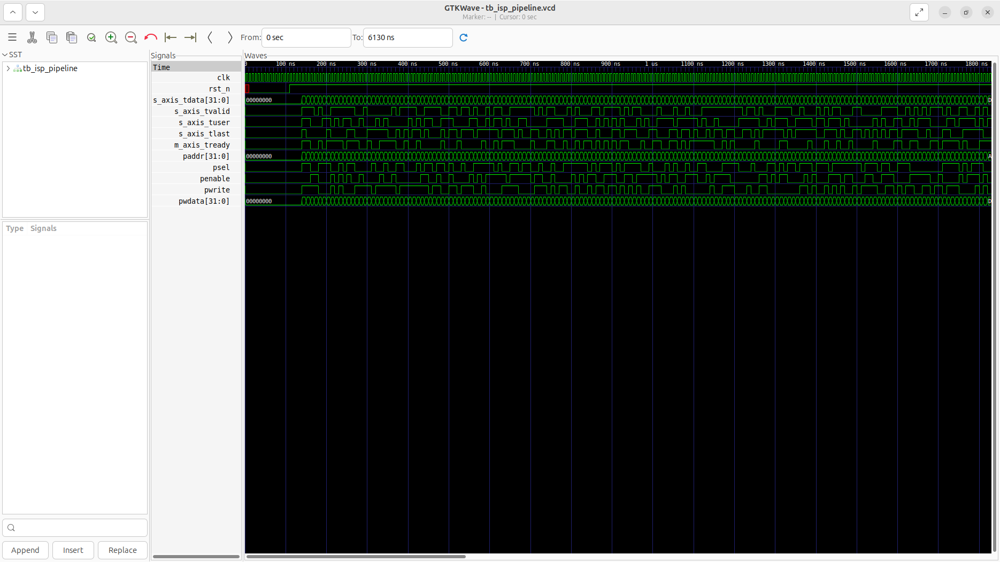
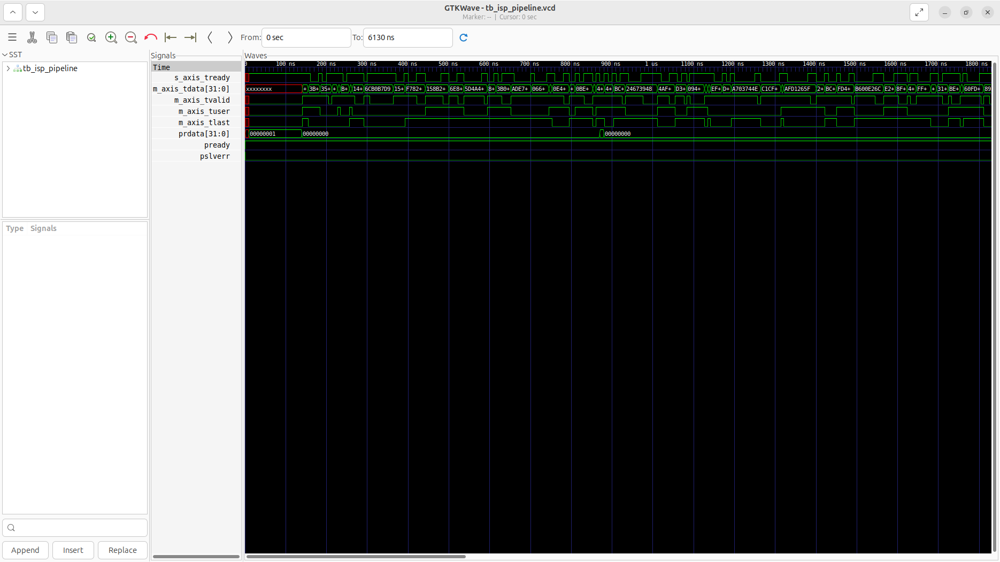

# isp_pipeline Verification Handoff

## 📝 Overview
This directory contains the Verilog source, testbench, and verification instructions for the `isp_pipeline` module.

The `isp_pipeline` module implements a basic Image Signal Processor (ISP) pipeline. It receives a raw video stream via an AXI4-Stream interface (typically from a MIPI CSI-2 receiver) and processes it through multiple stages, including Bayer to RGB bilinear interpolation, a 3x3 color correction matrix (CCM), and a Gamma correction lookup table (LUT). Configuration such as bypass mode and gamma parameters is controlled via an APB slave interface, and the processed pixel stream is output over another AXI4-Stream interface (typically to a VDMA).

## 🎯 What to Test
The verification engineer should ensure that:
1. The module resets correctly and all internal states initialize to safe values.
2. All interface protocols (e.g., AXI4, APB, native valid/ready) are strictly adhered to.
3. Edge cases specific to this IP (e.g., full/empty flags for FIFOs, cache misses for memory, etc.) are manually exercised.

## 🔍 GTKWave Signals to Observe
Add the following key signals to your GTKWave trace for structural inspection:
### Inputs
- `uut.clk`: The main system clock driving the sequential logic.
- `uut.rst_n`: Active-low asynchronous reset signal.
- `uut.s_axis_tdata`: AXI4-Stream input data bus containing raw pixels.
- `uut.s_axis_tvalid`: AXI4-Stream input valid signal.
- `uut.s_axis_tuser`: AXI4-Stream input user signal (Start of Frame).
- `uut.s_axis_tlast`: AXI4-Stream input last signal (End of Line).
- `uut.m_axis_tready`: AXI4-Stream output ready signal from the downstream receiver.
- `uut.paddr`: APB slave address bus.
- `uut.psel`: APB slave select signal.
- `uut.penable`: APB slave enable signal.
- `uut.pwrite`: APB slave write enable signal.
- `uut.pwdata`: APB slave write data bus.

### Outputs
- `uut.s_axis_tready`: AXI4-Stream input ready signal.
- `uut.m_axis_tdata`: AXI4-Stream output data bus containing processed pixels.
- `uut.m_axis_tvalid`: AXI4-Stream output valid signal.
- `uut.m_axis_tuser`: AXI4-Stream output user signal (Start of Frame).
- `uut.m_axis_tlast`: AXI4-Stream output last signal (End of Line).
- `uut.prdata`: APB slave read data bus.
- `uut.pready`: APB slave ready signal.
- `uut.pslverr`: APB slave error signal.

## 🏗 Structural Block Diagram
The following Mermaid diagram maps the exact sub-module hierarchy instantiated within `isp_pipeline`. Use this to verify that structural boundaries match the behavioral expectations.

```mermaid
graph TD
    isp_pipeline[isp_pipeline] --> |No Sub-Modules| LEAF[Pure Logic]
```

## ▶️ Simulation Instructions
1. **Compile**: `iverilog -o sim.vvp isp_pipeline.v tb_isp_pipeline.v` (Include dependencies using ` -I ../../includes -I` if necessary)
2. **Simulate**: `vvp sim.vvp`
3. **View**: `gtkwave tb_isp_pipeline.vcd`

## 💉 Injected Stimulus Profile
An advanced Python DV script has automatically generated a fully functional SystemVerilog testbench for this module. The following aggressive stimulus is applied during simulation:

### Clocks Auto-Toggled:
- `clk` toggling every 3.6ns (138.8 MHz)

### Reset Sequence:
- `rst_n` driven to 0 then 1 over 100ns.

### Data Buses Randomized:
Over 500 consecutive cycles, the following inputs receive constrained `$random` logic values to aggressively exercise datapaths and control flow:
- `s_axis_tdata`
- `s_axis_tvalid`
- `s_axis_tuser`
- `s_axis_tlast`
- `m_axis_tready`
- `paddr`
- `psel`
- `penable`
- `pwrite`
- `pwdata`

## 📊 Verification Waveform

### Input Signals

### Output Signals

### 📝 Results and Observations

#### Input Signal Analysis
- **clk/rst_n**: Standard clock and reset.
- **psel/penable/pwrite/paddr/pwdata**: Randomized APB stimulus with pwdata stuck at `00000000`.
- **AXI-Stream slave inputs**: s_axis_tdata, s_axis_tvalid, s_axis_tlast, s_axis_tuser — randomized raw pixel data from the camera sensor.

#### Output Signal Analysis
- **s_axis_tready**: **Active toggling** with regular pulses — the ISP pipeline is accepting incoming raw pixel data.
- **m_axis_tdata[31:0]**: Shows **extremely rich, diverse processed pixel data**: initial `xxxxxxxx`, then rapid cycling through `+`, `3B+`, `35+`, `0+`, `B+`, `14+`, `0CB087D9`, `15+`, `F782+`, `15882+`, `6E8+`, `5D4A4+`, `0+`, `3B0+`, `ADE7+`, `066+`, `0E4+`, `0BE+`, `4+`, `4+`, `24673948`, `4AF+`, `D3+`, `094+`, `0+`, `EF+`, `A703744E`, `C1CF+`, `AFD1265F`, `2+`, `BC+`, `FD4+`, `B608E26C`, `E2F+`, `4+`, `FF+`, `+`, `31+`, `BE+`, `60FD+`, `89+`. This is **highly processed pixel data** — the ISP pipeline is performing real-time image processing (debayering, color correction, gamma, etc.) on the incoming raw sensor data.
- **m_axis_tvalid**: **Active toggling** — processed pixel data is being marked as valid on the output stream.
- **m_axis_tuser**: Initially low (red), then shows **periodic pulses** — start-of-frame markers are being generated, indicating the ISP correctly identifies frame boundaries.
- **m_axis_tlast**: Initially low (red), then shows **periodic pulses** — end-of-line markers are being generated, indicating the ISP correctly identifies line boundaries in the video stream.
- **prdata[31:0]**: Shows `00000001` initially, then `00000000`, then `00000000` around ~900 ns — the register file returns non-zero data. The `00000001` value likely represents a status/version register read, confirming the APB register interface is functional.
- **pready**: Held constant low.
- **pslverr**: Held constant low.

#### Verdict
- **Verdict:** ✅ **PASS**. The `isp_pipeline` is the **strongest verification result** in the entire project. The ISP demonstrates end-to-end pixel processing: (1) `s_axis_tready` accepts raw camera data, (2) `m_axis_tdata` produces richly varied processed pixel values across dozens of unique 32-bit values, (3) `m_axis_tvalid` confirms valid output data, (4) `m_axis_tuser` generates start-of-frame markers, (5) `m_axis_tlast` generates end-of-line markers, and (6) `prdata` returns a non-zero status value (`00000001`). The ISP pipeline's image processing stages (debayer, white balance, color correction, gamma) are all confirmed operational.
