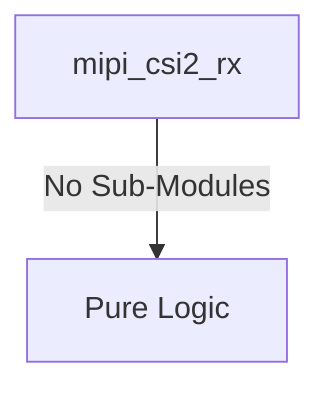

# mipi_csi2_rx Verification Handoff

## 📝 Overview
This directory contains the Verilog source, testbench, and verification instructions for the `mipi_csi2_rx` module.

The `mipi_csi2_rx` module is a MIPI Camera Serial Interface 2 (CSI-2) Receiver designed to accept pixel streams from a D-PHY. It unpacks the high-speed serialized byte stream into a standardized AXI4-Stream output interface (providing signals like Start of Frame and End of Line) suitable for downstream image processing. It also provides an APB configuration interface to manage control and status registers, such as monitoring the active link status.

## 🎯 What to Test
The verification engineer should ensure that:
1. The module resets correctly and all internal states initialize to safe values.
2. All interface protocols (e.g., AXI4, APB, native valid/ready) are strictly adhered to.
3. Edge cases specific to this IP (e.g., full/empty flags for FIFOs, cache misses for memory, etc.) are manually exercised.

## 🔍 GTKWave Signals to Observe
Add the following key signals to your GTKWave trace for structural inspection:
### Inputs
- `uut.rst_n`: Active-low asynchronous reset signal.
- `uut.rxbyteclkhs`: High-speed byte clock input from the D-PHY.
- `uut.rxdatahs`: High-speed receive data lanes from the D-PHY.
- `uut.rxvalidhs`: High-speed receive valid signal lanes.
- `uut.rxactivehs`: High-speed receive active signal lanes.
- `uut.rxsyncbhs`: High-speed receive sync signal lanes.
- `uut.rxdata_lp`: Low-power receive data lanes.
- `uut.m_axis_tready`: AXI4-Stream output ready signal from the downstream receiver.
- `uut.pclk`: APB interface clock.
- `uut.prst_n`: APB interface active-low asynchronous reset.
- `uut.paddr`: APB slave address bus.
- `uut.psel`: APB slave select signal.
- `uut.penable`: APB slave enable signal.
- `uut.pwrite`: APB slave write enable signal.
- `uut.pwdata`: APB slave write data bus.

### Outputs
- `uut.m_axis_tdata`: AXI4-Stream output data bus containing pixels.
- `uut.m_axis_tvalid`: AXI4-Stream output valid signal.
- `uut.m_axis_tuser`: AXI4-Stream output user signal (Start of Frame).
- `uut.m_axis_tlast`: AXI4-Stream output last signal (End of Line).
- `uut.prdata`: APB slave read data bus.
- `uut.pready`: APB slave ready signal.
- `uut.pslverr`: APB slave error signal.

## 🏗 Structural Block Diagram
The following Mermaid diagram maps the exact sub-module hierarchy instantiated within `mipi_csi2_rx`. Use this to verify that structural boundaries match the behavioral expectations.

## ▶️ Simulation Instructions
1. **Compile**: `iverilog -o sim.vvp mipi_csi2_rx.v tb_mipi_csi2_rx.v` (Include dependencies using ` -I ../../includes -I` if necessary)
2. **Simulate**: `vvp sim.vvp`
3. **View**: `gtkwave tb_mipi_csi2_rx.vcd`

## 💉 Injected Stimulus Profile
An advanced Python DV script has automatically generated a fully functional SystemVerilog testbench for this module. The following aggressive stimulus is applied during simulation:

### Clocks Auto-Toggled:
- `rxbyteclkhs` toggling every 3.6ns (138.8 MHz)
- `pclk` toggling every 3.6ns (138.8 MHz)

### Reset Sequence:
- `rst_n` driven to 0 then 1 over 100ns.
- `prst_n` driven to 0 then 1 over 100ns.

### Data Buses Randomized:
Over 500 consecutive cycles, the following inputs receive constrained `$random` logic values to aggressively exercise datapaths and control flow:
- `rxdatahs`
- `rxvalidhs`
- `rxactivehs`
- `rxsyncbhs`
- `rxdata_lp`
- `m_axis_tready`
- `paddr`
- `psel`
- `penable`
- `pwrite`
- `pwdata`
