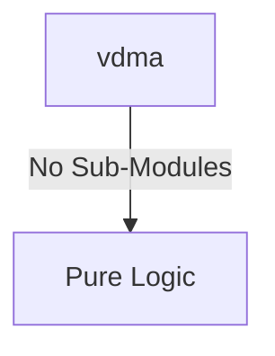

# vdma Verification Handoff

## 📝 Overview
This directory contains the Verilog source, testbench, and verification instructions for the `vdma` module.

The `vdma` (Video DMA) module acts as a high-performance bridge between continuous AXI4-Stream video data and memory-mapped AXI4 (e.g., DDR memory). It features separate Write (S2MM) and Read (MM2S) channels, supporting advanced capabilities like triple buffering and 2D transfer strides. Configuration registers (such as frame sizes, strides, and buffer base addresses) are accessible via an APB slave interface, making it ideal for interfacing camera inputs and display outputs.

## 🎯 What to Test
The verification engineer should ensure that:
1. The module resets correctly and all internal states initialize to safe values.
2. All interface protocols (e.g., AXI4, APB, native valid/ready) are strictly adhered to.
3. Edge cases specific to this IP (e.g., full/empty flags for FIFOs, cache misses for memory, etc.) are manually exercised.

## 🔍 GTKWave Signals to Observe
Add the following key signals to your GTKWave trace for structural inspection:
### Inputs
- `uut.clk`: The main system clock driving the sequential logic.
- `uut.rst_n`: Active-low asynchronous reset signal.
- `uut.s_axis_s2mm_tdata`: AXI4-Stream IN (S2MM) data bus.
- `uut.s_axis_s2mm_tvalid`: AXI4-Stream IN (S2MM) valid signal.
- `uut.s_axis_s2mm_tuser`: AXI4-Stream IN (S2MM) user signal (Start of Frame).
- `uut.s_axis_s2mm_tlast`: AXI4-Stream IN (S2MM) last signal (End of Line).
- `uut.m_axis_mm2s_tready`: AXI4-Stream OUT (MM2S) ready signal.
- `uut.m_axi_awready`: AXI4 Master write address ready.
- `uut.m_axi_wready`: AXI4 Master write data ready.
- `uut.m_axi_bvalid`: AXI4 Master write response valid.
- `uut.m_axi_bresp`: AXI4 Master write response status.
- `uut.m_axi_arready`: AXI4 Master read address ready.
- `uut.m_axi_rvalid`: AXI4 Master read data valid.
- `uut.m_axi_rdata`: AXI4 Master read data bus.
- `uut.m_axi_rresp`: AXI4 Master read response status.
- `uut.m_axi_rlast`: AXI4 Master read last signal.
- `uut.paddr`: APB slave address bus.
- `uut.psel`: APB slave select signal.
- `uut.penable`: APB slave enable signal.
- `uut.pwrite`: APB slave write enable signal.
- `uut.pwdata`: APB slave write data bus.

### Outputs
- `uut.s_axis_s2mm_tready`: AXI4-Stream IN (S2MM) ready signal.
- `uut.m_axis_mm2s_tdata`: AXI4-Stream OUT (MM2S) data bus.
- `uut.m_axis_mm2s_tvalid`: AXI4-Stream OUT (MM2S) valid signal.
- `uut.m_axis_mm2s_tuser`: AXI4-Stream OUT (MM2S) user signal (Start of Frame).
- `uut.m_axis_mm2s_tlast`: AXI4-Stream OUT (MM2S) last signal (End of Line).
- `uut.m_axi_awvalid`: AXI4 Master write address valid.
- `uut.m_axi_awaddr`: AXI4 Master write address bus.
- `uut.m_axi_awlen`: AXI4 Master write burst length.
- `uut.m_axi_awsize`: AXI4 Master write burst size.
- `uut.m_axi_wvalid`: AXI4 Master write data valid.
- `uut.m_axi_wdata`: AXI4 Master write data bus.
- `uut.m_axi_wstrb`: AXI4 Master write strobe bus.
- `uut.m_axi_wlast`: AXI4 Master write last signal.
- `uut.m_axi_bready`: AXI4 Master write response ready.
- `uut.m_axi_arvalid`: AXI4 Master read address valid.
- `uut.m_axi_araddr`: AXI4 Master read address bus.
- `uut.m_axi_arlen`: AXI4 Master read burst length.
- `uut.m_axi_arsize`: AXI4 Master read burst size.
- `uut.m_axi_rready`: AXI4 Master read data ready.
- `uut.prdata`: APB slave read data bus.
- `uut.pready`: APB slave ready signal.
- `uut.pslverr`: APB slave error signal.
- `uut.vdma_irq`: Interrupt request signal from the VDMA controller.

## 🏗 Structural Block Diagram
The following Mermaid diagram maps the exact sub-module hierarchy instantiated within `vdma`. Use this to verify that structural boundaries match the behavioral expectations.

## ▶️ Simulation Instructions
1. **Compile**: `iverilog -o sim.vvp vdma.v tb_vdma.v` (Include dependencies using ` -I ../../includes -I` if necessary)
2. **Simulate**: `vvp sim.vvp`
3. **View**: `gtkwave tb_vdma.vcd`

## 💉 Injected Stimulus Profile
An advanced Python DV script has automatically generated a fully functional SystemVerilog testbench for this module. The following aggressive stimulus is applied during simulation:

### Clocks Auto-Toggled:
- `clk` toggling every 3.6ns (138.8 MHz)

### Reset Sequence:
- `rst_n` driven to 0 then 1 over 100ns.

### Data Buses Randomized:
Over 500 consecutive cycles, the following inputs receive constrained `$random` logic values to aggressively exercise datapaths and control flow:
- `s_axis_s2mm_tdata`
- `s_axis_s2mm_tvalid`
- `s_axis_s2mm_tuser`
- `s_axis_s2mm_tlast`
- `m_axis_mm2s_tready`
- `m_axi_awready`
- `m_axi_wready`
- `m_axi_bvalid`
- `m_axi_bresp`
- `m_axi_arready`
- `m_axi_rvalid`
- `m_axi_rdata`
- `m_axi_rresp`
- `m_axi_rlast`
- `paddr`
- `psel`
- `penable`
- `pwrite`
- `pwdata`
